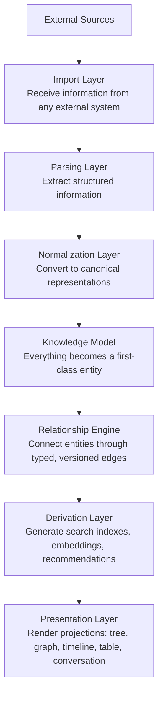

# Knowledge Operating System

> A deterministic knowledge engine that treats knowledge as source code and retrieval as compilation.

Knowledge OS is an open-source platform for ingesting, normalizing, and reasoning over heterogeneous knowledge. It replaces the document-centric mental model with an entity-centric one, where everything -- concepts, people, papers, code, decisions -- becomes a first-class citizen in a queryable knowledge graph.

The system is engineered as a **knowledge compiler**: information enters through importers, is normalized into a canonical model, and is projected into derived representations optimized for search, AI, graph traversal, and human interfaces. No single storage engine defines the truth. The canonical knowledge model does.

---

## Core Principles

**Knowledge is the source of truth.** Storage engines, search indexes, embeddings, and caches are derived artifacts that can be rebuilt at any time.

**Composition over inheritance.** Entities acquire behavior through components, not class hierarchies. Every entity is assembled from reusable, interchangeable parts.

**Storage independence.** The architecture never depends on a specific database, AI model, or search engine. Adapters isolate implementation details. The domain model remains independent.

**Every projection is disposable.** Views, indexes, graphs, and embeddings are derived from canonical data. They may be discarded and reconstructed without loss.

---

## Architecture

The system follows a seven-layer pipeline inspired by compiler architecture:



For a detailed explanation of each layer, see [Pipeline](docs/architecture/pipeline.md).

---

## Documentation

Documentation follows the [Diataxis framework](https://diataxis.fr/) -- four types of content for four different needs.

| Section          | Purpose                                          | Link                                              |
| ---------------- | ------------------------------------------------ | ------------------------------------------------- |
| **Philosophy**   | Why this project exists and what it believes     | [docs/philosophy/](docs/philosophy/README.md)     |
| **Architecture** | How the system is designed and why               | [docs/architecture/](docs/architecture/README.md) |
| **Reference**    | Definitive specifications and glossary           | [docs/reference/](docs/reference/README.md)       |
| **Engineering**  | Testing, security, deployment, and practices     | [docs/engineering/](docs/engineering/README.md)   |
| **Guides**       | How-to guides, tutorials, and AI agent workflows | [docs/guides/](docs/guides/README.md)             |
| **Appendices**   | Diagrams, patterns, and canonical examples       | [docs/appendices.md](docs/appendices.md)          |
| **Contributing** | How to participate in the project                | [CONTRIBUTING.md](CONTRIBUTING.md)                |

### Key Documents

| Document                                                      | Description                                          |
| ------------------------------------------------------------- | ---------------------------------------------------- |
| [Seed Manifesto](docs/foundational-manifesto.md)              | The constitutional outline of the entire project     |
| [Technical Foundation](docs/engineering-architecture.md)      | The engineering architecture constitution            |
| [Philosophy](docs/philosophy/philosophy.md)                   | Core philosophy and immutable principles             |
| [Vision](docs/philosophy/vision.md)                           | Why Knowledge OS exists                              |
| [Boundaries](docs/philosophy/boundaries.md)                   | What we build and what we intentionally skip         |
| [Open Infrastructure](docs/philosophy/open-infrastructure.md) | Why Knowledge OS is available to everyone            |
| [Mental Model](docs/architecture/mental-model.md)             | The canonical way of thinking about the system       |
| [Domain Model](docs/architecture/domain-model.md)             | Entity, relationship, and component types            |
| [System Overview](docs/architecture/overview.md)              | Current technical architecture                       |
| [Landscape 2026](docs/research/landscape-2026.md)             | 2026 knowledge management landscape                  |
| [Glossary](docs/reference/glossary.md)                        | Every project term, defined once (Part XIV)          |
| [Appendices](docs/appendices.md)                              | Reference diagrams, patterns, and examples (Part XV) |

---

## Mental Model

Knowledge OS is not a database. It is a knowledge engine.

Databases are implementation details. Storage technologies exist to optimize specific access patterns. No storage engine defines the knowledge model. The application owns the knowledge model.

This distinction is the foundation of every architectural decision in the system. For a full explanation, see [Philosophy](docs/philosophy/philosophy.md).

---

## Technology

| Layer         | Choice               | Why                                      |
| ------------- | -------------------- | ---------------------------------------- |
| Core          | Rust                 | Domain model, pipeline, storage adapters |
| API           | Axum                 | Tokio team, Tower middleware, type-safe  |
| Desktop       | Tauri 2.x + Svelte 5 | Rust backend, small binary, fast UI      |
| Mobile        | React Native         | Cross-platform, TypeScript               |
| DB (local)    | SQLite               | Embedded, zero-config                    |
| DB (cloud)    | PostgreSQL           | Production multi-user                    |
| Search        | Tantivy              | Rust-native, embeddable                  |
| Serialization | Serde                | Already used in all code examples        |

---

## Project Layout

Three independent projects sharing a Rust workspace of core crates:

```
knowledge-os/
├── Makefile
├── core/                         # Cargo workspace
│   ├── Cargo.toml
│   ├── knowledge-core/           # Domain model, entity types, ports
│   ├── knowledge-storage/        # Storage adapters (SQLite, Postgres, etc.)
│   ├── knowledge-import/         # Import + parsing + normalization
│   └── knowledge-derive/         # Search indexes, embeddings, graph projection
├── api/                          # Axum REST + MCP server
│   ├── Cargo.toml
│   └── src/
│       ├── bin/knowledge-api.rs  # Server entry point
│       └── features/<domain>/    # Handlers, services
├── desktop/                      # Tauri 2.x + Svelte 5
│   ├── src-tauri/                # Rust backend (generated by cargo-tauri init)
│   └── src/                      # Frontend (index.html)
├── mobile/                       # React Native (generated by @react-native-community/cli)
│   ├── App.tsx
│   └── package.json
├── docs/
└── scripts/
```

Each core crate is replaceable. Swap SQLite for Postgres? Replace `knowledge-storage`. Change import pipeline? Replace `knowledge-import`. The domain model in `knowledge-core` never changes.

**Offline / cloud toggle:** Desktop and mobile switch between an embedded API (SQLite, localhost) and a remote API endpoint. Same adapter pattern, different target.

---

## Status

Current status:
- [x] Foundational seed manifesto
- [x] Engineering architecture constitution
- [x] Documentation structure
- [x] Complete documentation (manifesto parts I-XV covered)
- [x] Architecture Decision Records (6 accepted)
- [x] Engineering practices (testing, security, deployment)
- [x] Guides (plugin development, AI agents)
- [x] Tutorials (first import, custom importer)
- [x] Engineering handbook, runbooks, product requirements, UI design system
- [x] Language selection and project setup
- [x] First implementation milestone
- [x] 2026 landscape research (landscape-2026.md)
- [x] PRD-0001: Core Entity Model
- [x] Open infrastructure philosophy

---

## Contributing

See [CONTRIBUTING.md](CONTRIBUTING.md) for guidelines on how to participate in this project.

All contributors -- human engineers, AI agents, designers, product managers, and researchers -- must read the [Seed Manifesto](docs/foundational-manifesto.md) before contributing.

---

## License

[MIT](LICENSE)
