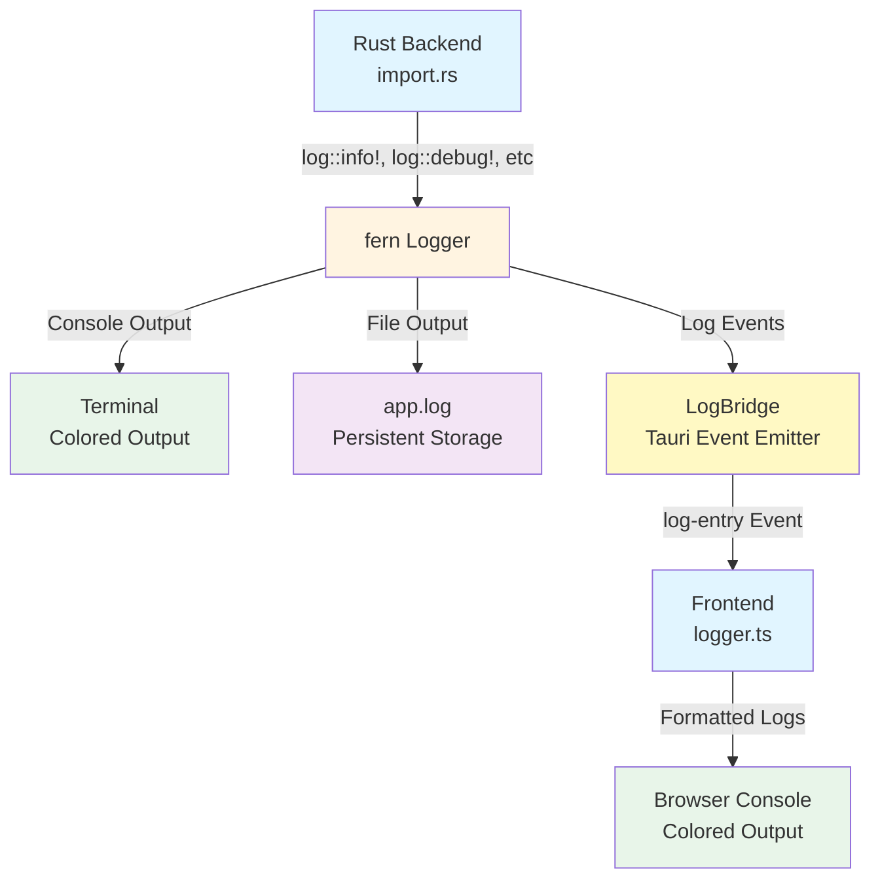

# Import Traceability Logging

Comprehensive logging system for the import process with visibility in browser console, terminal, and persistent log files.

## Overview

The import process now includes detailed traceability logs that track every step of the import pipeline. Logs are visible in:

1. **Browser Console** - Real-time logs forwarded from backend via Tauri events
2. **Terminal** - Colored output when running `cargo tauri dev`
3. **Log Files** - Persistent logs in `<app-data>/app.log`

## Log Levels

- **ERROR** (Red) - Failures that stop processing
- **WARN** (Yellow) - Recoverable issues
- **INFO** (Green) - Major milestones (start, complete, counts)
- **DEBUG** (Blue) - Detailed step-by-step progress (dev mode only)
- **TRACE** (Gray) - Very detailed data (dev mode only)

## Correlation IDs

Every import operation generates a unique correlation ID (UUID) that links all related log entries. This makes it easy to trace the complete flow of a single import operation across multiple files and async operations.

Example:
```
[10:23:45.123] INFO import.started: correlation_id=550e8400-e29b-41d4-a716-446655440000, file_count=3
[10:23:45.124] INFO import.file.started: correlation_id=550e8400-e29b-41d4-a716-446655440000, path=/path/to/file.md
[10:23:45.234] INFO import.file.completed: correlation_id=550e8400-e29b-41d4-a716-446655440000, path=/path/to/file.md, duration_ms=110
[10:23:45.345] INFO import.completed: correlation_id=550e8400-e29b-41d4-a716-446655440000, created=3, duration_ms=222
```

## What's Logged

### File Import
- Start/end of import operation with file count
- Directory detection and file listing
- Format detection (extension and magic bytes)
- Importer selection
- Parsing stage
- Entity creation and saving
- Search indexing
- Cross-reference resolution
- Error tracking with full context
- Timing metrics for each stage

### URL Import
- Fetch start/end
- Content parsing
- Entity creation
- Timing metrics

### Clipboard Import
- Format detection (text/HTML)
- Parsing
- Entity creation

### Database Import
- Connection type detection
- Table listing
- Row processing
- Entity creation per row

### Other Operations
- Image import (OCR)
- Undo operations
- Directory previews
- Structured data imports

## Log File Location

Logs are persisted to:
- **Linux**: `~/.local/share/knowledge-os-desktop/app.log`
- **macOS**: `~/Library/Application Support/knowledge-os-desktop/app.log`
- **Windows**: `C:\Users\<user>\AppData\Roaming\knowledge-os-desktop\app.log`

## Development

To see all logs (including DEBUG and TRACE):
```bash
cargo tauri dev
```

In release mode, only INFO and above are logged to reduce noise.

## Configuration

Log levels are configured in `desktop/src-tauri/src/logger.rs`:

```rust
let level = if cfg!(debug_assertions) {
    LevelFilter::Debug  // Dev mode: show DEBUG and above
} else {
    LevelFilter::Info   // Release mode: show INFO and above
};
```

You can suppress noisy logs from specific modules:
```rust
.level_for("hyper", LevelFilter::Warn)
.level_for("reqwest", LevelFilter::Warn)
```

## Frontend Integration

Logs are automatically forwarded to the browser console via the log bridge initialized in `desktop/src/main.ts`:

```typescript
import { setupLogBridge } from "./lib/logger.js";
setupLogBridge();
```

The bridge listens for `log-entry` events from the backend and formats them with colors in the console.

## Example Output

### Terminal
```
[10:23:45.123 INFO  knowledge_desktop::commands::import] import.started: correlation_id=550e8400, file_count=3
[10:23:45.124 DEBUG knowledge_desktop::commands::import] import.file.started: path=/path/to/file.md, extension=md
[10:23:45.234 INFO  knowledge_desktop::commands::import] import.file.completed: duration_ms=110
```

### Browser Console
```
[10:23:45] INFO knowledge_desktop::commands::import import.started: correlation_id=550e8400, file_count=3
[10:23:45] DEBUG knowledge_desktop::commands::import import.file.started: path=/path/to/file.md, extension=md
[10:23:45] INFO knowledge_desktop::commands::import import.file.completed: duration_ms=110
```

## Architecture



## Future Enhancements

- [ ] Log rotation (size-based or time-based)
- [ ] Log filtering by correlation ID in UI
- [ ] Export logs to file from UI
- [ ] Remote log aggregation (optional)
- [ ] Performance metrics dashboard
