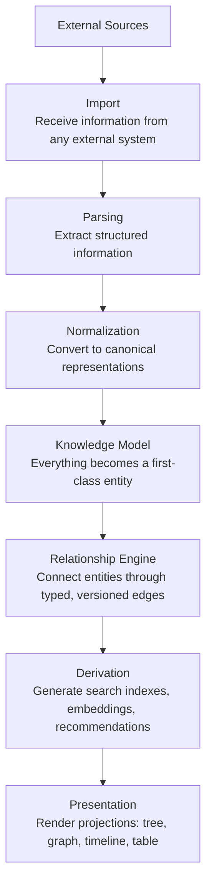
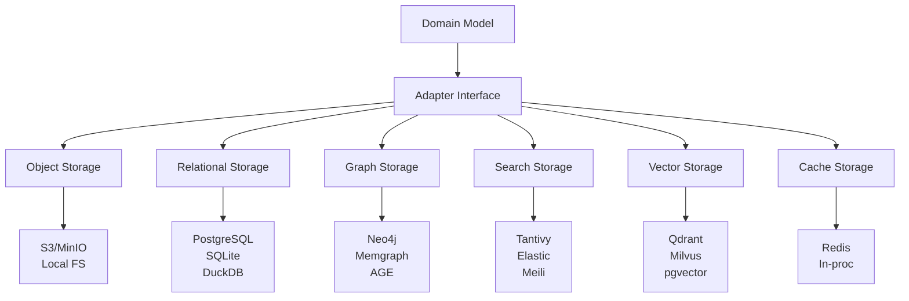
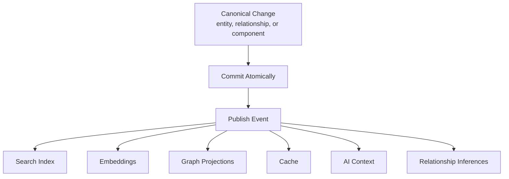
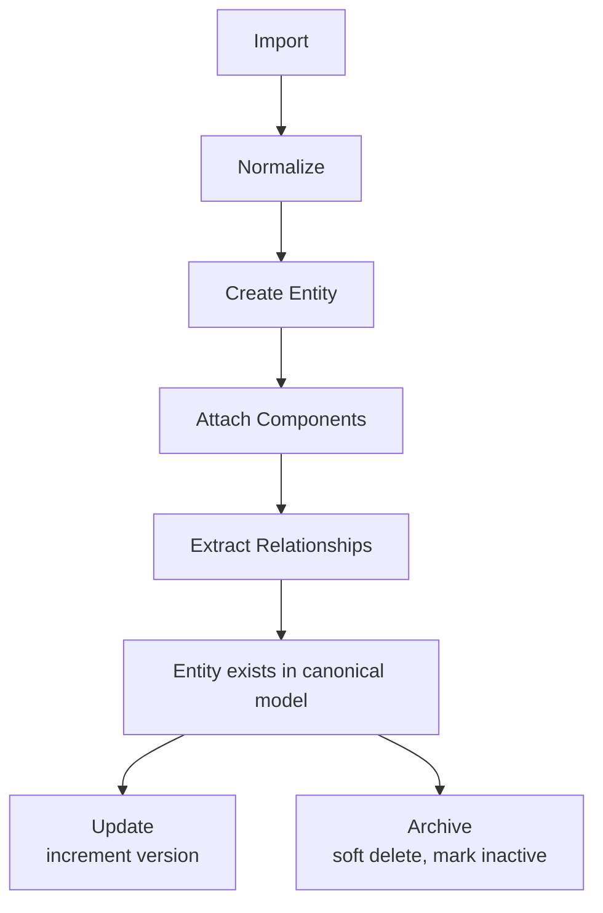
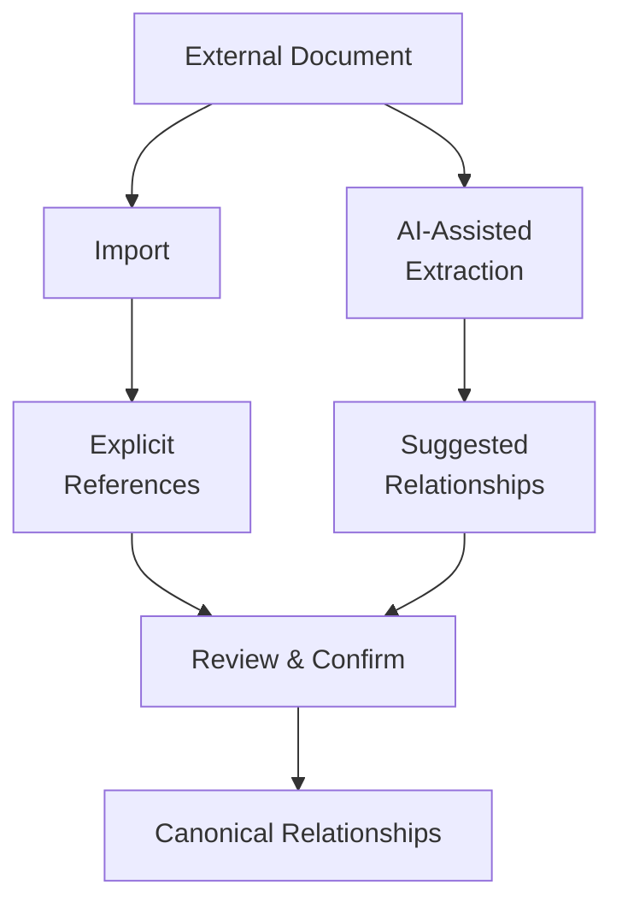
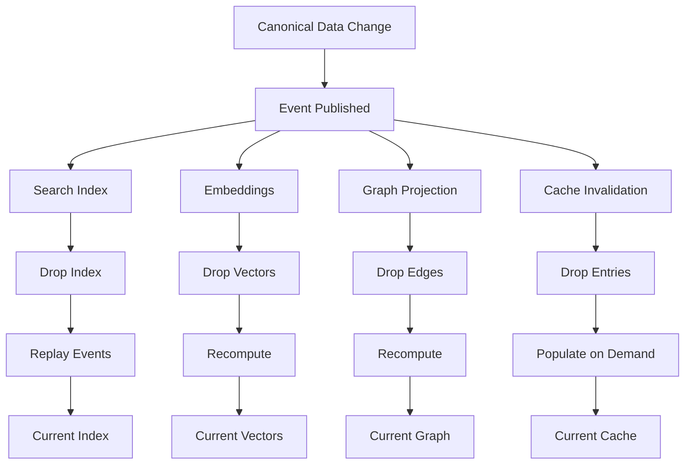

# Appendices

> Reference diagrams, architectural patterns, canonical examples, and frequently referenced models. This document supplements the main documentation with visual and structural references.

---

## Appendix A — Reference Diagrams

### A.1 Pipeline Architecture



### A.2 Storage Architecture



### A.3 Event Flow



Each handler is independent and idempotent.

### A.4 Entity Lifecycle



### A.5 Relationship Extraction



### A.6 Derived Data Regeneration



---

## Appendix B — Architectural Patterns

### B.1 Adapter Pattern

**Context:** The system must persist data across multiple storage engines without coupling the domain model to any specific engine.

**Solution:** Each storage engine is accessed through an adapter that implements a common interface. The domain model depends on the interface, never on the implementation.

**Application in Knowledge OS:** Storage adapters (SQLite, PostgreSQL, Tantivy, Qdrant, Redis, S3), AI provider adapters (OpenAI, Anthropic, local models), import adapters (Markdown, PDF, HTML, Git).

**Reference:** [ADR-0002](architecture/adrs/adr-0002.md), [Storage Philosophy](architecture/storage.md)

### B.2 Entity Component System (ECS)

**Context:** The system must represent diverse knowledge entities without creating rigid inheritance hierarchies.

**Solution:** Entities are assembled from composable components rather than defined through class hierarchies. Each entity is a container for components. Each component represents one aspect of the entity. Systems operate on entities with specific component combinations.

**Application in Knowledge OS:** Every entity (Person, Paper, Tool, Concept, etc.) is assembled from components (Title, Description, Content, Tags, Timeline, etc.). No entity class hierarchy exists.

**Reference:** [ADR-0003](architecture/adrs/adr-0003.md), [Composition](architecture/composition.md)

### B.3 Event Sourcing / CQRS

**Context:** The system must propagate canonical data changes to multiple derived representations without synchronous coupling.

**Solution:** Every canonical change emits an event. Events are processed asynchronously through independent handlers. Read models (derived data) are projections of the canonical event log.

**Application in Knowledge OS:** EntityCreated, EntityUpdated, ComponentAdded events trigger search index updates, embedding recomputation, graph projection updates, and cache invalidation. Each handler is independent and idempotent.

**Reference:** [ADR-0004](architecture/adrs/adr-0004.md), [Events](architecture/events.md)

### B.4 Compiler Architecture

**Context:** The system must process heterogeneous knowledge through a sequence of deterministic transformations.

**Solution:** The system is modeled as a deterministic compiler. Information enters as source material, passes through lexical analysis (import), parsing, semantic analysis (normalization), and canonical representation, and is then compiled into derived artifacts optimized for specific access patterns.

**Application in Knowledge OS:** Import = lexical analysis. Parsing = syntactic analysis. Normalization = semantic analysis. Canonical model = intermediate representation. Derivation = optimization. Presentation = code generation.

**Reference:** [ADR-0005](architecture/adrs/adr-0005.md), [Compilation](architecture/compilation.md)

### B.5 Canonical Data Model

**Context:** The system must represent knowledge independently of storage technology.

**Solution:** The canonical knowledge model is the single source of truth. All other representations are derived. Derived data may be regenerated at any time.

**Application in Knowledge OS:** The canonical entity model contains entities, components, and relationships. Search indexes, embeddings, graph projections, and caches are derived from the canonical model and may be rebuilt at any time.

**Reference:** [ADR-0001](architecture/adrs/adr-0001.md), [Data Model](architecture/data-model.md)

---

## Appendix C — Canonical Examples

### C.1 Importing a Research Paper

**Input:** A Markdown file containing a research paper summary.

**Import pipeline:**

1. **Import.** The Markdown importer reads the file and produces an `ImportedEntity`.
2. **Parse.** The parser extracts: title, author references, content body, metadata (date, language).
3. **Normalize.** The normalizer identifies the entity type as `Paper`. Resolves author references against existing `Person` entities. Assigns a canonical UUID.
4. **Knowledge Model.** Creates a `Paper` entity with components: `Title`, `Content`, `Author`, `Tags`, `Timeline`, `Language`, `Provenance`.
5. **Relationship Engine.** Extracts relationships: `authored_by` (to Person entities), `references` (to other Paper or Concept entities).
6. **Derivation.** Generates: search index entry, vector embedding, graph projection entry.
7. **Presentation.** The entity appears in graph view, table view, timeline, and search results.

**Resulting entity:**

```
Entity: "Attention Is All You Need"
  Type: Paper
  Components:
    - Title { name: "Attention Is All You Need" }
    - Content { markdown: "The dominant sequence transduction models..." }
    - Author { people: [Vaswani, Shazeer, Parmar, Uszkoreit, Jones, Gomez, Kaiser, Polosukhin] }
    - Tags { values: ["transformer", "attention", "NLP", "sequence-modeling"] }
    - Timeline { created_at: 2017-06-12, imported_at: 2026-07-21 }
    - Language { code: "en" }
    - Provenance { source: "papers/attention.md", importer: "markdown-importer" }
  Relationships:
    - authored_by --> Person("Vaswani"), Person("Shazeer"), ...
    - references --> Paper("Neural Machine Translation by Jointly Learning to Align and Translate")
    - references --> Paper("Long Short-Term Memory")
    - implements --> Concept("attention mechanism")
    - teaches --> Concept("transformer architecture")
```

### C.2 Entity Resolution

**Input:** Two imported documents that reference the same person differently.

**Scenario:**

- Document 1 references "Dr. Geoffrey Hinton"
- Document 2 references "Geoffrey Hinton"
- Document 3 references "Hinton"

**Resolution process:**

1. **Normalize.** The normalizer detects potential duplicates through string similarity and co-occurrence analysis.
2. **AI-assisted.** The AI provider suggests that all three references refer to the same person.
3. **Human review.** The user confirms the merge.
4. **Canonical model.** A single `Person` entity is created with components from all three sources. The entity retains provenance from all three imports.

### C.3 Derived Data Regeneration

**Scenario:** The embedding model is upgraded from `text-embedding-3-small` to `text-embedding-3-large`.

**Regeneration process:**

1. **Detect.** Configuration change is detected: embedding model changed.
2. **Event.** An `EmbeddingModelChanged` event is published.
3. **Handler.** The embedding handler processes the event:
   - Queries all entities with `Embedding` components.
   - For each entity, recomputes the embedding using the new model.
   - Updates the `Embedding` component with the new vector and model identifier.
   - Publishes `EmbeddingUpdated` events for each affected entity.
4. **Derivation.** The vector store is updated with new embeddings.
5. **Consistency.** All derived data is now consistent with the new model.

**What is preserved:** All canonical data (entities, components, relationships) remains unchanged. Only the derived embedding data is regenerated.

### C.4 Plugin Adding a New Importer

**Goal:** Add support for importing BibTeX files.

**Steps:**

1. **Create plugin crate.** `knowledge-os-bibtex-importer`.
2. **Implement `ImportAdapter` trait.**
   - `can_import()`: check for `.bib` file extension and BibTeX format detection.
   - `import()`: parse BibTeX entries, extract fields (title, author, year, abstract, doi), create `ImportedEntity` objects.
   - `supported_types()`: return `["bibtex"]`.
3. **Create manifest.** `knowledge-plugin.toml` declaring `importer` capability for `bibtex` format.
4. **Write tests.** Unit tests for BibTeX parsing. Integration tests for the full import pipeline.
5. **Build and install.** `cargo build --release`, then `knowledge-os plugin install ./target/release/libknowledge_os_bibtex_importer.so`.

**Result:** The system now supports importing BibTeX files without any changes to the core.

---

## Appendix D — Frequently Referenced Models

### D.1 The Ten Engineering Questions

Every feature must answer these questions before implementation:

1. Which canonical entities are introduced?
2. Which relationships are introduced?
3. Which components are introduced?
4. Which events are emitted?
5. Which derived representations are generated?
6. Which layer owns the feature?
7. Can every derived artifact be regenerated?
8. Does the feature violate storage independence?
9. Does the feature introduce implementation leakage?
10. Does the feature preserve the canonical model?

**Reference:** [Engineering Principles](philosophy/engineering-principles.md), [CONTRIBUTING.md](../CONTRIBUTING.md)

### D.2 The Compiler Analogy

| Compiler Stage | Knowledge OS Stage |
|---------------|-------------------|
| Source code | External resources (documents, APIs, media) |
| Lexical analysis | Import layer (format detection, extraction) |
| Parsing | Parsing layer (structural analysis) |
| Semantic analysis | Normalization layer (entity resolution, identity) |
| Intermediate representation | Canonical entity model |
| Optimization | Derivation layer (index generation, embedding) |
| Code generation | Presentation layer (view rendering) |
| Executable | Rendered knowledge projection |

**Reference:** [Compilation](architecture/compilation.md), [ADR-0005](architecture/adrs/adr-0005.md)

### D.3 The ECS Comparison

| Game Engine ECS | Knowledge OS ECS |
|----------------|-------------------|
| Entity = game object | Entity = knowledge concept |
| Component = behavior data | Component = entity aspect |
| System = game logic | System = pipeline stage |
| Frame-based updates | Event-driven updates |
| Spatial components | Semantic components |

**Reference:** [Composition](architecture/composition.md), [ADR-0003](architecture/adrs/adr-0003.md)

### D.4 Canonical vs Derived Decision Table

| Question | Canonical | Derived |
|----------|-----------|---------|
| Can it be regenerated from other data? | No | Yes |
| Does it represent user knowledge? | Yes | No |
| Does it require durability? | Yes | No |
| Is it versioned? | Yes | Optional |
| Is it auditable? | Yes | Optional |
| Is it the source of truth? | Yes | Never |
| May it be discarded without data loss? | No | Yes |

**Reference:** [Data Model](architecture/data-model.md)

### D.5 Mental Model Shifts

| Old Model | New Model |
|-----------|-----------|
| Files | Entities |
| Folders | Relationships |
| File type | Component assembly |
| Directory tree | Knowledge graph |
| Search query | Graph traversal + projection query |
| Save | Import + normalize + persist |
| Open | Render projection |
| Copy | Reference (same entity, multiple views) |
| Delete | Archive (soft delete, preserve history) |
| Backup | Export canonical data |

**Reference:** [Mental Model](architecture/mental-model.md)

### D.6 Storage Engine Decision Matrix

| Access Pattern | Recommended Engine | Alternative |
|---------------|-------------------|-------------|
| Structured metadata | SQLite (local) / PostgreSQL (production) | DuckDB |
| Full-text search | Tantivy (local) / Elasticsearch (production) | Meilisearch |
| Semantic similarity | Qdrant | Milvus, pgvector |
| Relationship traversal | Graph extension on relational | Neo4j, Memgraph |
| Binary artifacts | Local filesystem (local) / S3 (production) | MinIO |
| Caching | In-process (local) / Redis (production) | Memory-mapped files |

**Reference:** [Storage](architecture/storage.md)

---

## Appendix E — Decision Records

Architecture Decision Records (ADRs) capture significant architectural decisions along with their context and consequences. ADRs are immutable once accepted.

| ADR | Title | Status | Date |
|-----|-------|--------|------|
| [ADR-0001](architecture/adrs/adr-0001.md) | Knowledge Model as Canonical Source of Truth | Accepted | 2026-07-21 |
| [ADR-0002](architecture/adrs/adr-0002.md) | Storage Independence via Adapter Pattern | Accepted | 2026-07-21 |
| [ADR-0003](architecture/adrs/adr-0003.md) | Entity Component Model for Knowledge Entities | Accepted | 2026-07-21 |
| [ADR-0004](architecture/adrs/adr-0004.md) | Event-Driven Derivation Pipeline | Accepted | 2026-07-21 |
| [ADR-0005](architecture/adrs/adr-0005.md) | Compiler-Inspired Architecture | Accepted | 2026-07-21 |

**See also:** [ADR Index](architecture/adrs/README.md)

---

## Appendix F — Evolution History

### Version 0.1.0 (2026-07-21)

Initial documentation release. Established the foundational architecture:

- Foundational seed manifesto
- Engineering architecture constitution
- Documentation structure following Diataxis framework
- README with architecture overview
- Contributing guidelines
- MIT License
- Architecture Decision Records framework
- Design principles, goals, and non-goals
- System baseline architecture documentation
- Layered architecture deep dive
- Canonical vs derived data documentation
- Storage philosophy documentation
- Entity component model documentation
- Compiler perspective documentation
- Event-driven architecture documentation
- Project glossary

### Version 0.2.0 (2026-07-21)

Expanded documentation to cover all manifesto parts:

- Vision document (Part I)
- Mental model document (Part III)
- Domain model document (Part V)
- AI architecture document (Part IX)
- UI philosophy document (Part VIII)
- Engineering principles document (Part X)
- Extensibility document (Part XI)
- Product vision document (Part XII)
- Governance document (Part XIII)
- Scalability and synchronization documents
- Testing strategy, security architecture, deployment architecture
- Plugin development guide and AI agent guidelines
- 5 Architecture Decision Records (ADR-0001 through ADR-0005)

### Version 0.3.0 (2026-07-21)

Completed the manifesto documentation:

- Canonical vocabulary document (Part XIV) -- expanded glossary
- Architectural principles document (Part VI) -- consolidated principles
- Appendices document (Part XV) -- reference diagrams, patterns, examples
- Expanded vision document (Part I) with deeper analysis
- Expanded philosophy document (Part II) with deeper principles
- Engineering handbook -- day-to-day engineering practices
- UI design system -- component specifications
- Operational runbooks -- incident response and procedures
- Product requirements -- Year 1 functional and non-functional requirements
- Tutorials -- first import walkthrough, custom importer development

---

## Further Reading

- [Foundational Manifesto](foundational-manifesto.md) -- The constitutional outline
- [Engineering Architecture](engineering-architecture.md) -- The engineering constitution
- [Glossary](reference/glossary.md) -- Every project term, defined once
- [ADR Index](architecture/adrs/README.md) -- Architecture Decision Records
