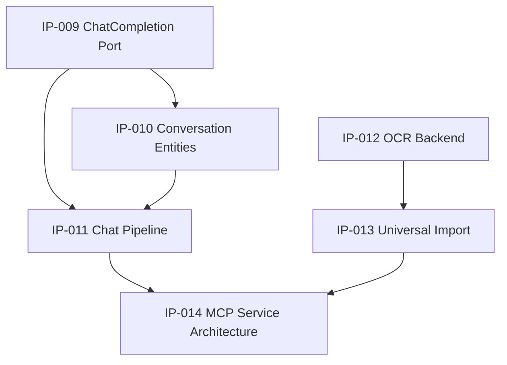

# Architecture Decision Records

> Significant architectural decisions are recorded here. Each decision is immutable once accepted.

---

## What Is an ADR?

An Architecture Decision Record (ADR) captures a significant architectural decision along with its context and consequences. ADRs are immutable once accepted -- they are superseded, not edited.

This practice is described by Michael Nygard in [Documenting Architecture Decisions](https://cognitect.com/blog/2011/11/15/documenting-architecture-decisions) and adopted widely in architecture-first projects.

---

## ADR Template

```markdown
# ADR-NNNN: [Short Title]

**Status:** Proposed | Accepted | Deprecated | Superseded by ADR-XXXX
**Date:** YYYY-MM-DD
**Deciders:** [people or team]

## Context

What is the issue motivating this decision or change?

## Decision

What is the change we are proposing and/or doing?

## Alternatives Considered

### Option 1: [Name]
- Pros: ...
- Cons: ...
- Why not chosen: ...

### Option 2: [Name]
- Pros: ...
- Cons: ...

## Consequences

### Positive
- ...

### Negative
- ...

### Risks
- ...

## Related Decisions
- ADR-XXXX: [related]
```

---

## ADR Lifecycle

```
Proposed --> Accepted --> [Deprecated | Superseded]
    |          |
 Rejected   Active (implemented)
```

- **Proposed.** Under discussion. Not yet decided.
- **Accepted.** Decision is final. Implementation may begin.
- **Deprecated.** Decision is no longer relevant. kept for historical reference.
- **Superseded.** Replaced by a newer ADR. The superseding ADR is referenced.

---

## ADR Index

| ADR      | Title                                                            | Status   | Date       | Implementation Plan                                                                   |
| -------- | ---------------------------------------------------------------- | -------- | ---------- | ------------------------------------------------------------------------------------- |
| ADR-0001 | [Knowledge Model as Canonical Source of Truth](adr-0001.md)      | Accepted | 2026-07-21 | —                                                                                     |
| ADR-0002 | [Storage Independence via Adapter Pattern](adr-0002.md)          | Accepted | 2026-07-21 | —                                                                                     |
| ADR-0003 | [Entity Component Model for Knowledge Entities](adr-0003.md)     | Accepted | 2026-07-21 | —                                                                                     |
| ADR-0004 | [Event-Driven Derivation Pipeline](adr-0004.md)                  | Accepted | 2026-07-21 | —                                                                                     |
| ADR-0005 | [Compiler-Inspired Architecture](adr-0005.md)                    | Accepted | 2026-07-21 | —                                                                                     |
| ADR-0006 | [Entity Resolution as Critical Layer](adr-0006.md)               | Accepted | 2026-07-22 | —                                                                                     |
| ADR-0007 | [Multi-Format Import via ImportAdapter Trait](adr-0007.md)       | Accepted | 2026-07-22 | —                                                                                     |
| ADR-0008 | [Fuzzy Entity Resolution with Confidence Scoring](adr-0008.md)   | Accepted | 2026-07-22 | —                                                                                     |
| ADR-0009 | [Extended Cross-Reference Patterns](adr-0009.md)                 | Accepted | 2026-07-22 | —                                                                                     |
| ADR-0010 | [Entity Type Inference from Frontmatter](adr-0010.md)            | Accepted | 2026-07-22 | —                                                                                     |
| ADR-0011 | [BinaryContent Component](adr-0011.md)                           | Accepted | 2026-07-22 | —                                                                                     |
| ADR-0012 | [PDF Parser Selection](adr-0012.md)                              | Accepted | 2026-07-24 | —                                                                                     |
| ADR-0013 | [Composite Entity Resolution with Weighted Signals](adr-0013.md) | Accepted | 2026-07-24 | —                                                                                     |
| ADR-0014 | [Bounded Graph Traversal via Recursive CTE](adr-0014.md)         | Superseded by ADR-0019 | 2026-07-24 | [IP-001](../../engineering/implementation-plans/IP-001-graph-traversal.md) (Complete) |
| ADR-0015 | [View Projection System](adr-0015.md)                            | Proposed | 2026-07-24 | [IP-002](../../engineering/implementation-plans/IP-002-view-projections.md)           |
| ADR-0016 | [Plugin System Architecture](adr-0016.md)                        | Proposed | 2026-07-24 | [IP-003](../../engineering/implementation-plans/IP-003-plugin-system.md)              |
| ADR-0017 | [Semantic Search via Embeddings](adr-0017.md)                    | Proposed | 2026-07-24 | [IP-004](../../engineering/implementation-plans/IP-004-semantic-search.md)            |
| ADR-0018 | [Collection Entity for Curated Groups](adr-0018.md)              | Proposed | 2026-07-24 | [IP-005](../../engineering/implementation-plans/IP-005-collections.md)                |
| ADR-0019 | [Level-by-Level BFS for Graph Traversal](adr-0019.md)            | Proposed | 2026-07-28 | PRD-0005                                                                              |
| ADR-0020 | [Composite Indexes for Relationship Traversal](adr-0020.md)      | Proposed | 2026-07-28 | PRD-0005                                                                              |
| ADR-0021 | [Tauri as Desktop Application Framework](adr-0021.md)            | Proposed | 2026-07-28 | PRD-0006                                                                              |
| ADR-0022 | [Stateless Tauri IPC Bridge](adr-0022.md)                        | Proposed | 2026-07-28 | PRD-0006                                                                              |
| ADR-0023 | [ChatCompletion Port Trait for LLM Provider Abstraction](adr-0023.md) | Proposed | 2026-07-29 | PRD-0007                                                                              |
| ADR-0024 | [Conversation and Message as Canonical Entities](adr-0024.md)     | Proposed | 2026-07-29 | PRD-0007                                                                              |
| ADR-0025 | [Chat Context Assembly as a Derivation Layer Pipeline](adr-0025.md) | Proposed | 2026-07-29 | PRD-0007                                                                              |
| ADR-0026 | [Pluggable OCR Backend with Image Blobs as Canonical and OCR Text as Derived](adr-0026.md) | Proposed | 2026-07-29 | PRD-0007                                                                              |
| ADR-0027 | [Universal Import with Database Connectors and Column Mapping](adr-0027.md) | Proposed | 2026-07-29 | PRD-0007                                                                              |
| ADR-0028 | [MCP-Compatible Service Architecture for Chat and Entity Retrieval](adr-0028.md) | Proposed | 2026-07-29 | PRD-0007                                                                              |

---

## Implementation Plan Dependencies

The PRD-0003 implementation plans have the following dependency chain:

```
IP-001 (Complete)  ──────────────────────────────────────────────────┐
    │                                                                │
    ├── IP-002 (View Projections) ────────────────────────────┐      │
    │       │                                                  │      │
    │       └── IP-005 (Collections) ──────────────────┐      │      │
    │                                                  │      │      │
    ├── IP-003 (Plugin System) ──────────────┐         │      │      │
    │       │                                │         │      │      │
    │       └── IP-004 (Semantic Search) ────┤         │      │      │
    │                                       │         │      │      │
    └── IP-006 (Integration & Testing) ◄────┴─────────┴──────┴──────┘
```

- **IP-001** is complete. All other IPs depend on it.
- **IP-002** depends on IP-001 (`TraversalPort` for graph view).
- **IP-003** depends on IP-001. Defines `AiAdapter`/`VectorStore` stubs.
- **IP-004** depends on IP-003 D1 (refines `AiAdapter`/`VectorStore` traits).
- **IP-005** depends on IP-002 D2 (`TreeViewAdapter` with `collection_repo`).
- **IP-006** depends on all IPs being complete.

### PRD-0007 Plans

The PRD-0007 implementation plans have the following dependency chain:



- **IP-009** is the foundation. Defines the `ChatCompletion` trait.
- **IP-010** depends on IP-009 (uses trait in `ConversationRepository` extensions). Adds canonical entity types.
- **IP-011** depends on IP-009 and IP-010. Implements the chat pipeline.
- **IP-012** is independent (OCR is a parallel concern).
- **IP-013** depends on IP-012 (D8 image extraction uses `OcrBackend`). Universal import.
- **IP-014** depends on IP-011 (verifies framework-agnosticism) and reuses the service layer from existing plans.

---

## Rules

1. **One decision per ADR.** Do not combine multiple decisions in a single record.
2. **Immutability.** Once accepted, an ADR is never edited. Supersede it with a new one.
3. **Sequential numbering.** ADR numbers are never reused.
4. **Context is mandatory.** Every ADR must explain the problem it addresses.
5. **Consequences are mandatory.** Every ADR must describe positive, negative, and risk outcomes.
