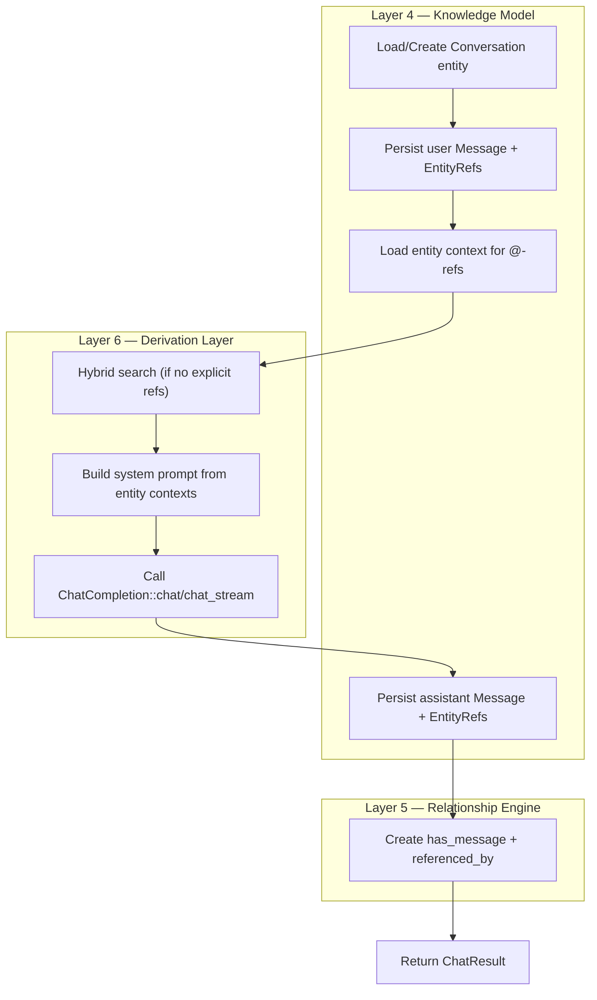

# ADR-0025: Chat Context Assembly as a Derivation Layer Pipeline

**Status:** Proposed
**Date:** 2026-07-29
**Deciders:** Core maintainers

## Context

The chat feature in PRD-0007 must answer user questions grounded in the user's knowledge graph. A user asks "what architecture does this paper propose?" and the system produces a response that cites the relevant entities. The LLM receives both the user's question and structured context assembled from the knowledge graph.

Three architectural patterns are possible for context assembly:

1. **Pre-compute and cache.** The system prompt for every possible (conversation, query) pair is pre-computed and stored. Queries hit a cache. The LLM is called with cached context.
2. **Store context as canonical.** Each message has a `SystemPrompt` component that records the exact text sent to the LLM. The prompt is part of the canonical record.
3. **Assemble on demand.** Each message triggers a derivation pipeline that loads the referenced entities, builds the system prompt, and passes it to the LLM. The prompt itself is never stored.

The architecture documents (data-model.md, pipeline.md) provide a clear principle: data that can be regenerated from canonical sources is derived; only data that cannot be regenerated is canonical. The system prompt for any (conversation, query) combination can be regenerated from the canonical `Message` entities and the canonical entities they reference. The user's question, the LLM's response, the entity references, the search index state, and the embedding model are all canonical or regenerable inputs. The system prompt is a function of these inputs.

The pipeline model also places retrieval and generation at specific layers: full-text search and vector similarity search are derivation-layer activities (Layer 6). Views render canonical and derived data (Layer 7). The chat pipeline is a derivation pipeline that produces an LLM call as its final step.

The chat must also handle streaming: the LLM produces tokens incrementally, and the user sees them as they arrive. Intermediate state ("Searching knowledge graph...", "Reading 3 entities...", "Generating response...") must be communicated to the frontend. The derivation pipeline emits status events during execution.

A subtle but important consideration: the response itself (the AI's text) is canonical — it cannot be regenerated. But the prompt that produced it is derived. The conversation record stores the response, the user's question, and the entity references. It does not store the prompt.

## Decision

The chat pipeline is a derivation-layer (Layer 6) pipeline. The system prompt is derived data, regenerable from canonical sources, and is never stored. The pipeline is implemented as `ChatPipeline` in `knowledge-derivation/src/features/chat/pipeline.rs`.

Step 4 (hybrid search) reuses the existing `SearchIndex` (FTS5 keyword) and `VectorStore` (cosine similarity) from ADR-0017. The fusion uses the same Reciprocal Rank Fusion logic as the standard semantic search. The result is a ranked list of entities with confidence scores.

Step 5 (system prompt construction) is deterministic. The prompt template is fixed and lives in `knowledge-derivation`. The template instructs the LLM to ground answers in provided entities, cite sources using numbered citations `[1]`, use `@EntityType:Title` for entity references, and refuse to fabricate facts not in the context. The template adapts based on whether explicit `@`-mentions were provided or implicit search was used (the `{{#has_context}}` / `{{^has_context}}` branches in the PRD template).

Step 6 (LLM call) uses the `ChatCompletion` port trait (ADR-0023). The trait is invoked with the assembled prompt, the message history, the response mode (`Fast` or `Thinking`), the source toggles (knowledge graph on/off, web search on/off), and the provider configuration.

The pipeline is a regular Rust struct, not a plugin. It is constructed at application startup with the concrete dependencies (`EntityRepository`, `ComponentRepository`, `RelationshipRepository`, `SearchIndex`, `VectorStore`, `Box<dyn ChatCompletion>`). It is held in `AppState` and called from Tauri IPC commands (`chat_send`, `chat_stream`).

The pipeline does not cache system prompts. Every call re-assembles the prompt from current canonical state. This ensures the response always reflects the latest entity state, even if a referenced entity was updated mid-conversation. The cost is repeated search and context loading per message. The cost is acceptable for chat workloads (one user, one conversation at a time).

The pipeline emits `ProcessingStatus` updates during execution: `Searching { detail: String }`, `ReadingEntities { count: u32 }`, `Generating`. These are propagated to the frontend through Tauri events (`chat:status`). The frontend renders them as animated status indicators.

Citation tracking is part of the system prompt and post-processing. The prompt instructs the LLM to use numbered citations `[1]`, `[2]`. After the response is received, the pipeline scans the response for citation markers and maps each to the corresponding entity from the context list. The `CitationSource` records the number, entity ID, entity type, title, and a snippet for the "View sources" footer.

The `EntityRefs` component on the AI's `Message` records every entity that the LLM cited, regardless of how it appeared in the response text. This enables graph queries like "which AI messages cited this paper?" without parsing the response.

### Layer Ownership

| Sub-feature | Layer | Rationale |
|---|---|---|
| Universal import | 1 | Import layer — receives external data |
| Chat completion trait | 4 | Knowledge model — port trait, framework-agnostic |
| Chat pipeline (RAG) | 6 | Derivation layer — assembles AI context from canonical entities |
| Chat view + UI | 7 | Presentation layer — renders the conversation |
| Conversation storage | 4 | Knowledge model — persists conversations and messages |
| Slash commands (`/`) | 7 | Presentation layer — UI affordance |

The trait belongs to the knowledge model layer (4) as a port definition. The pipeline belongs to the derivation layer (6) as it assembles derived artifacts (prompts, retrieval results). The view belongs to the presentation layer (7) as it renders the conversation.

### Fast vs Thinking Mode

The `ResponseMode` parameter controls the depth of context retrieval:

- **Fast** — fewer context retrievals, shorter system prompt, less reasoning depth. Uses top-k=3 from search, summarizes entity content to first 200 chars. Target: < 1s to first token.
- **Thinking** — full entity context, deeper reasoning, full citations. Uses top-k=10, includes complete entity content and relationships. Target: deeper, more accurate answers with full source attribution.

The mode is a per-request parameter. The pipeline implements both as the same retrieval path with different limits and prompt instructions.

### Source Toggles

`SourceToggles` controls which knowledge sources the LLM uses:

- `knowledge_graph: bool` — search and use entities from the user's knowledge graph (default: true)
- `web_search: bool` — search the web for additional context (default: false; web search provider is a future enhancement)

When `knowledge_graph` is false, the system prompt does not include entity context. The LLM responds from general knowledge only and does not produce citations (or produces citations to its training data, which are not navigable in the UI). The pipeline does not run search in this mode.

## Alternatives Considered

### Option 1: Pre-compute and cache system prompts

- Pros: Faster response time for repeated queries. Lower load on entity store and search index. Cache hits avoid search and context assembly.
- Cons: Cache invalidation is complex — every canonical change potentially invalidates cached prompts. The cache becomes a parallel source of truth that drifts from canonical state. The system must reconcile cache and canonical state on every access. Conversation-specific prompts are unique to each (user, conversation, query) tuple, so cache hit rate is low.
- Why not chosen: Cache invalidation cost exceeds the savings. The system prompt is fast to assemble from canonical state at chat scale.

### Option 2: Store system prompt as a canonical `SystemPrompt` component

- Pros: The exact prompt sent to the LLM is preserved. Auditable. Reproducible — the same prompt can be re-sent to the LLM to regenerate the same response (if the model is deterministic).
- Cons: Violates the canonical/derived distinction. The prompt can be regenerated from canonical sources. Storing it creates a second source of truth that can drift from canonical state. Auditing concerns are addressed by the canonical inputs (message text, entity references, model name) — the prompt itself is a deterministic function of these inputs.
- Why not chosen: Misclassifies derived data as canonical. The prompt is reproducible from canonical inputs. Storing it bloats the canonical model with redundant data.

### Option 3: Assemble system prompt on demand, no caching (chosen)

- Pros: The system prompt always reflects the latest canonical state. No cache invalidation. No drift between canonical and prompt. The pipeline is stateless with respect to derived artifacts — every call is a fresh derivation.
- Cons: Repeated search and context loading for every message. The cost is acceptable for chat scale (one user, one conversation at a time). Caching could be added as a future optimization if profiling shows the derivation is a bottleneck.
- Why chosen: The pipeline is consistent with the derivation-layer model. The system prompt is derived data; derived data is assembled on demand. The cost is bounded by chat workload characteristics.

### Option 4: Run search and LLM call inside the chat view component

- Pros: No pipeline layer between the UI and the providers. The view component is self-contained.
- Cons: Violates layer separation. The view is Layer 7; search is Layer 6. Moving search into the view breaks the architecture and prevents other consumers (REST API, MCP server) from using the same retrieval logic. Provider details leak into the UI.
- Why not chosen: The pipeline is the right architectural boundary. The view calls the pipeline; the pipeline calls the search index, vector store, and chat provider.

## Consequences

### Positive

- **Layer 6 owns retrieval and prompt assembly.** Search, embedding lookup, and system prompt construction live in the derivation layer where they belong. The presentation layer (chat view) calls the pipeline and renders results.
- **Pipeline is framework-agnostic.** The pipeline is a standalone Rust struct usable from Tauri commands, a future REST API, or a future MCP server. No coupling to the desktop framework.
- **Citations are accurate.** Citations are mapped from the response text to the context entity list, ensuring every `[1]` in the response corresponds to a real entity. The mapping is deterministic given the response and the context.
- **Fast/Thinking modes give users control.** Users can choose between speed and depth. The mode is a per-request parameter, not a global setting. The pipeline implements both as the same retrieval path with different limits.
- **Source toggles prevent unnecessary context.** When knowledge graph is off, the LLM responds from general knowledge and no context is loaded. This is useful for general-purpose questions and reduces token usage.
- **Re-running chat with updated entities produces updated responses.** A referenced entity is edited; the next chat call sees the updated state. No cache invalidation is needed.
- **Streaming status is observable.** The `ProcessingStatus` enum is part of the `ChatDelta` type. The frontend sees status changes as they occur, matching Claude.ai and Glean's tool-use visibility pattern.

### Negative

- **Search and context loading on every call.** Every message triggers a search and context assembly. For long conversations, the cost is repeated work for the same referenced entities. A future optimization could memoize the context assembly per (conversation, entity-set) tuple.
- **Token usage depends on retrieval depth.** Thinking mode loads top-k=10 entities with full content. A 10K-token response may consume 15-20K tokens of context. The context limit handling (F2.16) truncates oldest messages when approaching the limit.
- **Citation mapping is post-hoc.** The LLM is instructed to use citations, but the actual mapping of `[1]` to entities happens after the response is received. If the LLM uses citations inconsistently, some citations may be dropped. The pipeline tracks which entities were cited (via `EntityRefs` on the response Message) and lists them in the "View sources" footer even if the inline citation is missing.
- **No prompt versioning.** Different prompt template versions produce different responses. The pipeline does not record which template version was used. A future enhancement could add a `PromptVersion` field to `Message` provenance metadata.
- **Mode and toggle changes are not persisted.** Fast vs Thinking is a per-request setting. The user's preference is held in the frontend state, not in the conversation entity. A future PRD may add a `DefaultMode` to the Conversation entity.

### Risks

- **LLM hallucinates citations:** The LLM may use `[1]` even when entity 1 is not relevant to the statement. The pipeline cannot prevent this — it can only map the citation marker to the corresponding entity. The system prompt instructs the LLM to use citations only for supported statements. The feedback mechanism (F2.15) lets users report incorrect citations.
- **Search returns irrelevant entities:** The hybrid search may return entities that are not relevant to the user's question. The LLM may use them anyway. The system prompt instructs the LLM to use only the entities that are relevant. The user can disable the knowledge graph source toggle to fall back to general knowledge.
- **Context window exceeded:** A long conversation with extensive entity context may exceed the LLM's context window. The `ContextTooLong` error is returned. The frontend shows a "Continue conversation" button that summarizes old messages and continues (F2.16).
- **Streaming interruption:** Network failures mid-stream produce a partial response. The pipeline persists the partial response as a Message entity (with whatever was received before the interruption). The user sees a truncated response and can retry.
- **Provider unreachable:** OpenAI, Ollama, or LM Studio may be down. The `chat_test_provider` operation verifies reachability before first use. A failed test displays a clear error with setup instructions. The fallback is the MockChatAdapter for evaluation and demo.

## Related Decisions

- **ADR-0001:** Knowledge Model as Canonical Source of Truth — the pipeline reads from canonical entities and writes to canonical Message entities.
- **ADR-0004:** Event-Driven Derivation Pipeline — search and embedding updates are event-driven; the pipeline consumes the latest derived state.
- **ADR-0005:** Compiler-Inspired Architecture — the pipeline is a derivation-layer feature analogous to optimization in a compiler.
- **ADR-0017:** Semantic Search via Embeddings — the pipeline reuses `SearchIndex` and `VectorStore` for hybrid retrieval.
- **ADR-0023:** ChatCompletion Port Trait for LLM Provider Abstraction — the pipeline calls the trait to obtain AI responses.
- **ADR-0024:** Conversation and Message as Canonical Entities — the pipeline writes to Message entities and creates `has_message` and `referenced_by` relationships.
- **ADR-0028:** MCP-Compatible Service Architecture — the framework-agnostic pipeline enables future MCP exposure.

## References

- [PRD-0007](../../engineering/prds/prd-0007-knowledge-chat-and-universal-import.md) — Knowledge Chat and Universal Import
- [Domain Model](../domain-model.md) — Entity, relationship, and component types
- [Pipeline](../pipeline.md) — Seven-layer architecture; chat is a Layer 6 derivation pipeline
- [Data Model](../data-model.md) — Canonical vs derived data; system prompts are derived
- [Events](../events.md) — Event types and structure
