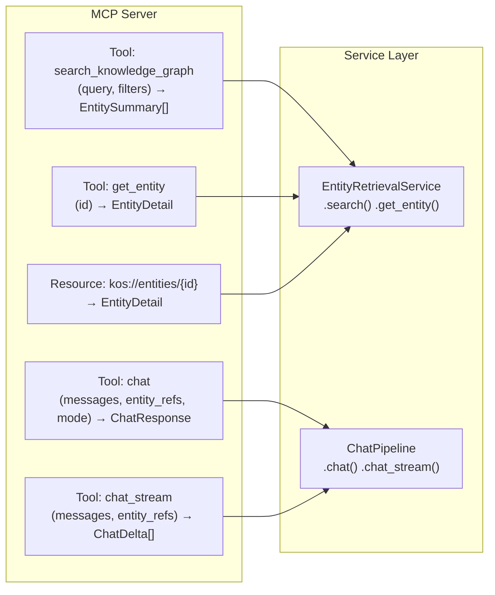
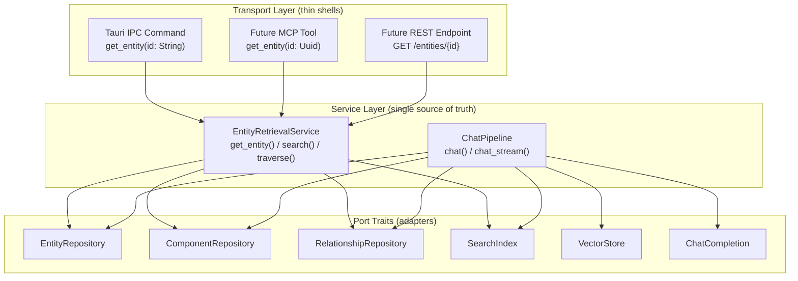

# ADR-0028: MCP-Compatible Service Architecture for Chat and Entity Retrieval

**Status:** Proposed
**Date:** 2026-07-29
**Deciders:** Core maintainers

## Context

The Model Context Protocol (MCP) is an emerging standard for exposing tools and resources to Large Language Models. An MCP server can be queried by external agents (Claude, GPT-4o, custom clients) to access structured data and perform actions. Knowledge OS is a knowledge engine; exposing its retrieval and chat capabilities through MCP would let any MCP-compatible agent reason over a user's knowledge graph.

PRD-0007 does not implement the MCP server, but it requires architectural compatibility. Two architectural patterns are possible for this:

1. **Tightly coupled to Tauri IPC.** The chat and entity retrieval code lives in the Tauri command layer (ADR-0022). The MCP server would be a separate, parallel implementation that re-creates the same logic.

2. **Framework-agnostic service layer.** The chat and entity retrieval logic lives in standalone Rust structs that can be invoked from any context: Tauri IPC commands, a future REST API, a future MCP server, a CLI command, a test harness.

The architecture documents (philosophy.md, extensibility.md) establish that core capabilities must be reusable across interfaces. The plugin system (ADR-0016) and storage adapters (ADR-0002) are framework-agnostic. The chat and entity retrieval must follow the same pattern or the system accumulates parallel implementations that drift.

Three concerns drive the architectural compatibility requirement:

- **Serializability.** The MCP transport is JSON-based. All chat and entity retrieval request/response types must derive `Serialize`/`Deserialize`. This is a constraint on type design.

- **Transport-agnostic service.** The `ChatPipeline` and `EntityRetrievalService` must be invocable without depending on Tauri's `State`, command macros, or webview. The service constructors take plain references to port traits.

- **Tool and resource exposure.** The MCP server exposes capabilities as "tools" (callable functions) and "resources" (addressable data). The chat pipeline and entity retrieval are the natural mapping: `search_knowledge_graph(query, filters)` is a tool, `get_entity(id)` is a tool, and `kos://entities/{id}` is a resource. The service layer must be designed so that this mapping is straightforward.

The PRD's F5 requirements specify the architectural compatibility:
- F5.1: `ChatCompletion` trait must be exposed as a reusable service.
- F5.2: Entity retrieval and search must be callable from a shared service layer.
- F5.3: Chat request/response types must be serializable for MCP transport.
- F5.4: The MCP server (future) will expose `search_knowledge_graph` and `get_entity` as tools and `kos://entities/{id}` as a resource.

## Decision

A framework-agnostic service layer is established for chat and entity retrieval. Two services are extracted as standalone Rust structs:

- `ChatPipeline` (in `knowledge-derivation/src/features/chat/pipeline.rs`) — assembles AI context, calls the LLM, persists conversation. Constructed with `Arc<dyn EntityRepository>`, `Arc<dyn ComponentRepository>`, `Arc<dyn RelationshipRepository>`, `Arc<dyn SearchIndex>`, `Arc<dyn VectorStore>`, and `Box<dyn ChatCompletion>`. No Tauri dependency.

- `EntityRetrievalService` (new, in `knowledge-core/src/services/entity_retrieval.rs`) — loads entities, components, and relationships for a set of entity IDs. Constructed with `Arc<dyn EntityRepository>`, `Arc<dyn ComponentRepository>`, and `Arc<dyn RelationshipRepository>`. No Tauri dependency.

The services are held in `AppState` (alongside the storage) and invoked from Tauri IPC commands. The same services are invocable from a future REST API, a future MCP server, a CLI command, or a test harness.

### EntityRetrievalService

```rust
pub struct EntityRetrievalService {
    entity_repo: Arc<dyn EntityRepository>,
    component_repo: Arc<dyn ComponentRepository>,
    relationship_repo: Arc<dyn RelationshipRepository>,
}

impl EntityRetrievalService {
    pub fn new(
        entity_repo: Arc<dyn EntityRepository>,
        component_repo: Arc<dyn ComponentRepository>,
        relationship_repo: Arc<dyn RelationshipRepository>,
    ) -> Self;

    /// Load a single entity with all its components and relationships.
    pub async fn get_entity(
        &self,
        entity_id: Uuid,
    ) -> Result<EntityDetail, RetrievalError>;

    /// Load multiple entities (batch).
    pub async fn get_entities(
        &self,
        entity_ids: &[Uuid],
    ) -> Result<Vec<EntityDetail>, RetrievalError>;

    /// Search entities by keyword with optional type and tag filters.
    pub async fn search(
        &self,
        query: &str,
        filter: &RetrievalFilter,
    ) -> Result<Vec<EntitySummary>, RetrievalError>;

    /// Traverse the relationship graph from a start entity.
    pub async fn traverse(
        &self,
        start: Uuid,
        max_depth: u32,
    ) -> Result<TraversalResult, RetrievalError>;
}

pub struct RetrievalFilter {
    pub entity_types: Option<Vec<String>>,
    pub tags: Option<Vec<String>>,
    pub limit: Option<usize>,
}

pub struct EntitySummary {
    pub id: Uuid,
    pub entity_type: String,
    pub title: String,
    pub preview: String,
    pub tags: Vec<String>,
    pub updated_at: DateTime<Utc>,
}

pub struct EntityDetail {
    pub id: Uuid,
    pub entity_type: String,
    pub components: BTreeMap<String, serde_json::Value>,
    pub relationships: Vec<RelationshipSummary>,
    pub events: Vec<EventSummary>,
    pub version: u64,
    pub created_at: DateTime<Utc>,
    pub updated_at: DateTime<Utc>,
}
```

The `EntityRetrievalService` is a coordinator that calls the existing port traits. It does not implement new queries. It composes the existing primitives into a service interface suitable for chat context assembly, MCP tool exposure, and REST API endpoints.

The service's request/response types derive `Serialize`/`Deserialize`. The types are domain-level — they do not expose storage internals (no SQL, no row IDs, no adapter-specific fields).

### Chat Service Reuse

The `ChatPipeline` (ADR-0025) is already framework-agnostic — it is a standalone struct with port trait dependencies. ADR-0023 establishes that all chat types derive `Serialize`/`Deserialize`. The Tauri IPC commands (`chat_send`, `chat_stream`, `chat_search_entities`, `chat_list_conversations`, `chat_delete_conversation`, `chat_rename_conversation`, `chat_stop_stream`, `chat_send_feedback`) are thin wrappers (ADR-0022) that call the `ChatPipeline` and the `EntityRetrievalService`.

The future MCP server will expose the same `ChatPipeline` and `EntityRetrievalService` as MCP tools and resources:



The mapping from MCP tool to Rust service is one-to-one. The MCP server translates the JSON-RPC request into a Rust call and returns the result as JSON. No logic duplication is required.

### Service Constructor Pattern

Both services are constructed at application startup with the same dependency injection pattern. The Tauri command layer adds no behavior — it acquires the service from `AppState` and calls the method. A future REST API or MCP server does the same:



```rust
let entity_retrieval = EntityRetrievalService::new(
    state.entity_repo.clone(),
    state.component_repo.clone(),
    state.relationship_repo.clone(),
);

let chat_pipeline = ChatPipeline::new(
    state.entity_repo.clone(),
    state.component_repo.clone(),
    state.relationship_repo.clone(),
    state.search_index.clone(),
    state.vector_store.clone(),
    state.chat_provider.clone(),
);

// Tauri command
async fn get_entity(id: String) -> Result<EntityDetail, String> {
    state.entity_retrieval.get_entity(Uuid::parse_str(&id)?).await.map_err(|e| e.to_string())
}

// Future MCP tool
async fn get_entity_tool(id: String) -> Result<EntityDetail, McpError> {
    state.entity_retrieval.get_entity(Uuid::parse_str(&id)?).await.map_err(McpError::from)
}

// Future REST endpoint
async fn get_entity_endpoint(Path(id): Path<String>) -> Result<Json<EntityDetail>, ApiError> {
    Ok(Json(state.entity_retrieval.get_entity(Uuid::parse_str(&id)?).await?))
}
```

The service is the single source of business logic. The transport is a thin shell.

### Type Design Constraints

All service request/response types are designed to be JSON-friendly:

- No internal pointers or references. All data is owned (`String`, `Vec<T>`, `Uuid`, `DateTime<Utc>`).
- Enums use `#[serde(rename_all = "snake_case")]` or `#[serde(tag = "kind")]` for stable wire formats.
- Optional fields use `Option<T>`, not sentinel values.
- Recursive types (e.g., graph traversal results) are bounded by depth limits to prevent unbounded serialization.
- Field naming follows the Rust convention (`snake_case`); the JSON wire format is also `snake_case` (matching the existing port trait conventions).

The types are designed to be the stable wire contract. Changes to the types are versioned (a future `v2` module path) to preserve backward compatibility for MCP clients.

### MCP Server as Future PRD

The MCP server implementation is a separate, future PRD. This ADR establishes the architectural compatibility — the service layer is designed so that the MCP server can be added without modifying the chat pipeline, entity retrieval, or domain model. The future PRD will define the MCP tool and resource schemas, the JSON-RPC transport, the authentication model, and the deployment topology.

## Alternatives Considered

### Option 1: Tauri-coupled implementation, MCP server as separate parallel implementation

- Pros: The Tauri implementation is simple. The MCP server can be designed independently without constraints from the Tauri architecture.
- Cons: Two parallel implementations of chat and entity retrieval. Logic duplication. Drift between implementations as one is updated and the other is not. The MCP server must re-implement the entire context assembly, search integration, and conversation persistence.
- Why not chosen: The architecture explicitly requires core capabilities to be reusable across interfaces. Two parallel implementations violate this principle and create ongoing maintenance burden.

### Option 2: REST API as the only service layer, MCP as a thin wrapper

- Pros: A REST API is a well-understood interface. The MCP server calls the REST API endpoints. Single source of truth.
- Cons: The REST API introduces HTTP overhead (latency, serialization, transport security) for what is otherwise an in-process call from the Tauri command. The chat pipeline cannot stream responses through a request-response REST API — it requires server-sent events or WebSockets. The REST API also requires authentication, rate limiting, and deployment topology decisions that are not relevant to the desktop app.
- Why not chosen: The REST API is a future enhancement, not a current requirement. The service layer is a Rust trait/struct that any transport can wrap. Adding a REST API in between adds latency and complexity without benefit for the in-process desktop use case.

### Option 3: WebAssembly-based plugin runtime for the service layer

- Pros: Sandboxed execution, language-agnostic. A MCP server written in JavaScript or Python could be embedded in the desktop app.
- Cons: The chat pipeline is already a Rust struct. A WASM runtime would add another execution context for the same logic. WASM sandboxing is not needed because the service is part of the trusted core.
- Why not chosen: The service is core functionality, not a plugin. It runs in the trusted process. WASM sandboxing is appropriate for untrusted plugins, not for core services.

### Option 4: Framework-agnostic service layer with serializable types (chosen)

- Pros: Single source of truth for chat and entity retrieval logic. Tauri commands, future REST API, future MCP server, CLI commands, and test harnesses all call the same service. No logic duplication. The service is the architectural boundary; the transport is replaceable.
- Cons: The service must be designed with no Tauri or webview dependencies. This requires discipline — the service cannot use `tauri::State`, command macros, or event types. The service's types must derive `Serialize`/`Deserialize` from the start, which constrains the design.
- Why chosen: The service layer is the right architectural boundary. The chat pipeline and entity retrieval are core capabilities. Tauri is the transport for the desktop app; the service is independent of any transport. Future transports (REST, MCP, gRPC) wrap the service.

## Consequences

### Positive

- **Single source of truth.** Chat and entity retrieval logic exists once. Updates to the chat pipeline or entity retrieval propagate to all transports (Tauri, future REST, future MCP) automatically.
- **Tauri command layer is thin.** The IPC commands are pure delegation. They acquire the service from `AppState` and call the method. No business logic in commands (ADR-0022 principle).
- **MCP server is a future addition without service changes.** The MCP server translates JSON-RPC requests into Rust service calls. The service is the same code path used by the Tauri commands.
- **REST API is a future addition without service changes.** The REST API translates HTTP requests into Rust service calls. Streaming responses use server-sent events backed by the same `ChatDelta` stream.
- **Testable services.** The `ChatPipeline` and `EntityRetrievalService` are testable with mock port traits. No Tauri runtime or webview is required. The services can be unit-tested in isolation.
- **Service types are wire-compatible.** All request/response types derive `Serialize`/`Deserialize`. The JSON wire format is stable. The same types cross the Rust-TypeScript boundary (Tauri IPC) and the Rust-JSON-RPC boundary (MCP).
- **Backward compatibility through versioning.** When the service types evolve, a new `v2` module path is added. The original types continue to work. MCP clients and REST clients can migrate at their own pace.

### Negative

- **Type design constraints.** All service types must be JSON-friendly. Internal pointers, lazy values, and adapter-specific types are excluded. The constraint is mild for most types but may force choices (e.g., representing a graph as a flat list of nodes and edges rather than a recursive structure).
- **Service interface stability.** Once the MCP server and REST API are built on the service interface, changes to the service have broader impact. The service becomes a stable contract, versioned independently of the application.
- **No Tauri-specific features in the service.** Streaming through Tauri events (`chat:status`, `chat:delta`) is a transport concern. The service emits `ChatDelta` values; the transport decides how to deliver them. A non-Tauri consumer (CLI, MCP) must implement its own delivery mechanism.
- **EntityRetrievalService is a new layer.** The service adds a coordinator between the Tauri commands and the port traits. The layer is thin but it is a new abstraction that must be maintained.

### Risks

- **Type evolution breaks MCP clients:** A breaking change to a service type affects all consumers. Mitigation: type versioning through module paths. The `v1` types are frozen; new features go into `v2` types. MCP clients opt in to the new version.
- **Service construction is manual:** Each consumer (Tauri, future REST, future MCP) must construct the service with the right dependencies. A future enhancement could provide a `ServiceBuilder` that wires up all services from a single configuration.
- **Service abstraction leaks storage details:** If the service's response types expose SQL row IDs or adapter-specific fields, the abstraction fails. Mitigation: the service types are domain-level (EntitySummary, EntityDetail). Storage internals never appear in service responses.
- **MCP server scope creep:** The future MCP server may be tempted to add capabilities that are not yet in the service. Each new capability should be added to the service first, then exposed via MCP. The service remains the source of truth.
- **Streaming protocol differences:** Tauri events, server-sent events, and MCP streaming all have different transport semantics. The service emits `ChatDelta` values uniformly; each transport maps them to its native streaming primitive. The mapping is transport-specific code, not service code.

## Related Decisions

- **ADR-0001:** Knowledge Model as Canonical Source of Truth — the service reads from canonical entities and writes to canonical entities.
- **ADR-0002:** Storage Independence via Adapter Pattern — the service uses port traits, not concrete adapters. The service is storage-independent.
- **ADR-0016:** Plugin System Architecture — the service layer is part of the trusted core, not the plugin layer. Plugins extend the service but do not replace it.
- **ADR-0021:** Tauri as Desktop Application Framework — the Tauri commands are one consumer of the service. The service is framework-agnostic.
- **ADR-0022:** Stateless Tauri IPC Bridge — the Tauri IPC commands are thin wrappers around the service. The principle extends to future REST and MCP servers.
- **ADR-0023:** ChatCompletion Port Trait for LLM Provider Abstraction — the `ChatCompletion` trait is invoked by the `ChatPipeline` service.
- **ADR-0024:** Conversation and Message as Canonical Entities — the `ChatPipeline` writes to canonical Message entities.
- **ADR-0025:** Chat Context Assembly as a Derivation Layer Pipeline — the pipeline's framework-agnostic nature is what enables MCP exposure.

## References

- [PRD-0007](../../engineering/prds/prd-0007-knowledge-chat-and-universal-import.md) — Knowledge Chat and Universal Import (F5)
- [Anthropic. "Model Context Protocol (MCP)" (2025)](https://modelcontextprotocol.io/) — Reference for the MCP standard
- [Domain Model](../domain-model.md) — Entity, relationship, and component types
- [Pipeline](../pipeline.md) — Seven-layer architecture; service layer sits between presentation and derivation
- [Extensibility](../extensibility.md) — Plugin system and extension points
