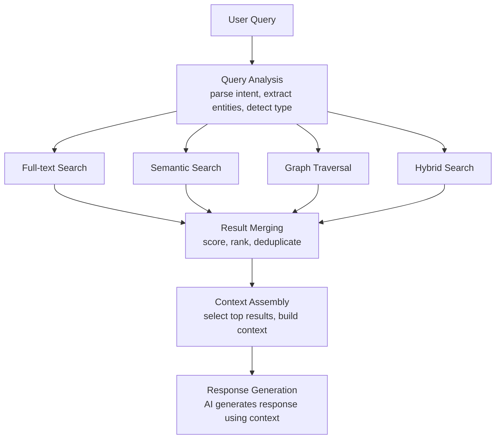

# Artificial Intelligence

> AI is an engine, not the source of truth. AI performs extraction, classification, summarization, and inference. Every AI output is reviewable, versioned, and replaceable.

---

## AI Principles

Knowledge OS integrates artificial intelligence as a foundational system component. These principles govern every AI interaction:

1. **AI assists. AI does not define.** AI performs tasks that augment knowledge construction. AI does not own the knowledge model. The canonical model is the source of truth.

2. **AI outputs are derived data.** Every AI-generated artifact -- entity suggestions, relationship inferences, classifications, summaries, embeddings -- is derived. It may be discarded and regenerated.

3. **AI outputs are reviewable.** Every AI output is presented to a human before becoming canonical. The system marks AI-generated data with its provenance: which model produced it, when, and with what confidence.

4. **AI outputs are versioned.** When the underlying model changes, AI outputs are recomputed. The system tracks which model version produced which output.

5. **AI is model-independent.** The architecture never depends on a specific AI model, provider, or API. AI providers are adapters. Replacing one provider never changes the domain model.

6. **AI is explainable.** When AI makes a classification, inference, or recommendation, the system demands an explanation. Black-box outputs are flagged for review.

7. **AI has boundaries.** AI does not perform actions without human approval. AI suggests. Humans decide.

---

## Context Construction

Before any AI operation, the system constructs context. Context is the information assembled for a specific interaction, query, or AI task.

### Context Components

Context is built from canonical data:

- **Target entity.** The entity the AI operation concerns.
- **Related entities.** Entities connected through relationships (1-3 hops).
- **Components.** Relevant components of the target and related entities.
- **Graph neighborhood.** The local subgraph surrounding the target.
- **User query.** The natural language question or instruction.
- **Conversation history.** Previous turns in an ongoing interaction (if applicable).

### Context Assembly Rules

1. **Context is derived from canonical data.** Context is never fabricated. It is assembled from entities, components, and relationships.
2. **Context is bounded.** Context size is limited by the AI model's context window. The system selects the most relevant information within the budget.
3. **Context is auditable.** Every context assembly records which entities, components, and relationships were included.
4. **Context is reproducible.** Given the same inputs, the system produces the same context.

### Context Ranking

When context must be selected from a larger set than the model can consume, the system ranks by:

- **Relationship proximity.** Entities closer to the target in the graph rank higher.
- **Relationship type.** Some relationship types indicate stronger relevance (`implements` ranks higher than `related_to`).
- **Recency.** More recently modified entities rank higher.
- **User relevance.** Entities the user has recently interacted with rank higher.

---

## Knowledge Retrieval

Knowledge retrieval is the process of finding relevant entities for a given query. It replaces traditional search with entity-aware retrieval.

### Retrieval Modes

The system supports multiple retrieval modes, each optimized for different query types:

**Full-text retrieval.** Matches query terms against indexed text fields (titles, descriptions, content). Returns entities with matching text. Optimized for exact and near-exact matches.

**Semantic retrieval.** Computes vector similarity between the query embedding and entity embeddings. Returns entities with similar meaning. Optimized for conceptual queries.

**Graph traversal.** Follows relationships from a starting entity. Returns entities connected through the knowledge graph. Optimized for relational queries.

**Hybrid retrieval.** Combines full-text, semantic, and graph retrieval. Merges results using a scoring function that balances text relevance, semantic similarity, and graph proximity.

### Retrieval Pipeline



### Retrieval Rules

1. **Retrieval never modifies canonical data.** Retrieval is a read operation. It queries the knowledge graph without changing it.
2. **Retrieval is auditable.** Every retrieval records which mode was used, what query was issued, and what results were returned.
3. **Retrieval is explainable.** Every result includes the reason it was retrieved: which mode found it, what score it received, and what relationships connect it to the query.

---

## Reasoning

Reasoning is the process of drawing conclusions from the knowledge graph. AI performs reasoning as a derivation, not as a fact.

### Reasoning Types

**Entity reasoning.** Given a query about an entity, the AI assembles information from the entity's components and relationships to construct an answer.

```
Query: "What is the relationship between transformers and attention mechanisms?"
Reasoning:
  1. Retrieve Concept("transformers")
  2. Retrieve Concept("attention mechanisms")
  3. Traverse relationships between them
  4. Find: transformers implements attention, attention is a core concept
  5. Synthesize answer from component content and relationships
```

**Comparative reasoning.** Given two or more entities, the AI compares their components, relationships, and properties.

```
Query: "How do PyTorch and TensorFlow differ?"
Reasoning:
  1. Retrieve Tool("PyTorch"), Tool("TensorFlow")
  2. Compare components: tags, descriptions, authors, timelines
  3. Compare relationships: what each implements, depends on, extends
  4. Synthesize comparison from structural differences
```

**Causal reasoning.** Given a chain of relationships, the AI traces causation or influence through the graph.

```
Query: "Why did the project switch from Python to Rust?"
Reasoning:
  1. Retrieve Project("the project")
  2. Traverse: depends_on, implements, inspired_by
  3. Find Decision("use Rust")
  4. Trace: Decision inspired_by PerformanceConcern
  5. Synthesize causal chain from relationship sequence
```

### Reasoning Rules

1. **Reasoning cites sources.** Every claim in an AI response references the entity, component, or relationship it was derived from.
2. **Reasoning distinguishes fact from inference.** Explicitly stated information is labeled as canonical. AI-inferred conclusions are labeled as derived.
3. **Reasoning is bounded.** The system limits the depth of reasoning to prevent hallucination cascades.
4. **Reasoning is reproducible.** Given the same context, the system produces the same reasoning chain.

---

## Planning

Planning is the process of decomposing a complex query or task into a sequence of retrieval and reasoning steps.

### Planning Model

The AI planner receives a query and produces a plan:

```
Query: "Create a learning path from zero knowledge to building a transformer model"
Plan:
  1. Retrieve prerequisite concepts (linear algebra, calculus, probability)
  2. Retrieve foundational concepts (neural networks, backpropagation)
  3. Retrieve intermediate concepts (attention mechanisms, positional encoding)
  4. Retrieve target concept (transformers)
  5. Order concepts by dependency relationships
  6. Attach learning resources (papers, videos, tutorials) to each concept
  7. Generate ordered sequence with dependencies
```

### Planning Rules

1. **Plans are derived.** A plan is a projection of the knowledge graph optimized for a specific goal.
2. **Plans are reviewable.** Every plan is presented to the user before execution.
3. **Plans reference canonical data.** Every step in a plan references an entity in the knowledge graph.
4. **Plans are adjustable.** Users may modify plans. Modifications are applied as manual overrides.

---

## Automation

Automation allows AI to perform tasks within the knowledge system without direct human intervention for each operation. Automation is bounded by explicit rules.

### Automation Capabilities

- **Import automation.** Automatically import from configured sources on a schedule.
- **Classification automation.** Automatically classify imported entities by type and tags.
- **Relationship extraction automation.** Automatically extract relationships from imported content.
- **Summarization automation.** Automatically generate summaries for entities without Description components.
- **Embedding automation.** Automatically generate embeddings for entities with Content components.

### Automation Rules

1. **Automation is opt-in.** No automation runs unless explicitly configured.
2. **Automation is auditable.** Every automated action is logged with its trigger, input, output, and model version.
3. **Automation has limits.** Automation never creates canonical entities without human review. Automation may create draft entities flagged for review.
4. **Automation is stoppable.** Any automation may be paused or stopped at any time.
5. **Automation is replaceable.** Automation providers are adapters. Replacing one provider never changes the automation rules.

---

## Agents

Agents are AI-powered components that perform autonomous tasks within the knowledge system. Agents differ from automation in that agents make decisions, while automation follows rules.

### Agent Capabilities

- **Research agent.** Given a topic, the agent retrieves relevant entities, identifies gaps in knowledge, and suggests entities to import.
- **Organization agent.** The agent suggests entity classifications, relationship types, and tag assignments.
- **Curation agent.** The agent identifies outdated entities, suggests updates, and recommends archiving.
- **Discovery agent.** The agent finds connections between distant parts of the knowledge graph.

### Agent Rules

1. **Agents suggest. Agents do not execute.** Agent outputs are presented as proposals. A human approves or rejects each proposal.
2. **Agents are scoped.** Each agent operates within a defined scope: specific entity types, relationship types, or graph regions.
3. **Agents are auditable.** Every agent action is logged: what was proposed, what was approved, what was rejected.
4. **Agents are replaceable.** Agent implementations are adapters. Replacing an agent never changes the knowledge model.
5. **Agents have budgets.** Each agent has resource limits: maximum entities processed, maximum context size, maximum execution time.

---

## Human Collaboration

AI and humans collaborate through a defined interaction model.

### Interaction Patterns

**Human initiates, AI responds.** The user asks a question. AI retrieves context, reasons over the knowledge graph, and generates a response.

```
User: "What papers influenced the transformer architecture?"
AI: [retrieves relevant entities, traverses relationships, synthesizes answer]
```

**AI suggests, human decides.** AI proposes an action (classify an entity, create a relationship, generate a summary). The user approves or rejects.

```
AI: "I suggest classifying 'GPT-4' as a Tool entity with tags [language model, transformer, OpenAI]. Approve?"
User: "Approve, but add tag [generative AI]"
```

**AI monitors, human reviews.** AI continuously monitors the knowledge graph for issues (outdated entities, missing relationships, classification conflicts). Reports are generated for human review.

```
AI Report: "3 entities have conflicting classifications. 12 entities lack summaries. 5 relationships have confidence below 0.5."
User: [reviews and resolves each issue]
```

### Collaboration Rules

1. **Humans have final authority.** AI never overrides a human decision.
2. **AI explains its reasoning.** Every AI suggestion includes an explanation of why it was made.
3. **Humans can override AI.** Manual changes to AI-generated data are preserved and never overwritten by automation.
4. **AI respects scope.** AI operates within the boundaries defined by the user or the system configuration.

---

## Explainability

Every AI output in Knowledge OS is explainable. The system demands transparency in AI operations.

### Explainability Requirements

**Provenance.** Every AI output records:
- Which model produced it (provider, model name, version)
- When it was produced (timestamp)
- What context was used (entities, components, relationships)
- What confidence the model assigned

**Reasoning chain.** For complex operations (reasoning, planning), the system records the step-by-step process:
- What entities were retrieved
- What relationships were traversed
- What conclusions were drawn
- What evidence supports each conclusion

**Comparison.** When AI suggests a classification or relationship, the system shows:
- What alternatives were considered
- Why the suggested option was preferred
- What evidence distinguishes it from alternatives

### Explainability Rules

1. **No unexplainable outputs.** If the system cannot explain an AI output, the output is flagged for human review.
2. **Explanations are stored.** Explanations are attached to AI outputs as metadata. They persist across model updates.
3. **Explanations are queryable.** Users may ask "why was this classified as X?" and receive the full reasoning chain.

---

## AI Integration Points

AI is integrated at specific points in the pipeline:

| Pipeline Stage          | AI Operation                             | Output             |
| ----------------------- | ---------------------------------------- | ------------------ |
| **Import**              | Content extraction, format detection     | Parsed content     |
| **Normalization**       | Entity resolution, duplicate detection   | Canonical entities |
| **Knowledge Model**     | Classification, tagging                  | Entity metadata    |
| **Relationship Engine** | Relationship extraction, inference       | Relationships      |
| **Derivation**          | Embedding generation, summarization      | Derived artifacts  |
| **Presentation**        | Query understanding, response generation | Rendered responses |

At each stage, AI operates as a component within the pipeline. AI does not bypass the pipeline. AI does not access storage directly. AI produces derived data that flows through the same event-driven mechanisms as all other derived data.

---

## Further Reading

- [Philosophy](../philosophy/philosophy.md) -- AI as an immutable principle
- [Pipeline](pipeline.md) -- How AI fits in the seven-layer architecture
- [Events](events.md) -- How AI outputs propagate through the system
- [Data Model](data-model.md) -- AI outputs as derived data
- [Composition](composition.md) -- How AI components attach to entities
