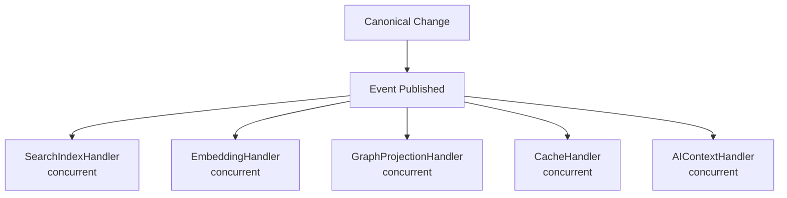
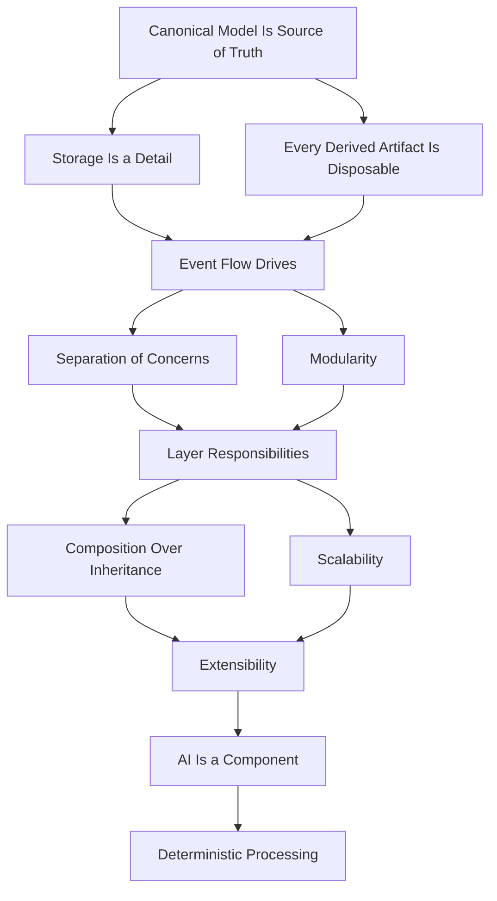

# Architectural Principles

> Architectural invariants independent of technology. These principles govern every design decision. They are never violated, regardless of implementation.

---

## Purpose

This document defines the architectural invariants of the Knowledge Operating System. Every feature, every storage decision, every pipeline stage, and every plugin is validated against these principles.

These principles are technology-independent. They remain valid whether the system is implemented in Rust, Go, or any future language. They remain valid whether the storage engine is SQLite, PostgreSQL, or a technology that does not yet exist.

Architectural principles are distinct from design principles. Design principles describe how code is written. Architectural principles describe how the system is structured. Both are immutable. This document covers architectural principles.

---

## 1. The Canonical Model Is the Source of Truth

The knowledge model represents reality independently of storage technology. Every entity, relationship, component, artifact, and capability is represented within the canonical model. All other representations are derived. Derived data may be regenerated at any time.

This is the most important architectural principle. Every other principle follows from it.

**What this means:**

- The canonical model is the only data that cannot be regenerated. If the search index is lost, rebuild it. If the embedding store is lost, recompute it. If the canonical model is lost, knowledge is lost.
- The canonical model is not a database table. It is a logical representation that may span multiple storage engines.
- The canonical model is not a file format. It is a runtime representation that exists independently of how it is persisted.
- The canonical model is not an API response. It is the internal representation from which API responses are derived.

**Implications for design:**

- Every new entity type must be representable within the canonical model.
- Every new relationship type must be representable within the canonical model.
- Every new component type must be representable within the canonical model.
- No derived artifact may contain information that cannot be recovered from the canonical model.

**See also:** [Canonical Data](../reference/glossary.md#canonical-data), [Knowledge Model](../reference/glossary.md#knowledge-model), [ADR-0001](adrs/adr-0001.md)

---

## 2. Storage Is an Implementation Detail

No storage engine defines the knowledge model. The application owns the knowledge model. Storage technologies exist to optimize specific access patterns. Replacing one implementation never changes the architecture.

**What this means:**

- The domain model depends on storage interfaces, never on storage implementations.
- SQLite may be replaced by PostgreSQL. Tantivy may be replaced by Elasticsearch. Qdrant may be replaced by Milvus. The domain model, the pipeline, and all business logic remain unchanged.
- Storage engines are adapters. They implement a common interface. The application calls the interface, never the implementation.
- Canonical data is persisted through storage engines. Derived data is persisted through storage engines. But neither canonical nor derived data is defined by storage engines.

**Storage categories and their roles:**

| Category | Role | Canonical? |
|----------|------|-----------|
| Object Storage | Large binary artifacts | Yes |
| Relational Storage | Structured data, metadata, transactions | Yes |
| Graph Storage | Relationship traversal | No (derived projection) |
| Search Storage | Full-text retrieval | No (derived projection) |
| Vector Storage | Semantic retrieval | No (derived projection) |
| Cache Storage | Performance optimization | No (derived projection) |

**Implications for design:**

- New storage engines are added as plugins. No core code changes.
- Storage adapter interfaces are versioned. Breaking changes follow the deprecation policy.
- Cross-engine consistency is managed through events, not through transactions.

**See also:** [Storage](storage.md), [Adapter](../reference/glossary.md#adapter), [ADR-0002](adrs/adr-0002.md)

---

## 3. Every Derived Artifact Is Disposable

Search indexes, embeddings, recommendations, similarity graphs, caches -- all may be discarded and reconstructed from canonical data. No derived representation becomes the source of truth.

**What this means:**

- Derived data is computed from canonical data. It is a function of canonical data. Given the same canonical data, the same derived data is produced.
- Derived data is not protected with the same durability guarantees as canonical data. Derived data may be rebuilt. Canonical data cannot.
- Derived data may become stale. Staleness is an acceptable trade-off for performance and scalability. The system converges to consistency through event-driven processing.
- Derived data may contain errors. Errors in derived data are corrected by rebuilding from canonical data, not by patching the derived data.

**The compiler analogy:**

This mirrors the relationship between source code and compiled artifacts. Source code is the source of truth. Object files are derived. If you lose the object files, you recompile. If you lose the search index, you rebuild it.

| Compiler Concept | Knowledge OS Equivalent |
|------------------|------------------------|
| Source code | Canonical entities, relationships, components |
| Intermediate representation | Normalized knowledge model |
| Compiled artifacts | Search indexes, embeddings, graphs |
| Executable | Rendered views |
| Object files | Cached projections |

**Implications for design:**

- Every derived artifact must have a regeneration path from canonical data.
- Every derived artifact must be identifiable as derived, never as canonical.
- Regeneration must be idempotent. Rebuilding the same derived data twice produces the same result.
- Regeneration must be auditable. The system records when and why derived data was rebuilt.

**See also:** [Derived Data](../reference/glossary.md#derived-data), [Data Model](data-model.md), [Compilation](compilation.md)

---

## 4. Event Flow Drives the System

Every meaningful modification to canonical data emits an event. Events trigger asynchronous processing through the derivation pipeline. Each derived artifact is updated by an independent event handler. Handlers are idempotent and isolated.

**What this means:**

- Canonical data changes are committed atomically. Events are published after the canonical change succeeds.
- Derived data is updated asynchronously. There is a window between canonical change and derived update where views may show stale data.
- Each event handler is independent. A failure in one handler does not affect other handlers or canonical data.
- Events are durable and replayable. The system can rebuild all derived data by replaying events from the beginning.

**Event flow architecture:**



**Rules:**

1. Events are the only mechanism for propagating canonical changes to derived data.
2. Events are ordered per entity. Cross-entity ordering is eventually consistent.
3. Events are idempotent. Processing the same event twice produces the same result.
4. Failed events are retried with exponential backoff. Events that fail permanently are moved to a dead letter queue.

**Implications for design:**

- Every feature that modifies canonical data must emit events.
- Every feature that reads derived data must tolerate staleness.
- Every event handler must be idempotent and isolated.
- Event schemas are versioned and never restructured.

**See also:** [Events](events.md), [Event](../reference/glossary.md#event), [Synchronization](synchronization.md), [ADR-0004](adrs/adr-0004.md)

---

## 5. Separation of Concerns

The system is organized into independent layers. Each layer has one responsibility. Each layer communicates through explicit contracts. No layer bypasses another.

**What this means:**

- The import layer handles external formats. It does not perform business logic.
- The parsing layer extracts structure. It does not interpret meaning.
- The normalization layer resolves entities. It does not store data.
- The knowledge model layer manages canonical data. It does not derive data.
- The relationship engine manages edges. It does not render views.
- The derivation layer generates projections. It does not own canonical data.
- The presentation layer renders views. It does not modify canonical data.

**Layer communication:**

```
Layer N  --[Contract]-->  Layer N+1
```

Each layer receives input through a defined interface and produces output through a defined interface. A layer does not access the internal state of another layer.

**Benefits:**

- Independent replacement. Any layer may be replaced without affecting others.
- Compositional testing. Each layer can be tested in isolation.
- Clear ownership. Every feature belongs to exactly one layer.
- Reduced coupling. Changes in one layer do not cascade to others.

**Implications for design:**

- Every feature must identify which layer owns it.
- No layer may bypass another layer. The import layer does not write to the search index. The presentation layer does not write to the canonical model.
- Layer contracts are versioned. Breaking changes follow the deprecation policy.

**See also:** [Pipeline](pipeline.md), [Layer Responsibilities](#6-layer-responsibilities)

---

## 6. Layer Responsibilities

Each layer of the pipeline has exactly one responsibility. Understanding these responsibilities is essential for placing features correctly.

| Layer | Responsibility | Owns | Does Not Own |
|-------|---------------|------|-------------|
| **Import** | Receive information from external systems | Format detection, extraction, transformation | Business logic, entity resolution |
| **Parsing** | Extract structured information | Syntactic analysis, metadata extraction | Semantic interpretation, entity creation |
| **Normalization** | Convert to canonical representations | Entity identification, duplicate detection, identity resolution | Storage, derived data generation |
| **Knowledge Model** | Store and manage canonical entities | Entity lifecycle, component attachment, versioning | Derived data, view rendering |
| **Relationship Engine** | Connect entities through typed edges | Relationship creation, traversal, versioning | Entity creation, view rendering |
| **Derivation** | Generate derived representations | Search indexes, embeddings, recommendations, caches | Canonical data, view rendering |
| **Presentation** | Render projections for interfaces | View rendering, navigation, context assembly | Canonical data modification, derived data generation |

**Rules:**

1. Each layer processes input and produces output. No layer retains state beyond its responsibility.
2. Layers are independent. Replacing one layer does not affect others.
3. New layers may be inserted between existing layers. The pipeline is extensible.
4. Layers may be bypassed only if the bypass is explicit and documented.

**See also:** [Pipeline](pipeline.md), [Separation of Concerns](#5-separation-of-concerns)

---

## 7. Composition Over Inheritance

Entities acquire behavior through components, not class hierarchies. Every entity is assembled from reusable, interchangeable parts. This follows the Entity Component System (ECS) pattern adapted from game engine architecture.

**What this means:**

- There is no `Person` class. There is no `Paper` class. There are entities with different component assemblies.
- Adding a new entity type requires only adding a type configuration. No code changes.
- Adding a new behavior requires only adding a new system. No changes to existing entities.
- Components are data only. Behavior lives in systems that operate on component sets.

**Component model:**

```
Entity: "Deep Learning Paper"
  +-- Title { name: "Attention Is All You Need" }
  +-- Description { summary: "..." }
  +-- Content { markdown: "..." }
  +-- Author { people: [Vaswani, Shazeer, ...] }
  +-- Tags { values: ["transformer", "attention", "NLP"] }
  +-- Timeline { created: 2017-06-12 }
  +-- Embedding { vector: [...], model: "text-embedding-3" }
  +-- VersionHistory { versions: [...] }
```

**Benefits:**

- Eliminates the diamond problem, the fragile base class problem, and code duplication.
- Enables unlimited extensibility without modifying existing code.
- Makes the system testable. Components are simple data structures. Systems are pure functions over component sets.

**Implications for design:**

- New component types are added through configuration or plugins.
- Systems query for entities with required component combinations.
- Component validation is performed at the application level, not by the type system.

**See also:** [Composition](composition.md), [Entity Component Model](../reference/glossary.md#entity-component-model), [ADR-0003](adrs/adr-0003.md)

---

## 8. Modularity

The system is organized as a set of independent modules. Each module has a single responsibility. Modules communicate through explicit interfaces. Modules do not share internal state.

**Module categories:**

- **Core modules.** The canonical model, the pipeline, the event system. These are stable and change infrequently.
- **Adapter modules.** Storage engines, AI providers, external services. These are interchangeable.
- **Plugin modules.** Importers, exporters, renderers, views. These extend the system.

**Dependency rules:**

- Plugins depend on core modules. Core modules never depend on plugins.
- Adapter modules depend on core interfaces. Core modules depend on adapter interfaces, never on implementations.
- Module dependencies flow inward. The outermost modules depend on inner modules. Inner modules never depend on outer modules.

**Implications for design:**

- Each module is a crate (in Rust terminology). One crate per pipeline layer. One crate per storage adapter. One crate per plugin type.
- Module boundaries are enforced by the build system. Circular dependencies are compile errors.
- Module interfaces are versioned. Breaking changes follow the deprecation policy.

**See also:** [Extensibility](extensibility.md), [Plugin](../reference/glossary.md#plugin), [Engineering Principles](../philosophy/engineering-principles.md)

---

## 9. Scalability

The architecture scales horizontally through the pipeline and vertically through storage adapters. Every layer scales independently.

**Scaling dimensions:**

- **Data volume.** The system handles millions of entities and billions of relationships.
- **Throughput.** The system processes thousands of imports per minute.
- **Concurrency.** The system supports multiple simultaneous users and AI agents.

**Pipeline scaling:**

| Layer | Scaling Strategy | Parallelism |
|-------|-----------------|-------------|
| Import | Multiple importers run concurrently | Per-source parallelism |
| Parsing | Parsers run concurrently per document | Per-document parallelism |
| Normalization | Normalizers run concurrently per entity | Per-entity parallelism |
| Knowledge Model | Entity operations are independent | Per-entity parallelism |
| Relationship Engine | Relationship extraction runs concurrently | Per-source parallelism |
| Derivation | Each derivation type runs independently | Per-derivation-type parallelism |
| Presentation | Each view renders independently | Per-view parallelism |

**Storage scaling:**

Each storage engine scales according to its own characteristics. The architecture supports vertical scaling (add resources to a single node), horizontal scaling (distribute across multiple nodes), and functional scaling (separate deployment by function).

**Concurrency model:**

- Entity-level concurrency. Operations on different entities do not conflict.
- Pipeline-level concurrency. Pipeline layers process events concurrently.
- Storage-level concurrency. Storage engines manage concurrency through their own mechanisms.

**Implications for design:**

- Every layer must be independently scalable.
- Every event handler must be independently deployable.
- Cross-engine consistency is eventually consistent, not instantly consistent.

**See also:** [Scalability](scalability.md), [Storage](storage.md)

---

## 10. Extensibility

Every subsystem supports extension through plugins. Plugins extend capabilities without modifying the core. The core system is stable. The ecosystem provides variety.

**Extension points:**

- Importers and exporters
- Views and projections
- Storage adapters
- Relationship providers
- Search providers
- Embedding providers
- AI providers
- Automation agents

**Extension rules:**

1. Plugins are isolated. A plugin cannot modify the core system.
2. Plugins are replaceable. Any plugin may be replaced by another that implements the same interface.
3. Plugins are declarative. Plugin metadata is declared in a manifest.
4. Plugin capabilities are typed. The system queries capabilities to determine which plugins handle which operations.

**Plugin lifecycle:**

```
Discovery  -->  Registration  -->  Activation  -->  Execution  -->  Deactivation
```

**Implications for design:**

- The plugin API must be stable and versioned.
- Plugin interfaces must be minimal. Smaller interfaces are easier to implement and maintain.
- Plugin testing must use mock implementations of core services.

**See also:** [Extensibility](extensibility.md), [Plugin](../reference/glossary.md#plugin), [Capability](../reference/glossary.md#capability)

---

## 11. AI Is a Component, Not the System

Artificial intelligence performs extraction, classification, summarization, relationship inference, and planning. Every AI output is reviewable, versioned, and replaceable. AI assists in knowledge construction but never defines it.

**What this means:**

- AI outputs are derived data. They are probabilistic, not deterministic. They must be reviewed, versioned, and replaceable.
- AI is model-independent. The architecture never depends on a specific AI model, provider, or API.
- AI outputs are auditable. Every AI output records which model produced it, when, and with what confidence.
- AI suggests. Humans decide. AI never creates canonical entities without human approval.

**AI integration points:**

| Pipeline Stage | AI Operation | Output |
|---------------|--------------|--------|
| Import | Content extraction, format detection | Parsed content |
| Normalization | Entity resolution, duplicate detection | Canonical entities |
| Knowledge Model | Classification, tagging | Entity metadata |
| Relationship Engine | Relationship extraction, inference | Relationships |
| Derivation | Embedding generation, summarization | Derived artifacts |
| Presentation | Query understanding, response generation | Rendered responses |

**Implications for design:**

- AI providers are adapters. Replacing one provider never changes the domain model.
- AI outputs are flagged with provenance. The system tracks which model version produced which output.
- AI outputs are never treated as canonical without human approval.

**See also:** [AI](ai.md), [Agent](../reference/glossary.md#agent), [Automation](../reference/glossary.md#automation)

---

## 12. Deterministic Processing

The pipeline produces identical outputs from identical inputs. Every transformation is reproducible. There is no randomness, no non-deterministic side effects, and no hidden state that affects the pipeline.

**What this means:**

- The same input always produces the same canonical output.
- The same canonical data always produces the same derived data.
- The same events always produce the same derived state.
- The same context always produces the same AI response (given the same model version).

**Benefits:**

- Reproducibility. Re-running the pipeline on the same data produces identical results.
- Testing. Pipeline stages can be tested with fixed inputs and expected outputs.
- Debugging. Failures can be reproduced by re-running the pipeline.
- Recovery. Derived data can be rebuilt by re-running the pipeline from canonical data.

**Implications for design:**

- Pipeline stages must not use random number generators.
- Pipeline stages must not depend on wall-clock time.
- Pipeline stages must not depend on external services that may change behavior between runs.
- AI outputs must be pinned to specific model versions to ensure reproducibility.

**See also:** [Determinism](../reference/glossary.md#determinism), [Compilation](compilation.md), [Pipeline](pipeline.md)

---

## Principle Relationships

These principles are not independent. They form a coherent whole. The relationships between principles are as important as the principles themselves.



The canonical model principle is the root. Storage independence and disposable derived data follow from it. Event flow connects canonical changes to derived updates. Separation of concerns and modularity enable independent layer replacement. Layer responsibilities enforce the pipeline structure. Composition over inheritance enables extensibility. Scalability follows from the independent, composable layer design. Extensibility enables the plugin ecosystem. AI integration follows the same adapter pattern as storage. Deterministic processing ensures reproducibility across all layers.

---

## Validation Checklist

Every feature proposed for the system must answer these questions against the architectural principles:

1. **Does it preserve the canonical model as the source of truth?** If it bypasses the canonical model, redesign it.
2. **Does it maintain storage independence?** If it requires a specific storage engine, redesign it.
3. **Is every derived artifact disposable?** If any derived artifact cannot be rebuilt, reclassify it as canonical.
4. **Does it emit events for canonical changes?** If it modifies canonical data without emitting events, redesign it.
5. **Does it respect layer boundaries?** If it bypasses a layer, redesign it.
6. **Does it use composition over inheritance?** If it introduces class hierarchies, redesign it.
7. **Does it preserve determinism?** If it introduces randomness or hidden state, redesign it.
8. **Is it independently scalable?** If it couples to another layer's scaling, redesign it.
9. **Is it extensible through plugins?** If it requires core changes for new capabilities, redesign it.
10. **Does it treat AI as a component?** If AI outputs bypass review or become authoritative, redesign it.

Features that fail any question are redesigned before implementation.

---

## Further Reading

- [Philosophy](../philosophy/philosophy.md) -- Core principles and immutable values
- [Engineering Architecture](../engineering-architecture.md) -- The engineering constitution
- [Overview](overview.md) -- System-level architecture
- [Pipeline](pipeline.md) -- The seven-layer pipeline
- [Data Model](data-model.md) -- Canonical vs derived data
- [Storage](storage.md) -- Polyglot persistence
- [Events](events.md) -- Event-driven architecture
- [Composition](composition.md) -- Entity component model
- [Compilation](compilation.md) -- Compiler perspective
- [Scalability](scalability.md) -- Scaling strategies
- [Extensibility](extensibility.md) -- Plugin system
- [AI](ai.md) -- AI integration
