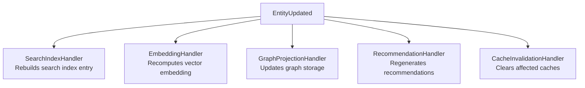

# Events

> Every meaningful modification generates events. Events trigger asynchronous processing.

---

## Overview

Knowledge OS is event-driven. Every change to canonical data emits an event. Events are processed asynchronously through the derivation pipeline to update derived artifacts: search indexes, embeddings, graph projections, and caches.

This architecture follows the patterns described in Gregor Hohpe and Bobby Woolf's [Enterprise Integration Patterns](https://www.enterpriseintegrationpatterns.com/patterns/messaging/CanonicalDataModel.html), applied at the application level.

---

## Event Types

### Canonical Events

Events that represent changes to canonical data:

| Event                  | Trigger               | Description                                  |
| ---------------------- | --------------------- | -------------------------------------------- |
| `EntityCreated`        | New entity added      | A new canonical entity is stored             |
| `EntityUpdated`        | Entity modified       | Entity components or metadata changed        |
| `EntityArchived`       | Entity soft-deleted   | Entity is marked as archived                 |
| `RelationshipCreated`  | New relationship      | A typed edge between entities is established |
| `RelationshipUpdated`  | Relationship modified | Relationship metadata or confidence changed  |
| `RelationshipArchived` | Relationship removed  | A relationship is marked as inactive         |
| `ComponentAdded`       | New component         | A new component is attached to an entity     |
| `ComponentUpdated`     | Component modified    | Component data is changed                    |
| `ComponentRemoved`     | Component detached    | A component is removed from an entity        |

### Derivation Events

Events that trigger derived data updates:

| Event                     | Trigger                 | Description                              |
| ------------------------- | ----------------------- | ---------------------------------------- |
| `ArtifactImported`        | Import complete         | External data has been imported          |
| `EmbeddingGenerated`      | Embedding computed      | Vector representation created            |
| `SearchIndexed`           | Index updated           | Full-text index entry created or updated |
| `GraphProjected`          | Graph updated           | Graph storage projection rebuilt         |
| `RecommendationGenerated` | Recommendation computed | AI-generated suggestion produced         |

---

## Event Structure

Every event carries:

```rust
struct Event {
    id: Uuid,                    // Unique event identifier
    kind: EventKind,             // Type of event
    entity_id: Uuid,             // Affected entity (if applicable)
    timestamp: DateTime<Utc>,    // When the event occurred
    version: u64,                // Entity version after this event
    metadata: EventMetadata,     // Source, actor, correlation ID
}
```

**Metadata fields:**

- `source`: What triggered the event (import, API, AI, manual)
- `actor`: Who initiated the change (user ID, agent ID)
- `correlation_id`: Links related events across the pipeline
- `causation_id`: Links an event to the event that caused it

---

## Processing Pipeline

Every asynchronous operation follows this pipeline:

```
Receive Event
     |
  Validate
     |
  Normalize
     |
  Persist Canonical Data
     |
  Generate Derived Data
     |
  Publish New Events
```

**Rules:**

- Each stage is isolated.
- Each stage is idempotent.
- Processing failures are retried with exponential backoff.
- Failed events are moved to a dead-letter queue for manual inspection.

---

## Event-Driven Derivation

When canonical data changes, derived artifacts are updated through event subscriptions:



Each handler is independent. Each handler can fail without affecting others. Each handler is idempotent -- processing the same event twice produces the same result.

---

## Idempotency

Idempotency is critical for event processing. The same event may be delivered multiple times due to network issues, processing failures, or replay scenarios.

**Idempotency strategies:**

- **Event deduplication.** Track processed event IDs. Skip already-processed events.
- **Version-based updates.** Use entity version numbers to avoid applying stale updates.
- **Upsert operations.** Use `INSERT ... ON CONFLICT ... DO UPDATE` for database operations.

---

## Event Replay

Events support full replay for:

- **Rebuilding derived data.** Drop all search indexes and replay events to rebuild them.
- **Recovery.** After a storage engine failure, replay events to restore derived state.
- **Migration.** When switching embedding models, replay events to recompute all embeddings.
- **Testing.** Replay production events against a test system for validation.

---

## Event Ordering

Events are ordered by:

1. **Timestamp.** Events are time-ordered within a single entity.
2. **Entity version.** Each event increments the entity version.
3. **Causal ordering.** The `causation_id` field links events in causal chains.

Cross-entity ordering is eventually consistent. The system does not guarantee global ordering across all entities.

---

## Dead Letter Queue

Events that fail processing after maximum retries are moved to a dead letter queue (DLQ). DLQ events are:

- Logged with full error context.
- Available for manual inspection.
- Reprocessable after the underlying issue is resolved.

---

## Further Reading

- [Overview](overview.md) -- System-level architecture
- [Pipeline](pipeline.md) -- How events drive the pipeline
- [Compilation](compilation.md) -- Incremental compilation through events
- [Data Model](data-model.md) -- How canonical changes propagate
