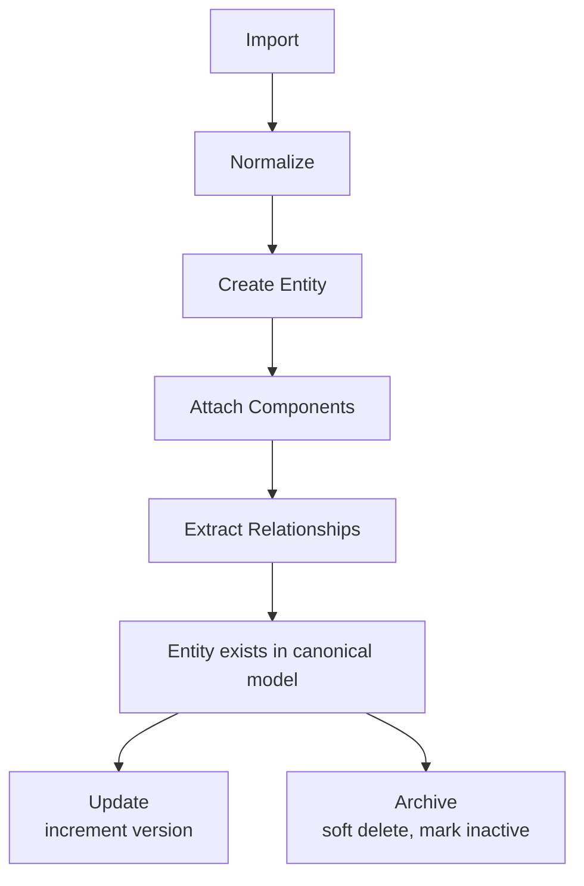
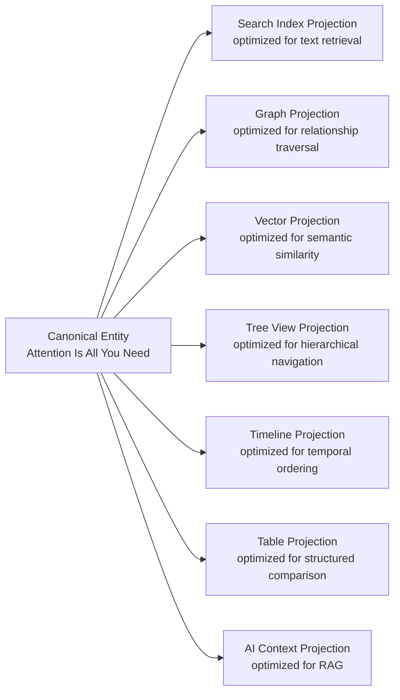

# Mental Model

> Think in entities, not files. Think in relationships, not folders. Think in projections, not formats.

---

## The Canonical Way of Thinking

The traditional mental model for organizing information is the filesystem:

```
Folder
  +-- File
  +-- File
       +-- Subfolder
            +-- File
```

This model is deeply ingrained. It is also fundamentally wrong for knowledge management. A filesystem organizes information by location. Knowledge is organized by meaning.

Knowledge OS replaces the filesystem mental model with a knowledge model built on five concepts:

1. **Entities** -- the atoms of knowledge
2. **Components** -- the aspects of an entity
3. **Relationships** -- the connections between entities
4. **Projections** -- the views of knowledge
5. **The Knowledge Graph** -- the sum of all entities and relationships

---

## Knowledge Model

The knowledge model is the canonical representation of all information in the system. It is the single source of truth. All other representations -- search indexes, graph projections, rendered views, AI context -- are derived from it.

The knowledge model contains:

- **Entities.** First-class knowledge objects. Every concept, person, organization, paper, tool, decision, and idea is an entity.
- **Components.** Typed data structures attached to entities. Components describe aspects: title, content, tags, timeline, embedding.
- **Relationships.** Typed, directed edges connecting entities. Relationships describe how entities relate: `created_by`, `references`, `depends_on`, `contradicts`.

The knowledge model does not contain:

- Search indexes (derived)
- Embeddings (derived)
- Caches (derived)
- Rendered views (derived)
- Any data that can be regenerated from canonical sources

---

## Entity Model

An entity is a named, typed, versioned object in the knowledge graph.

Every entity has:

- **An identifier.** A stable, unique, immutable identifier. Once assigned, it never changes.
- **A type.** The category of knowledge the entity represents (person, paper, concept, tool, etc.).
- **Components.** Zero or more typed data structures that describe the entity.
- **A version.** A monotonically increasing version number. Every modification increments the version.
- **Provenance.** The origin and history of the entity: when it was imported, from where, and by what process.

An entity is not defined by its type. An entity is defined by its components. Two entities of the same type may have completely different components. A person entity and a paper entity may both have a `Title` component, but the person's title is a name while the paper's title is a document heading.

### Entity Lifecycle



Entities are never hard-deleted. Archiving marks an entity as inactive while preserving its history. This ensures auditability and temporal queries.

---

## Component Model

A component is a data structure that represents one aspect of an entity. Components are the building blocks of entities.

Every component has:

- **A type.** The kind of aspect it represents (title, description, content, tags, etc.).
- **Data.** The typed payload specific to the component type.
- **No identity.** Components are identified by their type within an entity, not by global identifiers.

Components follow these rules:

1. **Single responsibility.** Each component handles one aspect.
2. **No dependencies.** Components do not reference other components.
3. **Composable.** Any component type may be attached to any entity.
4. **Optional.** Entities may have any combination of components.
5. **Data only.** Components contain data. Behavior lives in systems.

The same component type may appear on different entity types:

```
Title component:
  On a Person entity    -->  { name: "Ada Lovelace" }
  On a Paper entity     -->  { name: "Note G" }
  On a Tool entity      -->  { name: "LLVM" }
  On a Concept entity   -->  { name: "Monads" }
```

This composability eliminates inheritance. There is no `Person` class and no `Paper` class. There are entities with different component assemblies.

See [Composition](composition.md) for the full entity component model.

---

## Relationship Model

A relationship is a typed, directed, attributed edge connecting two entities.

Every relationship has:

- **A source entity.** The entity where the relationship originates.
- **A target entity.** The entity where the relationship points.
- **A type.** The semantic nature of the connection (`created_by`, `references`, `depends_on`, etc.).
- **Attributes.** Metadata about the relationship: confidence score, source, timestamp.
- **A version.** Relationships are versioned independently of the entities they connect.

Relationships are first-class citizens. They are not foreign keys. They are not implicit. They are explicit, queryable, versionable objects in the knowledge graph.

### Relationship Properties

- **Typed.** Every relationship has a semantic type. The type determines what the relationship means.
- **Directed.** Relationships have a source and a target. `A created_by B` is not the same as `B created_by A`.
- **Attributed.** Relationships carry metadata: when the relationship was established, what confidence the system has in it, and what source provided it.
- **Versioned.** Relationships track their history. A relationship that changes confidence over time retains its history.
- **Queryable.** Relationships support graph traversal: "find all papers that reference this concept," "find all tools used by this person," "find all entities that depend on this decision."

### Relationship Extraction

Relationships are extracted through multiple mechanisms:

- **Import-time extraction.** When a document is imported, explicit references (citations, links, authorship) are extracted as relationships.
- **Normalization-time extraction.** The normalization layer identifies implicit relationships (entity co-occurrence, conceptual similarity).
- **AI-assisted extraction.** AI models suggest relationships that are not explicitly stated. All AI-suggested relationships are flagged for review.
- **Manual creation.** Users create relationships directly through the interface.

All relationship extraction is auditable. Every extracted relationship records its source and confidence.

---

## Projection Model

A projection is a view of canonical data optimized for a specific access pattern or interface.

The same canonical entity may appear in many projections:



Projections follow these rules:

1. **Derived.** Projections are generated from canonical data. They are never canonical themselves.
2. **Disposable.** Any projection may be discarded and rebuilt without data loss.
3. **Synchronized.** Projections update when canonical data changes, through event-driven processing.
4. **Independent.** Each projection is managed by its own subsystem. Projections do not depend on each other.

The projection model enables the same knowledge to serve multiple interfaces without duplication. A search index serves text queries. A graph projection serves relationship traversal. A vector projection serves semantic similarity. All are derived from the same canonical entities.

---

## Knowledge Graph

The knowledge graph is the sum of all entities and relationships in the system.

It is not a separate storage engine. It is not a graph database. It is the emergent structure that arises from canonical entities connected by canonical relationships.

The knowledge graph has these properties:

- **Heterogeneous.** It contains many entity types and relationship types. A single graph may include people, papers, concepts, tools, decisions, and events.
- **Attributed.** Entities carry components. Relationships carry attributes. The graph is rich with metadata.
- **Versioned.** Every entity and relationship is versioned. The graph at any point in time can be reconstructed.
- **Evolving.** The graph grows with every import. New entities are added. New relationships are extracted. Existing entities are updated.
- **Queryable.** The graph supports multi-hop traversal, neighborhood discovery, path finding, and pattern matching.

### Graph Traversal Patterns

```
Find all entities related to "machine learning":
  Start at Concept("machine learning")
  Traverse: related_to, implements, requires, teaches
  Depth: 2-4 hops
  Result: subgraph of connected entities

Find the knowledge lineage of a decision:
  Start at Decision("use Rust")
  Traverse: inspired_by, references, depends_on
  Depth: unbounded
  Result: ordered chain of influencing entities

Find gaps in knowledge:
  Query: entities without Content component
  Filter: type = Concept
  Result: concepts that need documentation
```

The knowledge graph is the primary query structure. Search indexes, vector stores, and caches are derived projections that optimize specific access patterns against the graph.

---

## Canonical Concepts Summary

| Concept | Definition | Properties |
|---------|-----------|------------|
| **Entity** | A first-class knowledge object | Identifier, type, components, version, provenance |
| **Component** | A typed data structure describing an aspect of an entity | Type, data, no identity |
| **Relationship** | A typed, directed edge connecting two entities | Source, target, type, attributes, version |
| **Projection** | A derived view of canonical data | Derived, disposable, synchronized, independent |
| **Knowledge Graph** | The emergent structure of all entities and relationships | Heterogeneous, attributed, versioned, evolving, queryable |

---

## Mental Model Shifts

To think in Knowledge OS, abandon these旧 mental models:

| Old Model | New Model |
|-----------|-----------|
| Files | Entities |
| Folders | Relationships |
| File type | Component assembly |
| Directory tree | Knowledge graph |
| Search query | Graph traversal + projection query |
| Save | Import + normalize + persist |
| Open | Render projection |
| Copy | Reference (same entity, multiple views) |
| Delete | Archive (soft delete, preserve history) |
| Backup | Export canonical data |

---

## Further Reading

- [Composition](composition.md) -- Entity component model in detail
- [Data Model](data-model.md) -- Canonical vs derived data
- [Pipeline](pipeline.md) -- How knowledge flows through the system
- [Overview](overview.md) -- System-level architecture
- [Domain Model](domain-model.md) -- Formal entity, relationship, and component types
