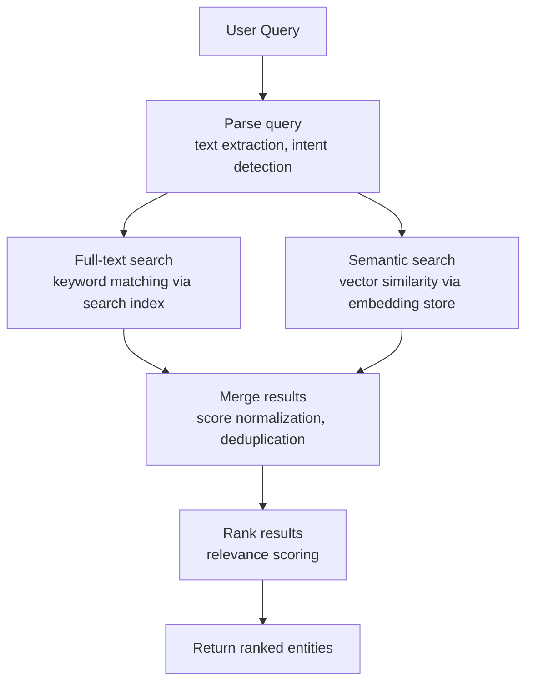
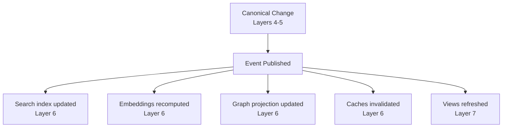

# Pipeline

> The system is organized into independent layers. Each layer has one responsibility. Each layer communicates through explicit contracts.

---

## Overview

The Knowledge OS processes information through a seven-layer pipeline. This structure is inspired by compiler architecture, where source code passes through lexical analysis, parsing, semantic analysis, optimization, and code generation -- each stage with a single responsibility, communicating through well-defined intermediate representations.

In Knowledge OS, information enters as raw external data and exits as rendered knowledge projections. Between these endpoints, each layer transforms the data in a specific, isolated, deterministic way.

---

## The Seven Layers

```
  Layer 1  Import Layer          Receive information from external systems
  Layer 2  Parsing Layer         Extract structured information
  Layer 3  Normalization Layer   Convert to canonical representations
  Layer 4  Knowledge Model       Entity storage and lifecycle
  Layer 5  Relationship Engine   Connect entities through typed edges
  Layer 6  Derivation Layer      Generate indexes, embeddings, recommendations
  Layer 7  Presentation Layer    Render projections for human and machine interfaces
```

---

## Layer 1 -- Import Layer

**Responsibility:** Receive information from external systems.

The import layer is the system's boundary with the outside world. It accepts information in any format and transforms it into an internal representation that the parsing layer can consume.

**Supported sources:**

- Documents: Markdown, PDF, Word, HTML
- Code: Git repositories, source files
- Media: YouTube, podcasts, audio, images
- Feeds: RSS, email
- Structured: APIs, databases
- Visual: OCR, screen captures

**Rules:**

- The import layer never performs business logic.
- It only transforms external formats into internal representations.
- Each importer is a plugin. New formats are added without modifying the core.

---

## Layer 2 -- Parsing Layer

**Responsibility:** Extract structured information from imported data.

The parser produces normalized intermediate structures from raw input. It does not interpret meaning. It extracts structure.

**Operations:**

- Parsing (syntactic structure extraction)
- Metadata extraction (author, date, source, format)
- Structural analysis (headings, sections, code blocks)
- Language detection
- OCR (optical character recognition for images)
- Audio transcription (speech-to-text for audio/video)
- Content segmentation (breaking content into meaningful chunks)

**Rules:**

- The parser produces deterministic outputs.
- The parser does not make semantic judgments.
- Parsing errors are logged, not silently swallowed.

---

## Layer 3 -- Normalization Layer

**Responsibility:** Convert parsed information into canonical representations.

Normalization is where raw structure becomes meaningful knowledge. This layer identifies entities, resolves duplicates, assigns canonical identifiers, and normalizes metadata.

**Operations:**

- Entity identification (recognizing that "Dr. Smith" and "John Smith" are the same person)
- Duplicate detection (finding that two references describe the same paper)
- Identity resolution (merging duplicate entities under a single canonical identity)
- Canonical identifier assignment (generating stable, unique IDs)
- Metadata normalization (standardizing dates, names, taxonomies)
- Content normalization (consistent formatting, encoding, structure)

**Rules:**

- Normalization produces deterministic outputs.
- Entity resolution is auditable -- every merge decision is recorded.
- Canonical identifiers are immutable once assigned.

---

## Layer 4 -- Knowledge Model

**Responsibility:** Store and manage canonical entities, their components, and their lifecycle.

This layer is the heart of the system. Everything becomes a first-class entity. There is no distinction between documents and objects.

**Entity types include:**

Concept, Person, Organization, Project, Book, Research Paper, Video, Article, Tool, Technology, Question, Idea, Event, Skill, Location, Dataset, Collection, Workspace.

**Rules:**

- The knowledge model is the canonical source of truth.
- Every entity is composed of components (see [Composition](composition.md)).
- Entities are versioned and auditable.
- No storage engine defines the entity model.

---

## Layer 5 -- Relationship Engine

**Responsibility:** Connect entities through typed, versioned, queryable relationships.

Relationships are first-class citizens. They are not foreign keys. They are typed, directed, attributed edges with their own metadata.

**Relationship types include:**

`created_by`, `references`, `implements`, `depends_on`, `contradicts`, `contains`, `extends`, `belongs_to`, `teaches`, `requires`, `related_to`, `inspired_by`.

**Rules:**

- Every relationship has metadata (confidence, source, timestamp).
- Relationships are versioned.
- Relationships are queryable through graph traversal.
- Relationship extraction may be AI-assisted, but all outputs are reviewable.

---

## Layer 6 -- Derivation Layer

**Responsibility:** Generate derived representations from canonical data.

Everything generated by computation belongs in this layer. Derived data optimizes specific access patterns but never becomes authoritative.

### Indexing

The indexing subsystem builds and maintains full-text search indexes from canonical content and metadata. Indexes enable fast text retrieval without scanning every entity.

**Operations:**

- Inverted index construction from content fields (title, body, tags, descriptions)
- Index updates on entity creation, component update, and component removal
- Index rebuild from canonical data (full reindex)
- Incremental index updates (partial reindex)

**Index types:**

| Index            | Source Fields                               | Purpose                                |
| ---------------- | ------------------------------------------- | -------------------------------------- |
| Content index    | `Content.markdown`, `Title.name`            | Full-text search across entity content |
| Metadata index   | `Tags.values`, `Language.code`, entity type | Faceted filtering                      |
| Structural index | Component types, relationship types         | Schema-aware queries                   |

**Rules:**

- Indexes are derived data. They may be dropped and rebuilt from canonical sources.
- Index updates are idempotent. Re-indexing the same entity twice produces the same index state.
- Index operations are asynchronous. Views may briefly show stale search results.

### Embedding

The embedding subsystem generates vector representations of canonical entities for semantic similarity search. Embeddings capture meaning that keyword search cannot.

**Operations:**

- Embedding generation from entity content (title + body + description)
- Embedding recomputation when source content changes
- Embedding model migration (recompute all embeddings with a new model)
- Similarity search against the embedding store

**Embedding pipeline:**

```
Canonical Entity
      |
   Extract text fields
      |
   Chunk (if content exceeds model context)
      |
   Generate vectors (via AI adapter)
      |
   Store in vector database
```

**Rules:**

- Embeddings are derived data. They may be dropped and recomputed from canonical content.
- Embedding generation uses the configured AI adapter. Changing the adapter recomputes all embeddings.
- Embeddings are versioned with the entity. Content changes trigger embedding recomputation.
- Embedding latency depends on the AI adapter. Expect 100-500ms per entity.

### Search

The search subsystem processes queries against both full-text indexes and semantic embeddings, combining results into ranked responses.

**Query processing:**



**Search modes:**

| Mode     | Engine       | Best For                                                    |
| -------- | ------------ | ----------------------------------------------------------- |
| Keyword  | Search index | Exact matches, specific terms, structured queries           |
| Semantic | Vector store | Conceptual queries, fuzzy matching, meaning-based retrieval |
| Hybrid   | Both         | Combined relevance, broad coverage                          |

**Rules:**

- Search queries operate on derived data (indexes and embeddings). They never access canonical storage directly for performance reasons.
- Search results are ranked by relevance score. The scoring algorithm is configurable per search adapter.
- Search supports filtering by entity type, tags, language, date range, and workspace.
- Search is eventually consistent with canonical data. Staleness is bounded by the synchronization latency (see [Synchronization](synchronization.md)).

### Other Derived Artifacts

The derivation layer also produces:

- **Recommendations** (suggested connections based on content similarity and graph proximity)
- **Similarity graphs** (computed proximity between entities based on embeddings)
- **Learning paths** (ordered sequences based on prerequisite relationships)
- **Relationship inference** (AI-suggested connections between entities)
- **Knowledge summaries** (condensed representations of entity clusters)
- **AI context** (retrieval-augmented generation payloads assembled from canonical data)
- **Caches** (precomputed query results for performance optimization)

**Rules:**

- This layer contains no canonical information.
- Everything is disposable.
- All derived artifacts may be regenerated from canonical data.
- Derived data is never the source of truth.

---

## Layer 7 -- Presentation Layer

**Responsibility:** Render projections of knowledge for human and machine interfaces.

Views never own information. Views render knowledge. Every entity may appear in multiple projections simultaneously.

**View types include:**

- Tree View (hierarchical navigation)
- Graph View (relationship exploration)
- Timeline (temporal ordering)
- Table (structured comparison)
- Calendar (date-based organization)
- Kanban (status-based workflow)
- Gallery (visual browsing)
- Mind Map (conceptual mapping)
- Conversation (dialogue-based interaction)
- Dashboard (aggregated overview)
- Learning Path (ordered progression)

**Rules:**

- Every interface is a projection.
- No interface owns data.
- Views remain synchronized because they render canonical data.
- New view types are added as plugins.

---

## Layer Communication

Layers communicate through explicit contracts. A layer does not access the internal state of another layer. It receives input through a defined interface and produces output through a defined interface.

```
Layer N  --[Contract]-->  Layer N+1
```

This isolation means:

- Any layer may be independently replaced.
- No layer bypasses another.
- Testing is compositional -- each layer can be tested in isolation.

---

## Synchronization

Canonical data changes propagate to derived data through events. The derivation layer subscribes to canonical events and updates derived artifacts asynchronously.



The system uses eventual consistency. Derived data may lag behind canonical data by milliseconds to seconds. This is a deliberate trade-off: strong consistency would require synchronous updates, which would slow the pipeline. Eventual consistency enables parallelism, scalability, and resilience.

For the full synchronization model, conflict resolution, and recovery procedures, see [Synchronization](synchronization.md).

---

## Pipeline Properties

**Deterministic.** The same input always produces the same canonical output.

**Idempotent.** Processing the same input twice produces the same result.

**Auditable.** Every transformation is recorded. Every entity change is versioned.

**Extensible.** New importers, parsers, views, and storage engines are added as plugins.

**Independent.** No layer depends on a specific technology. Adapters isolate implementation details.

---

## Further Reading

- [Overview](overview.md) -- System-level architecture
- [Compilation](compilation.md) -- The compiler analogy in depth
- [Events](events.md) -- How events drive the pipeline
- [Synchronization](synchronization.md) -- How derived data stays consistent
- [Data Model](data-model.md) -- Canonical vs derived data
