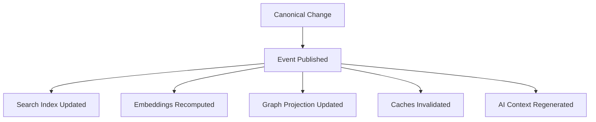
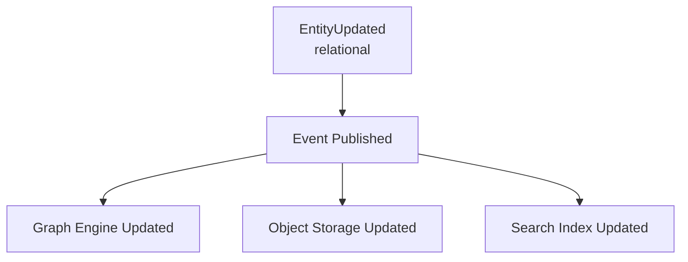

# Synchronization

> Canonical data changes. Derived data follows. The system uses events to propagate changes. Derived data is eventually consistent with canonical data.

---

## Synchronization Model

Knowledge OS uses an eventual consistency model for derived data:

1. Canonical data changes are committed atomically.
2. Events are published for derived data generation.
3. Derived data is updated asynchronously.
4. Views may briefly show stale data until derived data catches up.

This model is a deliberate trade-off. Strong consistency across all derived data would require synchronous updates, which would slow the pipeline. Eventual consistency enables parallelism, scalability, and resilience.

---

## Synchronization Layers

### Canonical to Derived

When canonical data changes, derived artifacts are updated through event subscriptions:



Each handler is independent. Each handler can fail without affecting others. Each handler is idempotent.

### Cross-Engine Synchronization

Canonical data may be stored in multiple storage engines (relational, object, graph). Synchronization across engines is managed through events:



Cross-engine synchronization is eventually consistent. The system does not guarantee that all engines reflect the same state at the same instant.

### Workspace Synchronization

In multi-user deployments, workspace synchronization ensures that all users see consistent views:

- **Entity changes** are propagated to all workspace members through events.
- **Conflict resolution** uses last-writer-wins for independent changes.
- **Conflicting changes** to the same entity are detected through version numbers and presented for manual resolution.

---

## Synchronization Guarantees

### What Is Guaranteed

- **Eventual consistency.** Given enough time, all derived data converges to the correct state.
- **Idempotency.** Processing the same event twice produces the same result.
- **Ordered processing per entity.** Events for a single entity are processed in order.
- **Durability of canonical data.** Canonical changes are committed before events are published.

### What Is Not Guaranteed

- **Instant consistency.** Derived data may lag behind canonical data for milliseconds to seconds.
- **Global ordering.** Events across different entities are not globally ordered.
- **Cross-engine atomicity.** Changes to multiple storage engines are not atomic.

---

## Conflict Resolution

### Entity Conflicts

When two users modify the same entity concurrently:

1. The first change is committed successfully (version increments).
2. The second change detects the version mismatch.
3. The second change is rejected with a conflict error.
4. The user resolves the conflict by choosing which version to keep or by merging.

### Relationship Conflicts

When two users create conflicting relationships:

1. Both relationships are committed (they are independent).
2. The system detects the conflict during query time.
3. The user resolves the conflict by choosing which relationship to keep.

### Import Conflicts

When an import produces an entity that conflicts with an existing entity:

1. The system detects the duplicate through identity resolution.
2. The import is merged with the existing entity (components are updated, not replaced).
3. The merge is recorded in the entity's version history.

---

## Synchronization Events

| Event | Trigger | Handler | Derived Update |
|-------|---------|---------|---------------|
| `EntityCreated` | New entity stored | SearchIndexHandler | Add to search index |
| `EntityCreated` | New entity stored | EmbeddingHandler | Generate embedding |
| `EntityCreated` | New entity stored | GraphProjectionHandler | Add to graph |
| `EntityUpdated` | Entity modified | SearchIndexHandler | Update search index |
| `EntityUpdated` | Entity modified | EmbeddingHandler | Recompute embedding |
| `EntityUpdated` | Entity modified | CacheHandler | Invalidate cache |
| `RelationshipCreated` | New relationship | GraphProjectionHandler | Add edge to graph |
| `RelationshipUpdated` | Relationship modified | GraphProjectionHandler | Update edge in graph |
| `ComponentAdded` | New component | SearchIndexHandler | Index new content |
| `ComponentUpdated` | Component modified | SearchIndexHandler | Reindex content |
| `ComponentRemoved` | Component removed | SearchIndexHandler | Remove from index |

---

## Failure Recovery

When a derived data store fails:

1. **Detect failure.** Health checks identify the failed store.
2. **Queue events.** Events for the failed store are queued, not dropped.
3. **Recover store.** The store is rebuilt from canonical data.
4. **Replay events.** Queued events are replayed to bring the store up to date.

The recovery process is:

```
Failure Detected
     |
  Events Queued
     |
  Store Rebuilt (from canonical data)
     |
  Events Replayed
     |
  Store Current
```

Recovery is possible because derived data is disposable. The system can rebuild any derived artifact from canonical sources.

---

## Synchronization Performance

### Latency

| Path | Expected Latency |
|------|-----------------|
| Canonical change to event published | < 10ms |
| Event published to derived update | 100ms - 5s |
| Derived update to view refresh | 100ms - 1s |
| Full search index rebuild (100K entities) | 5 - 15 minutes |
| Full embedding recomputation (100K entities) | 10 - 30 minutes |

### Throughput

| Operation | Throughput |
|-----------|-----------|
| Event publishing | 10,000+ events/second |
| Search index update | 1,000+ entities/second |
| Embedding computation | 100-500 entities/second |
| Cache invalidation | 10,000+ invalidations/second |

---

## Further Reading

- [Events](events.md) -- The event system that drives synchronization
- [Data Model](data-model.md) -- The canonical vs derived distinction
- [Pipeline](pipeline.md) -- How data flows through the system
- [Storage](storage.md) -- How storage engines participate in synchronization
