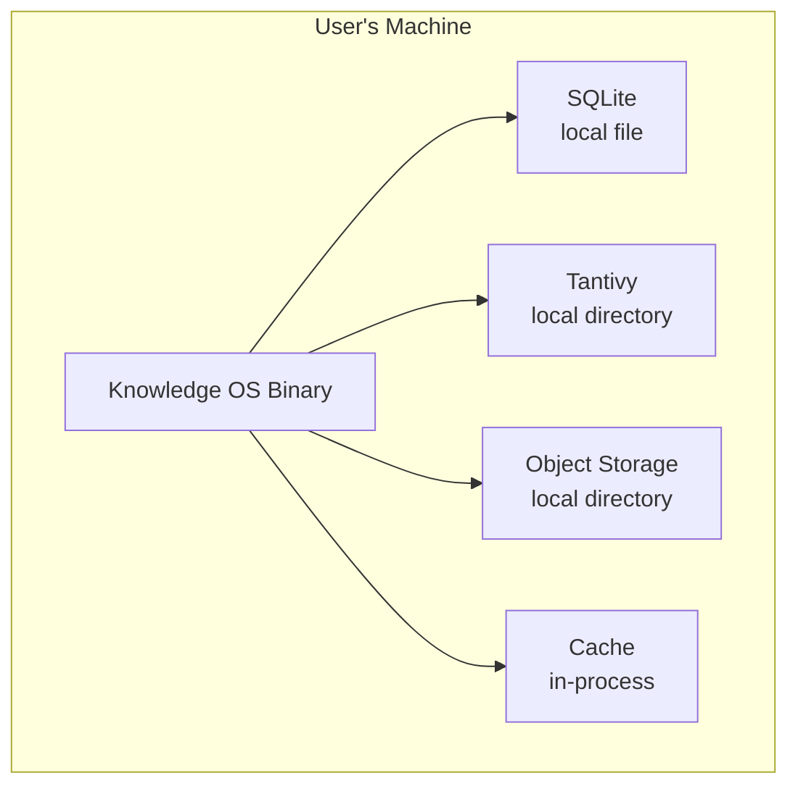
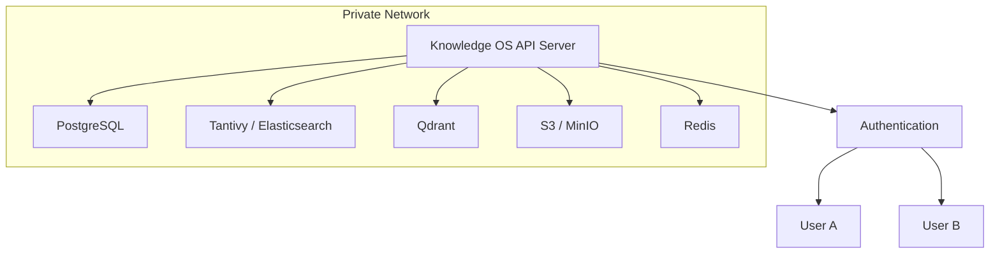
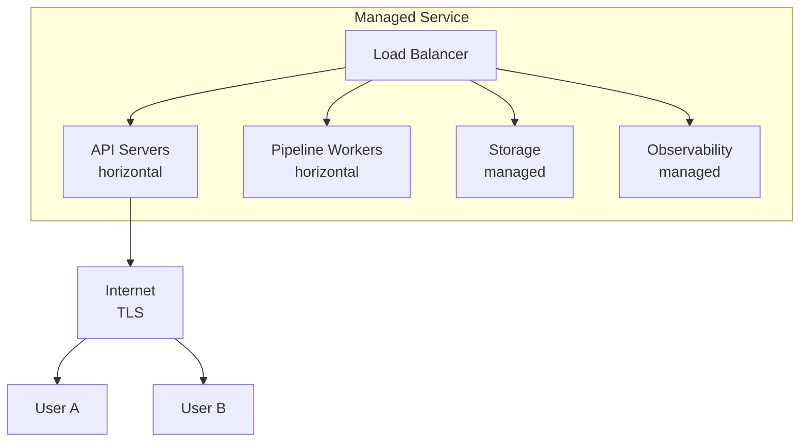

# Deployment Architecture

> Knowledge OS deploys anywhere: local machine, private cloud, or public cloud. Users own their data.

---

## Deployment Models

### Local Deployment

The simplest deployment model. Knowledge OS runs on the user's machine.



**Characteristics:**
- Single user
- All data local
- No network required
- Simplest configuration
- SQLite for relational storage
- Local filesystem for object storage

### Private Cloud Deployment

Knowledge OS runs in a private network, accessible to authorized users.



**Characteristics:**
- Multi-user
- Shared knowledge graph
- Workspace-based access control
- Network authentication
- Production-grade storage engines

### Managed Service Deployment

Knowledge OS runs as a managed service, handling infrastructure for users.



**Characteristics:**
- Multi-tenant
- Managed infrastructure
- Automatic scaling
- Managed backups
- Enterprise features (SSO, audit logging)

---

## Storage Configuration

### SQLite (Local)

```toml
[storage.relational]
driver = "sqlite"
path = "./data/knowledge.db"
```

### PostgreSQL (Production)

```toml
[storage.relational]
driver = "postgresql"
host = "localhost"
port = 5432
database = "knowledge_os"
```

### Tantivy (Local Search)

```toml
[storage.search]
driver = "tantivy"
path = "./data/search"
```

### Elasticsearch (Production Search)

```toml
[storage.search]
driver = "elasticsearch"
url = "http://localhost:9200"
index = "knowledge"
```

### Qdrant (Vector)

```toml
[storage.vector]
driver = "qdrant"
url = "http://localhost:6334"
collection = "knowledge"
```

### Redis (Cache)

```toml
[storage.cache]
driver = "redis"
url = "redis://localhost:6379"
```

### S3/MinIO (Object)

```toml
[storage.object]
driver = "s3"
bucket = "knowledge-os"
endpoint = "http://localhost:9000"
region = "us-east-1"
```

---

## Container Deployment

### Docker

```dockerfile
FROM rust:1.75 as builder
WORKDIR /app
COPY . .
RUN cargo build --release

FROM debian:bookworm-slim
RUN apt-get update && apt-get install -y ca-certificates
COPY --from=builder /app/target/release/knowledge-os /usr/local/bin/
EXPOSE 8080
CMD ["knowledge-os", "serve"]
```

### Docker Compose

```yaml
version: '3.8'
services:
  knowledge-os:
    image: knowledge-os:latest
    ports:
      - "8080:8080"
    volumes:
      - ./data:/data
    environment:
      - KNOWLEDGE_OS_STORAGE_RELATIONAL=sqlite
      - KNOWLEDGE_OS_STORAGE_RELATIONAL_PATH=/data/knowledge.db

  postgres:
    image: postgres:16
    volumes:
      - pgdata:/var/lib/postgresql/data
    environment:
      - POSTGRES_DB=knowledge_os

  qdrant:
    image: qdrant/qdrant:latest
    volumes:
      - qdrant_data:/qdrant/storage

  redis:
    image: redis:7-alpine

volumes:
  pgdata:
  qdrant_data:
```

---

## Backup and Recovery

### Canonical Data Backup

Canonical data is the source of truth. It must be backed up regularly.

- **SQLite:** File-level backup (copy the database file).
- **PostgreSQL:** `pg_dump` or continuous archiving.
- **Object storage:** S3 versioning, cross-region replication.

### Derived Data Recovery

Derived data is disposable. It is rebuilt from canonical data.

- **Search indexes:** Rebuild by replaying events or re-running the pipeline.
- **Embeddings:** Recompute from canonical content.
- **Graph projections:** Rebuild from canonical relationships.
- **Caches:** Populate on demand.

### Recovery Process

```
Data Loss Detected
     |
  Stop Pipeline
     |
  Restore Canonical Data (from backup)
     |
  Replay Events (from event log)
     |
  Derived Data Rebuilt
     |
  Resume Pipeline
```

---

## Observability Deployment

### Metrics

- Prometheus-compatible metrics endpoint.
- Pipeline throughput, latency, and error rates.
- Storage engine health and performance.

### Logging

- Structured JSON logs.
- Configurable log levels.
- Log aggregation through standard tools (Loki, ELK).

### Tracing

- OpenTelemetry-compatible distributed tracing.
- Correlation IDs across pipeline stages.
- Export to Jaeger, Zipkin, or compatible backends.

---

## Further Reading

- [Storage](../architecture/storage.md) -- Storage engine details
- [Scalability](../architecture/scalability.md) -- Scaling strategies
- [Security](security.md) -- Security architecture
