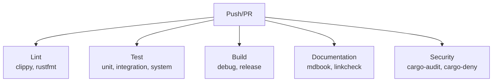

# Engineering Handbook

> Day-to-day engineering practices for contributing to Knowledge OS. This document supplements [Engineering Principles](../philosophy/engineering-principles.md) with practical workflows and conventions.

---

## Git Workflow

### Branch Strategy

All development happens on branches from `main`. Branch names follow this convention:

```
feat/<short-description>      New features
fix/<short-description>       Bug fixes
docs/<short-description>      Documentation changes
chore/<short-description>     Maintenance, dependency updates
refactor/<short-description>  Code restructuring without behavior change
```

Examples:
- `feat/markdown-importer`
- `fix/entity-resolution-duplicate`
- `docs/expand-glossary`
- `chore/update-rust-toolchain`

### Commit Messages

Commits follow [Conventional Commits](https://www.conventionalcommits.org/):

```
type(scope): description

[optional body]

[optional footer]
```

**Types:**

| Type       | When to Use                                |
| ---------- | ------------------------------------------ |
| `feat`     | New feature or capability                  |
| `fix`      | Bug fix                                    |
| `docs`     | Documentation only                         |
| `chore`    | Maintenance, dependencies, CI              |
| `refactor` | Code restructuring without behavior change |
| `test`     | Adding or updating tests                   |
| `perf`     | Performance improvement                    |
| `style`    | Formatting, whitespace (no logic change)   |

**Scope:** The affected module, crate, or component. Examples: `pipeline`, `storage-sqlite`, `plugin-api`, `domain-model`.

**Description:** Imperative mood, lowercase, no period. "add markdown importer" not "added markdown importer" or "adds markdown importer".

**Examples:**

```
feat(importer): add BibTeX importer plugin
fix(storage): handle SQLite connection pool exhaustion
docs(architecture): expand glossary with canonical vocabulary
chore(deps): update tantivy to 0.22
refactor(pipeline): extract normalization into separate crate
test(storage): add PostgreSQL adapter integration tests
```

### Pull Requests

1. Create a feature branch from `main`.
2. Make changes, commit frequently with clear messages.
3. Push the branch and open a pull request.
4. Fill in the PR description: what changed, why, how to test.
5. Ensure CI passes (lint, typecheck, tests).
6. Request review from at least one maintainer.
7. Address review feedback.
8. Squash merge into `main`.

### PR Description Template

```markdown
## What

Brief description of the change.

## Why

Why this change is needed. Link to issue or ADR if applicable.

## How

How the change was implemented. Key design decisions.

## Testing

How the change was tested. What tests were added or modified.

## Checklist

- [ ] Code follows project conventions
- [ ] Tests pass
- [ ] Documentation is updated
- [ ] No breaking changes (or breaking changes are documented)
- [ ] Answers the 10 engineering questions (if architectural)
```

---

## Code Review

### What Requires Review

- New entity types, relationship types, or component types
- New pipeline layers or modifications to existing layers
- New storage adapters
- New plugin types
- Changes to the event system
- Changes to the canonical model schema
- Changes to the derivation pipeline
- Any change that answers the 10 engineering questions

### What Does Not Require Review

- Bug fixes that do not change the data model
- Documentation updates
- Dependency upgrades
- Refactoring that does not change public APIs
- New importer plugins that follow the existing plugin contract

### Review Checklist

1. **Correctness.** Does the code do what it claims?
2. **Architecture.** Does the change pass the 10 engineering questions?
3. **Tests.** Are there adequate tests? Do they cover edge cases?
4. **Documentation.** Is the change documented? Are public APIs documented?
5. **Style.** Does the code follow project conventions?
6. **Performance.** Are there obvious performance issues?
7. **Security.** Are there security implications? Are inputs validated?
8. **Backward compatibility.** Does the change break existing functionality?

---

## Dependency Management

### Policy

- **Minimize dependencies.** Every dependency is a liability. Only add dependencies that provide significant value.
- **Prefer Rust-native.** Prefer crates written in Rust over FFI bindings when functionality is equivalent.
- **Audit dependencies.** All new dependencies must be reviewed for license compatibility, maintenance status, and security history.
- **Pin versions.** Use exact versions in `Cargo.lock`. Use version ranges in `Cargo.toml`.

### Adding a Dependency

1. Justify the dependency. What does it provide that cannot be reasonably implemented?
2. Check the license. Must be compatible with MIT.
3. Check maintenance status. Is the crate actively maintained?
4. Check security history. Any known vulnerabilities?
5. Add to `Cargo.toml` with a comment explaining why.

### Removing a Dependency

1. Verify the dependency is no longer used.
2. Remove from `Cargo.toml`.
3. Run `cargo update` to clean up `Cargo.lock`.
4. Verify the project builds and tests pass.

---

## CI/CD Pipeline

### Pipeline Stages



### Linting

- `cargo clippy --all-targets --all-features -- -D warnings` -- No clippy warnings allowed.
- `cargo fmt --check` -- Code must be formatted with rustfmt defaults.

### Testing

- `cargo test` -- All tests must pass.
- `cargo test --test integration` -- Integration tests must pass.
- Coverage target: > 90% for unit tests.

### Building

- `cargo build --release` -- Release build must succeed.
- `cargo build --no-default-features` -- Build with minimal features must succeed.

### Documentation

- `mdbook build docs/` -- Documentation must build without errors.
- Internal links must resolve.

### Security

- `cargo audit` -- No known vulnerabilities.
- `cargo deny check` -- License and dependency checks must pass.

---

## Debugging

### Logging

The system uses structured JSON logging. Log levels:

| Level   | When to Use                                                               |
| ------- | ------------------------------------------------------------------------- |
| `error` | System failure. Requires immediate attention.                             |
| `warn`  | Degraded operation. System continues but may need attention.              |
| `info`  | Significant event. Import completed, entity created, derivation finished. |
| `debug` | Detailed tracing. Useful for debugging specific issues.                   |
| `trace` | Very detailed tracing. Useful for understanding internal state.           |

### Debugging Pipeline Issues

1. **Enable debug logging** for the affected pipeline stage.
2. **Reproduce the issue** with a minimal input.
3. **Trace the data flow** through each layer.
4. **Compare canonical output** with expected output.
5. **Check derived artifacts** for consistency.

### Debugging Storage Issues

1. **Check storage adapter health** through the health check endpoint.
2. **Verify canonical data** in the relational storage.
3. **Verify derived data** in the search, vector, and graph stores.
4. **Check event log** for unprocessed or failed events.
5. **Trigger derived data rebuild** if derived data is inconsistent.

### Debugging Event Processing Issues

1. **Check the dead letter queue** for failed events.
2. **Review event metadata** for correlation IDs.
3. **Trace event processing** through each handler.
4. **Verify idempotency** by reprocessing the same event.
5. **Check handler isolation** to ensure one handler's failure does not affect others.

---

## Performance Profiling

### When to Profile

- Import throughput is below expected rates.
- Search latency exceeds acceptable thresholds.
- Embedding generation is slower than expected.
- Graph traversal takes too long.
- Memory usage grows without bound.

### Profiling Tools

- `cargo-flamegraph` -- CPU profiling for hot paths.
- `cargo-prof` -- Memory profiling for allocation patterns.
- `tracing` -- Distributed tracing for pipeline latency.
- `metrics` -- Custom metrics for pipeline throughput.

### Performance Targets

| Operation                | Target          | Acceptable     |
| ------------------------ | --------------- | -------------- |
| Import (Markdown)        | 100 docs/sec    | 50 docs/sec    |
| Search query             | < 50ms          | < 200ms        |
| Embedding generation     | 100 vectors/sec | 50 vectors/sec |
| Graph traversal (2 hops) | < 100ms         | < 500ms        |
| Entity creation          | < 10ms          | < 50ms         |

---

## Documentation Standards

### Writing Style

- Write as affirmation, not opinion. "The system uses events" not "I think events are better."
- Write for the reader, not the author. Assume the reader is intelligent but unfamiliar with the specific topic.
- Prefer concrete examples over abstract descriptions.
- Prefer tables over paragraphs for structured information.
- Never use speculative language ("might," "could," "should consider"). Use declarative language ("is," "does," "provides").

### File Conventions

- File names use `kebab-case.md`.
- Every document has a title and a one-line description.
- Every document links to related documents.
- No document stands alone. Every document is part of the reading order.

### Documentation Types

Following [Diataxis](https://diataxis.fr/):

| Type            | Purpose                   | Location                       |
| --------------- | ------------------------- | ------------------------------ |
| **Explanation** | Understanding and context | `philosophy/`, `architecture/` |
| **Reference**   | Factual specifications    | `reference/`, `architecture/`  |
| **How-to**      | Task-oriented guides      | `guides/`, `engineering/`      |
| **Tutorial**    | Learning experiences      | `guides/tutorials/`            |

---

## Further Reading

- [Engineering Principles](../philosophy/engineering-principles.md) -- How code is developed
- [Architectural Principles](../architecture/architectural-principles.md) -- Architectural invariants
- [Testing Strategy](testing-strategy.md) -- Test philosophy and pipeline testing
- [CONTRIBUTING.md](../../CONTRIBUTING.md) -- How to participate
