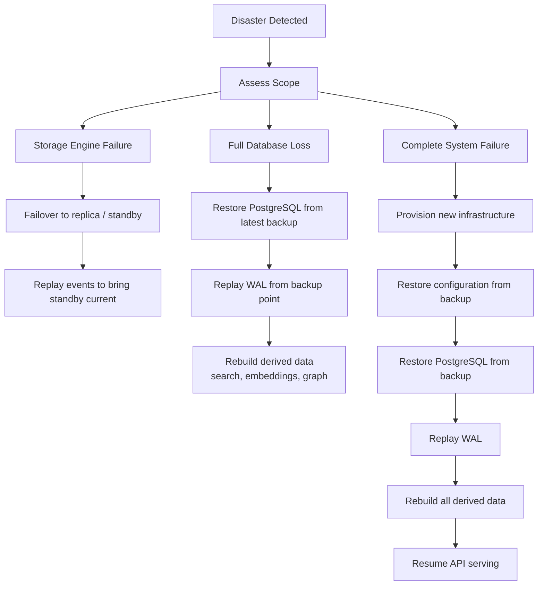
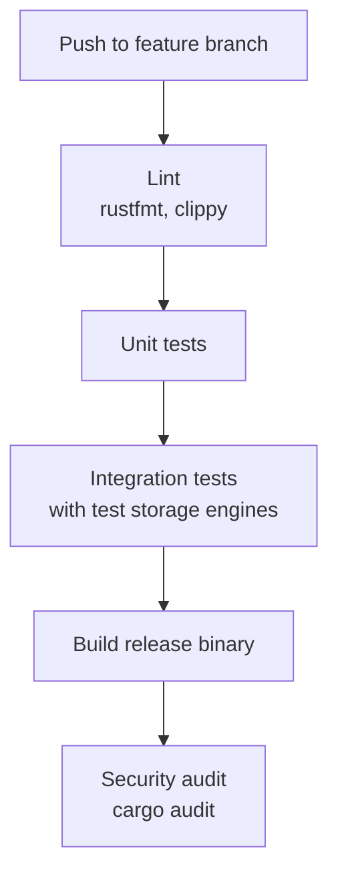
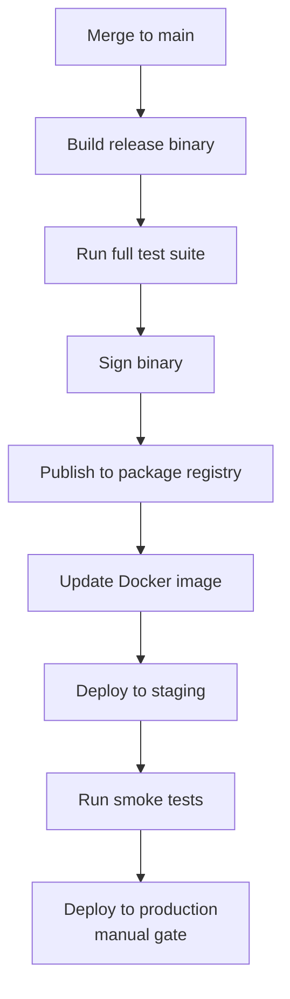
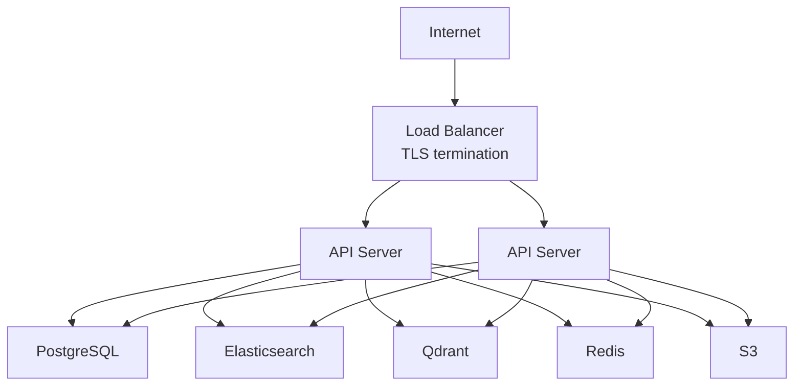
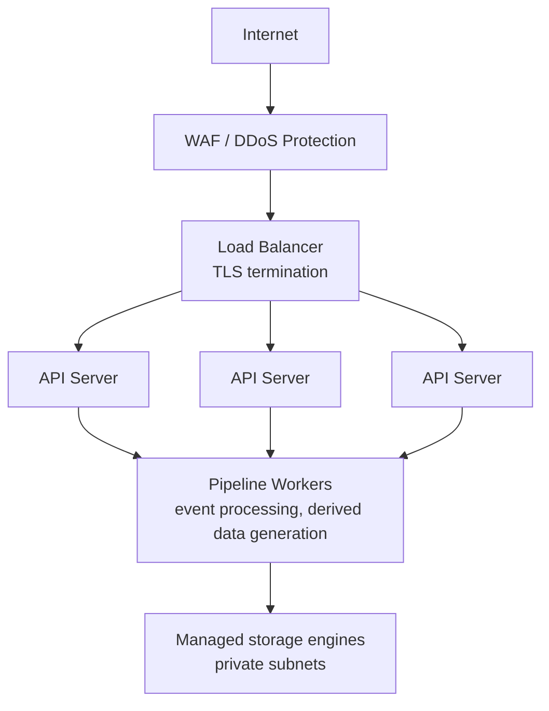

# Infrastructure Handbook

> The infrastructure supports the engine. The engine does not depend on the infrastructure.

---

## Overview

This handbook covers the infrastructure required to run Knowledge OS in production: provisioning, scaling, monitoring, backup and disaster recovery, and CI/CD pipeline infrastructure. It is distinct from [Deployment Architecture](deployment.md), which covers deployment models and storage configuration, and from [Operational Runbooks](operational-runbooks.md), which covers incident response procedures.

---

## Provisioning

### Local Deployment

Local deployments require no provisioning beyond the host machine.

**Minimum requirements:**

- 4 CPU cores
- 8 GB RAM
- 20 GB disk (grows with knowledge base size)
- No network required

**Recommended:**

- 8 CPU cores
- 16 GB RAM
- 100 GB SSD

### Private Cloud Deployment

**Compute:**

- 2+ API server instances (4 CPU, 8 GB RAM each)
- 1+ pipeline worker instances (4 CPU, 8 GB RAM each)
- Load balancer (HAProxy, NGINX, or cloud-native)

**Storage:**

| Engine | Provisioning | Notes |
|--------|-------------|-------|
| PostgreSQL | Managed or self-hosted | Primary relational store |
| Tantivy / Elasticsearch | Self-hosted or managed | Full-text search |
| Qdrant | Self-hosted or managed | Vector storage |
| Redis | Managed or self-hosted | Cache layer |
| S3 / MinIO | Managed or self-hosted | Object storage for binaries |

**Networking:**

- Internal network for storage engine communication
- TLS termination at load balancer
- DNS resolution for API endpoint

### Managed Service Deployment

**Compute:**

- Kubernetes cluster or equivalent container orchestration
- Horizontal pod autoscaler for API servers and pipeline workers
- Minimum 3 API server replicas for high availability
- Minimum 2 pipeline worker replicas

**Storage:**

- Managed PostgreSQL (e.g., AWS RDS, Cloud SQL)
- Managed Elasticsearch or self-hosted Tantivy on persistent volumes
- Managed Qdrant or self-hosted on persistent volumes
- Managed Redis (e.g., AWS ElastiCache)
- Managed object storage (e.g., AWS S3)

**Networking:**

- Load balancer (cloud-native or Ingress controller)
- TLS termination
- Private networking for storage engine communication
- WAF for external-facing endpoints

---

## Scaling

### Horizontal Scaling

Knowledge OS scales horizontally for API serving and pipeline processing.

**API Servers:**

- Stateless. Scale based on request throughput and latency.
- Load balancer distributes requests across instances.
- No shared state between instances. All state lives in storage engines.

**Pipeline Workers:**

- Stateless. Scale based on event queue depth and processing latency.
- Each worker processes events independently.
- Event ordering is per-entity. Workers process different entities in parallel.

**Scaling triggers:**

| Metric | Threshold | Action |
|--------|-----------|--------|
| API request latency (p95) | > 200ms | Add API server instance |
| Event queue depth | > 10,000 | Add pipeline worker |
| CPU utilization | > 70% sustained | Add instance of affected component |
| Memory utilization | > 80% sustained | Add instance or increase instance size |

### Vertical Scaling

Storage engines benefit from vertical scaling.

**PostgreSQL:**

- Increase RAM for larger buffer pools.
- Increase CPU for concurrent query handling.
- Use read replicas for read-heavy workloads.

**Search engine:**

- Increase RAM for index caching.
- Use sharding for large indexes (> 10M documents).

**Vector store:**

- Increase RAM for in-memory indexing.
- Use GPU acceleration for large-scale embedding computation.

### Storage Scaling

| Engine | Scaling Strategy | Limit |
|--------|-----------------|-------|
| PostgreSQL | Read replicas, connection pooling | Single-write, multi-read |
| Search engine | Sharding, index partitioning | Linear with shards |
| Vector store | Collection partitioning | Linear with nodes |
| Cache | Cluster mode (Redis Cluster) | Linear with nodes |
| Object storage | Native scaling (S3) | Effectively unlimited |

---

## Monitoring

### Health Checks

Every storage engine and service exposes a health check endpoint.

**Health check hierarchy:**

```
/health
  /health/relational   PostgreSQL / SQLite health
  /health/search       Tantivy / Elasticsearch health
  /health/vector       Qdrant health
  /health/cache        Redis health
  /health/object       S3 / MinIO health
  /health/pipeline     Pipeline worker health
```

**Health status values:**

| Status | Meaning | Action |
|--------|---------|--------|
| `healthy` | Operational | None |
| `degraded` | Partially operational | Investigate, no immediate action |
| `unhealthy` | Not operational | Trigger incident response |

### Metrics

Knowledge OS exposes Prometheus-compatible metrics at `/metrics`.

**Pipeline metrics:**

| Metric | Type | Description |
|--------|------|-------------|
| `pipeline_events_published_total` | counter | Total events published |
| `pipeline_events_processed_total` | counter | Total events processed |
| `pipeline_events_failed_total` | counter | Total events failed |
| `pipeline_event_processing_duration_seconds` | histogram | Event processing latency |
| `pipeline_derived_artifacts_built_total` | counter | Derived artifacts generated |
| `pipeline_derived_artifacts_rebuilt_total` | counter | Derived artifacts rebuilt |

**Storage metrics:**

| Metric | Type | Description |
|--------|------|-------------|
| `storage_operation_duration_seconds` | histogram | Storage operation latency |
| `storage_operation_errors_total` | counter | Storage operation failures |
| `storage_connection_pool_active` | gauge | Active connections |
| `storage_connection_pool_idle` | gauge | Idle connections |

**API metrics:**

| Metric | Type | Description |
|--------|------|-------------|
| `http_requests_total` | counter | Total HTTP requests |
| `http_request_duration_seconds` | histogram | Request latency |
| `http_request_size_bytes` | histogram | Request body size |
| `http_response_size_bytes` | histogram | Response body size |

### Dashboards

Pre-configured dashboards for Grafana or compatible:

- **Pipeline Overview:** Event throughput, processing latency, error rates, derived artifact generation.
- **Storage Overview:** Connection pool health, operation latency, error rates, disk usage.
- **API Overview:** Request throughput, latency percentiles, error rates, rate limit utilization.
- **Infrastructure Overview:** CPU, memory, disk, network across all instances.

### Alerting

**Critical alerts:**

| Alert | Condition | Action |
|-------|-----------|--------|
| `storage_unhealthy` | Health check returns `unhealthy` | Trigger incident runbook |
| `event_processing停滞` | Queue depth > 50,000 for > 5 minutes | Scale pipeline workers |
| `api_error_rate_high` | 5xx rate > 1% for > 5 minutes | Investigate API servers |
| `disk_usage_critical` | Disk > 90% | Expand or archive |

**Warning alerts:**

| Alert | Condition | Action |
|-------|-----------|--------|
| `storage_degraded` | Health check returns `degraded` | Investigate |
| `pipeline_latency_high` | p95 > 5s for > 10 minutes | Review pipeline load |
| `derived_data_stale` | Derived data age > 1 hour | Check derivation pipeline |

---

## Backup and Disaster Recovery

### Backup Strategy

**Canonical data (highest priority):**

| Data | Backup Method | Frequency | Retention |
|------|--------------|-----------|-----------|
| PostgreSQL | `pg_dump` + WAL archiving | Continuous (WAL), daily (full) | 30 days |
| Object storage | Versioning + cross-region replication | Continuous | 90 days |
| SQLite | File-level copy | Daily | 30 days |

**Configuration and infrastructure:**

| Data | Backup Method | Frequency | Retention |
|------|--------------|-----------|-----------|
| Configuration files | Git + object storage | On change | Indefinite |
| Plugin binaries | Object storage | On deploy | 90 days |
| TLS certificates | Vault / cert-manager | On renewal | 90 days |

**Derived data (no backup required):**

Derived data is disposable. It is rebuilt from canonical data. Backup is unnecessary. Recovery is achieved by replaying events.

### Recovery Time Objectives

| Scenario | RTO | RPO |
|----------|-----|-----|
| Single storage engine failure | < 5 minutes (failover) | 0 (no data loss) |
| Full database restore | < 30 minutes | < 1 hour (WAL lag) |
| Derived data rebuild | < 30 minutes (100K entities) | N/A (rebuilt from canonical) |
| Full system recovery | < 1 hour | < 1 hour |

### Disaster Recovery Process



---

## CI/CD Pipeline

### Source Control

- Git hosted on GitHub or self-hosted Git service.
- Branch strategy: `main` (production), `develop` (integration), feature branches.
- All changes require pull request review before merge.

### Build Pipeline



### Release Pipeline



### Deployment Pipeline

**Container-based:**

```yaml
# Example GitHub Actions workflow
name: Deploy
on:
  push:
    branches: [main]

jobs:
  deploy:
    runs-on: ubuntu-latest
    steps:
      - uses: actions/checkout@v4
      - name: Build
        run: cargo build --release
      - name: Test
        run: cargo test
      - name: Lint
        run: cargo clippy -- -D warnings
      - name: Security audit
        run: cargo audit
      - name: Build Docker image
        run: docker build -t knowledge-os:${{ github.sha }} .
      - name: Push to registry
        run: docker push knowledge-os:${{ github.sha }}
      - name: Deploy to staging
        run: kubectl set image deployment/knowledge-os knowledge-os=knowledge-os:${{ github.sha }}
      - name: Smoke tests
        run: ./scripts/smoke-tests.sh
      - name: Deploy to production
        if: success()
        run: kubectl --context=production set image deployment/knowledge-os knowledge-os=knowledge-os:${{ github.sha }}
```

### Environment Promotion

```
Local development
      |
   Unit tests (local)
      |
   Integration tests (CI)
      |
   Staging deployment (CI/CD)
      |
   Smoke tests (automated)
      |
   Production deployment (manual gate)
      |
   Post-deployment verification (automated)
```

---

## Secret Management

### Principles

- Secrets are never committed to source control.
- Secrets are stored in a secrets manager (Vault, AWS Secrets Manager, or equivalent).
- Secrets are injected at runtime through environment variables or volume mounts.
- Secrets are rotated on a regular schedule.

### Secret Inventory

| Secret | Storage | Rotation |
|--------|---------|----------|
| Database credentials | Secrets manager | 90 days |
| API keys | Secrets manager | 90 days |
| TLS certificates | cert-manager / Vault | 30 days |
| AI provider keys | Secrets manager | 90 days |
| Object storage credentials | Secrets manager | 90 days |

---

## Network Architecture

### Private Cloud



**Rules:**

- Storage engines are never exposed to the internet.
- All internal communication uses TLS.
- API servers are the only internet-facing component.
- Network policies restrict storage engine access to API servers and pipeline workers only.

### Managed Service



---

## Cost Optimization

### Local Development

- SQLite eliminates database hosting costs.
- Local filesystem eliminates object storage costs.
- In-process cache eliminates cache hosting costs.

### Production

- Right-size instances based on actual utilization metrics.
- Use reserved instances for predictable workloads.
- Use spot instances for pipeline workers (stateless, fault-tolerant).
- Archive old canonical data to cold storage if access frequency is low.
- Monitor storage growth and adjust retention policies.

### Scaling Decisions

| Scale When | Scale How | Cost Impact |
|------------|-----------|-------------|
| API latency p95 > 200ms | Add API server | +1 instance cost |
| Event queue depth > 10K | Add pipeline worker | +1 instance cost |
| Storage IOPS > provisioned | Vertical scale storage | +instance size |
| Storage capacity > 80% | Add storage capacity | +storage cost |

---

## Further Reading

- [Deployment Architecture](deployment.md) -- Deployment models and storage configuration
- [Operational Runbooks](operational-runbooks.md) -- Incident response procedures
- [Security](security.md) -- Threat model and access control
- [Scalability](../architecture/scalability.md) -- Scaling strategies and capacity planning
- [Storage](../architecture/storage.md) -- Storage engine details
- [Events](../architecture/events.md) -- Event-driven architecture
