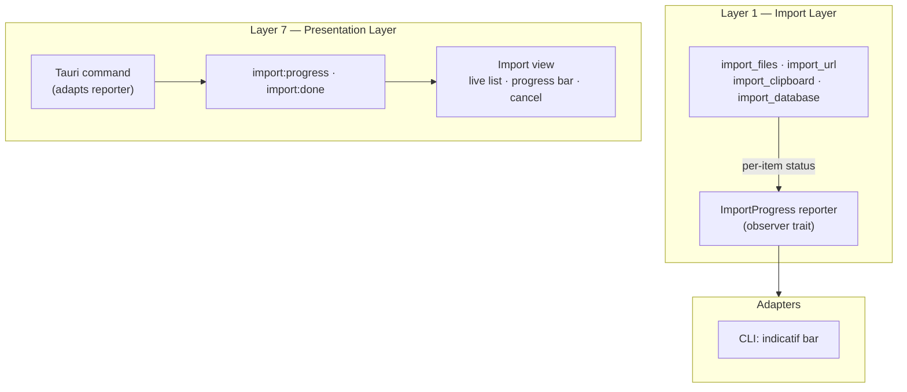

# PRD-0009: Import Workflow — Real-Time Progress and Batch Operations

**Status:** Draft
**Date:** 2026-07-31
**Author:** Core maintainers
**Priority:** P1 — Experience Layer
**Depends on:** PRD-0001, PRD-0002, PRD-0007, PRD-0008

---

## Purpose

This PRD completes the Import workflow so that large imports feel responsive, safe, and recoverable. The anchor feature is real-time per-file progress, deferred from PRD-0008 (which scoped backend changes out). It also consolidates the remaining import UX gaps identified by `docs/engineering/ux-audits/audit-import.md` and the cross-cutting import requirements in PRD-0007. This is a living draft — additional import features are added here as they are specified, rather than scattered across other PRDs.

---

## Problem Statement

The Import view is the most feature-rich workflow in the application, but it fails the *Immediate Feedback* and *Performance Perception* interaction principles for the operations it was built for.

**Progress is invisible during import.** The view shows results only after the backend command completes. For a large directory, database, or multi-file selection, the user watches a spinner with no indication of how many files have been processed, how many remain, or what succeeded and what failed. The audit (audit-import.md, P1 #1) identifies real-time progress as the top import defect. PRD-0007 already specifies per-file progress as P0 (F1.J.6), but the implementation delivers results after completion.

**Recovery and context are weak.** There is no import history, so a user cannot see what was imported, when, or how many entities it produced. Batch operations are limited to a single directory. URLs cannot be dropped onto the view. There is no preview of what will be created before a large import commits.

These are presentation-layer and transport-layer deficits. They require no new canonical entities and no changes to the pipeline spine.

---

## Scope

### In Scope

- Real-time per-file progress for all import sources (files, URL, clipboard, database)
- Determinate progress reporting (total known) for directory and multi-file imports
- Live per-item status updates during import
- Cancel a running import between items (graceful stop)
- Import history — recent import operations, per-operation results, re-import and undo from history
- Batch import from multiple directories and mixed selections
- Drag-and-drop URL support into the Import view
- Import preview — show what will be created before committing (from PRD-0007 F1.J.1)
- Post-import suggested actions (from PRD-0007 F1.J.3)

### Out of Scope

- New canonical entity or relationship types
- Changes to the pipeline spine (Import → Extract → Resolve → Store → Connect → Derive → Present)
- Watch-directory auto-import (PRD-0007 F1.J.5) — deferred; interacts with background services
- Import format auto-detection by magic bytes (PRD-0007 F1.J.8) — backend capability exists; wiring into the desktop view is a small follow-up, not covered here
- Conflict detection UI (PRD-0007 F1.J.2) — requires resolution strategy work from PRD-0004; separate PRD
- Real-time progress in the CLI beyond the existing `indicatif` gap (PRD-0004 G-005 / F6.2)
- Multi-user or remote import orchestration

---

## Engineering Questions

### 1. Which canonical entities are introduced?

None. Progress events are transient transport messages and are never persisted as entities. Import history (F2) is derived from existing canonical data — the event log and provenance components — not stored as a new entity type. If a canonical `ImportJob` entity becomes necessary later, it is introduced via ADR, not this PRD.

### 2. Which relationships are introduced?

None.

### 3. Which components are introduced?

None.

### 4. Which events are emitted?

No new canonical events. The `import:progress` stream is a presentation-transport event over Tauri IPC, exactly analogous to the `chat:status` / `chat:delta` events established by PRD-0007. Transport events are not recorded in the canonical event log.

### 5. Which derived representations are generated?

- **Import history** — derived by querying the event log (EntityCreated events) and provenance components, grouped by import operation via the existing import identifier used by snapshot-based undo (PRD-0004 G-030).
- **Progress state** — transient, rendered by the presentation layer, regenerated on demand and never persisted.

Both are regenerable from canonical data.

### 6. Which layer owns the feature?

| Feature              | Layer | Rationale                                                                         |
| -------------------- | ----- | --------------------------------------------------------------------------------- |
| Progress reporting   | 1     | Import layer — reports per-item state as it processes                             |
| Progress transport   | 7     | Presentation boundary — Tauri command adapts reporter to `import:progress` events |
| Import history query | 4/6   | Knowledge model query over canonical events                                       |
| Preview (dry run)    | 1     | Parse + resolve without persisting                                                |
| All UI               | 7     | Presentation layer                                                                |

### 7. Can every derived artifact be regenerated?

Yes. Import history rebuilds from the canonical event log. Progress is transient and re-issued on every import run. Preview output is recomputed per request.

### 8. Does the feature violate storage independence?

No. All reads go through existing port traits (`EventLog`, `EntityRepository`, `ComponentRepository`). The progress reporter is a port trait implemented by each adapter (Tauri command emits events; CLI writes to `indicatif`).

### 9. Does the feature introduce implementation leakage?

No. The progress reporter is a narrow observer trait in `knowledge-import`. Neither Tauri nor `indicatif` appears in core code. The `import:progress` payload is defined at the Tauri command boundary, mirroring the chat transport pattern.

### 10. Does the feature preserve the canonical model?

Yes. No canonical data is altered. Import preview runs the parse and resolution stages without a write; nothing is persisted until the user confirms.

---

## Pipeline Spine Analysis



The pipeline spine is unchanged. The reporter is an observer on Layer 1; each presentation adapter (Tauri command, CLI) implements it. No canonical event is emitted.

---

## Functional Requirements

### F1: Real-Time Import Progress

| ID   | Requirement                                                                                 | Priority | Acceptance Criteria                                                                                                                                 |
| ---- | ------------------------------------------------------------------------------------------- | -------- | --------------------------------------------------------------------------------------------------------------------------------------------------- |
| F1.1 | Emit a per-item progress event as each file is processed for all import sources             | P0       | `import_files`, `import_url`, `import_clipboard`, `import_database`, `import_file_recursive` each produce one progress event per processed item     |
| F1.2 | Progress event carries current item, running totals, and completion flag                    | P0       | Payload: `{ import_id, processed, total, current_path, status, created, merged, errors, done }`                                                     |
| F1.3 | Emit a `total` update once the batch size is known                                          | P0       | Directory and recursive imports emit total immediately after `list_files`; file selections emit total upfront; database imports count rows as items |
| F1.4 | Frontend subscribes to `import:progress` and renders items as they complete                 | P0       | Import view shows each item live with Processing / Imported / Merged / Failed status; no results are held until command completion                  |
| F1.5 | Show a determinate progress bar with counts when total is known                             | P1       | "Importing… 12 of 48 files" with progress bar; falls back to indeterminate spinner when total is unknown                                            |
| F1.6 | Emit an `import:done` event carrying the final result                                       | P1       | Frontend reconciles streaming state with final totals on completion                                                                                 |
| F1.7 | Cancel a running import between items                                                       | P1       | "Stop" button during import; cancellation takes effect between items (never mid-write); partial results remain visible and undoable                 |
| F1.8 | Progress events are debounced to at most one event per ~50ms during high-throughput imports | P1       | A 10,000-file import does not flood the frontend; the UI stays responsive                                                                           |

### F2: Import History

| ID   | Requirement                                                           | Priority | Acceptance Criteria                                                                                      |
| ---- | --------------------------------------------------------------------- | -------- | -------------------------------------------------------------------------------------------------------- |
| F2.1 | Record each completed import operation with source, time, and results | P0       | Derived from the event log: operation id, source description, timestamp, created / merged / error counts |
| F2.2 | Import view shows a recent imports list                               | P1       | "Recent Imports" section lists the last N operations with counts and timestamps                          |
| F2.3 | Undo a previous import from history                                   | P1       | Each history entry exposes "Undo", reusing the existing `undo_import(import_id)` command                 |
| F2.4 | Re-import from history                                                | P2       | History entry exposes "Re-import" for file-based operations that still exist at their original path      |
| F2.5 | History is rebuilt when the view loads and after each import          | P1       | The list reflects the canonical event log without a dedicated import-history table                       |

### F3: Batch Import from Multiple Sources

| ID   | Requirement                                                     | Priority | Acceptance Criteria                                                                                                   |
| ---- | --------------------------------------------------------------- | -------- | --------------------------------------------------------------------------------------------------------------------- |
| F3.1 | File picker allows selecting multiple directories               | P0       | Directory selection accepts more than one directory where the platform supports it; otherwise multiple file selection |
| F3.2 | Mixed selections (files + directories) import as a single batch | P1       | One import operation, one progress bar, combined totals across all selections                                         |
| F3.3 | Combined recursive depth preview for multiple directories       | P1       | Preview aggregates file count, total size, and format breakdown across all selected directories                       |

### F4: Drag-and-Drop URLs

| ID   | Requirement                                                      | Priority | Acceptance Criteria                                                                      |
| ---- | ---------------------------------------------------------------- | -------- | ---------------------------------------------------------------------------------------- |
| F4.1 | Dropping a URL onto the URL tab populates the URL field          | P1       | Drop of `text/uri-list` or URL-looking text sets `urlInput` and focuses the Fetch button |
| F4.2 | Dropping a URL onto the Files drop zone initiates a URL import   | P2       | Drop zone distinguishes URL drops from file drops and routes to `import_url`             |
| F4.3 | Dropping a URL during an active import is rejected with feedback | P1       | No-op with a status message; concurrent imports are not started                          |

### F5: Import Preview

| ID   | Requirement                                                        | Priority | Acceptance Criteria                                                                                         |
| ---- | ------------------------------------------------------------------ | -------- | ----------------------------------------------------------------------------------------------------------- |
| F5.1 | Preview what will be created before committing                     | P1       | After selection, the view shows the entities that would be created: type, title, and component summary      |
| F5.2 | Preview runs parse and resolve without persisting                  | P1       | `import_preview` command performs extraction and resolution against the store read-only; nothing is written |
| F5.3 | Cancel from preview writes nothing                                 | P1       | Cancelling the preview leaves the knowledge base unchanged                                                  |
| F5.4 | Large batches show aggregate stats with a sample, not every entity | P1       | Batches over a threshold (e.g. 200 entities) render counts by type plus a capped sample list                |
| F5.5 | Confirm from preview proceeds with the import                      | P1       | "Import N entities" button starts the import with progress as specified in F1                               |

### F6: Post-Import Suggested Actions

| ID   | Requirement                                              | Priority | Acceptance Criteria                                                                               |
| ---- | -------------------------------------------------------- | -------- | ------------------------------------------------------------------------------------------------- |
| F6.1 | Show contextual next steps after a completed import      | P1       | "X entities created. Try asking about them in Chat" and "Explore in Graph" links after completion |
| F6.2 | Suggested actions navigate without losing import results | P1       | Navigation keeps the Import view's result list intact when the user returns                       |

---

## Non-Functional Requirements

| ID  | Requirement                     | Target                                  | Validation Method                      |
| --- | ------------------------------- | --------------------------------------- | -------------------------------------- |
| NF1 | Progress event latency          | First event < 500ms after import starts | Manual timing on a large directory     |
| NF2 | UI responsiveness during import | FPS >= 30 with progress streaming       | Manual check; debounce per F1.8        |
| NF3 | History query latency           | < 100ms at 100K entities                | Criterion benchmark on event-log query |
| NF4 | Preview latency (large batch)   | < 2s for 500 files; counts first        | Manual timing; progressive render      |

---

## User Stories

### US1: Watch a Large Import Complete

**As a** knowledge worker,
**I want to** see each file's progress as a large directory imports,
**So that** I know the operation is working and how long it will take.

**Acceptance criteria:**
1. Each item appears with a live status as it completes.
2. A progress bar shows processed vs. total when known.
3. Failures are visible immediately, not after the whole batch.
4. I can stop the import between items.

### US2: Recover a Previous Import

**As a** knowledge worker,
**I want to** see my recent imports and undo any of them,
**So that** I can correct mistakes without knowing import IDs.

**Acceptance criteria:**
1. The Import view lists recent operations with counts and timestamps.
2. Each entry has an Undo action that reverses it.
3. The list updates after every import.

### US3: Preview Before Committing

**As a** knowledge worker,
**I want to** see what will be created before importing a large set,
**So that** I don't pollute my knowledge base by accident.

**Acceptance criteria:**
1. After selection, the view shows entities to be created.
2. Cancelling writes nothing.
3. Confirming starts the import with real-time progress.

---

## Architecture

### Crate Changes

#### `core/knowledge-import`

Add an `ImportProgress` observer trait to the importer module:

```rust
pub trait ImportProgress: Send + Sync {
    fn on_item(&self, item: &ImportProgressItem);
    fn on_total(&self, total: u32);
    fn on_done(&self, result: &ImportProgressResponse);
}
```

Batch entry points (`DirectoryImporter`, multi-file loops) accept an optional reporter. The trait is the single integration point for the CLI (`indicatif`, resolving PRD-0004 G-005) and the desktop Tauri command.

#### `desktop/src-tauri/src/commands/import.rs`

- Add `app: tauri::AppHandle` to `import_files`, `import_url`, `import_clipboard`, `import_database`, `import_file_recursive`.
- Construct an `ImportProgress` reporter that emits `import:progress` and `import:done` Tauri events, following the chat.rs emit pattern (PRD-0007).
- Add `import_cancel(import_id)` (F1.7) gated by a per-command cancellation flag checked between items.
- Add `import_preview(paths)` (F5) that runs extraction and resolution against the store without writing.
- Add `list_import_history(limit)` (F2) querying the event log and provenance components.

#### `desktop/src-tauri/src/lib.rs`

Register `import_cancel`, `import_preview`, `list_import_history`.

### Frontend Changes

| File                                 | Change                                                                                                                                                    |
| ------------------------------------ | --------------------------------------------------------------------------------------------------------------------------------------------------------- |
| `desktop/src/lib/import-progress.ts` | **New.** `ImportProgressSession` modeled on `chat-stream.ts`: subscribes to `import:progress` / `import:done`, invokes the import command, exposes stop() |
| `desktop/src/views/Import.svelte`    | Live item list, determinate progress bar, Stop button, Recent Imports section, preview panel, URL drop handling                                           |
| `desktop/src/lib/api.ts`             | `cancelImport`, `importPreview`, `listImportHistory` wrappers                                                                                             |
| `desktop/src/lib/types.ts`           | `ImportProgressEvent`, `ImportHistoryEntry`, `ImportPreview` types                                                                                        |

### Event Payload

```typescript
// desktop/src/lib/types.ts
export interface ImportProgressEvent {
  import_id: string;
  processed: number;
  total: number; // 0 until known
  current_path: string;
  status: "Processing" | "Imported" | "Merged" | "Failed";
  created: number;
  merged: number;
  errors: number;
  done: boolean;
}
```

The payload mirrors the existing `ImportProgressResponse` shape so the frontend can reconcile the streamed state with the final result.

---

## Acceptance Criteria

### Definition of Done

- [ ] All import sources stream per-item progress events (F1.1–F1.4)
- [ ] Determinate progress bar renders when total is known; indeterminate otherwise (F1.5)
- [ ] Stop between items cancels a running import; partial results remain undoable (F1.7)
- [ ] Progress streaming does not regress UI responsiveness on a 1,000-file import (NF2)
- [ ] Recent imports list is derivable from the canonical event log (F2.1–F2.5)
- [ ] Multiple directories import as one batch with combined progress (F3)
- [ ] URL drop populates the URL tab (F4)
- [ ] Preview shows entities to be created and cancels without writes (F5)
- [ ] Post-import suggested actions render after completion (F6)
- [ ] All tests pass; `cargo clippy -- -D warnings` and `cargo fmt --check` clean
- [ ] No new canonical entities, relationships, components, or canonical events

### Test Cases

1. **Directory progress** — importing a 100-file directory emits total immediately and per-file events in order.
2. **Progress bar** — determinate bar shows processed/total; indeterminate state before total is known.
3. **Cancel between items** — stop halts processing, completed items remain in the list and are undoable.
4. **Event debounce** — 1,000-file import emits no more than ~20 events/second during sustained throughput.
5. **History derivation** — history matches the event log after multiple imports, including failures.
6. **Undo from history** — undoing a past import removes exactly that operation's entities.
7. **Multiple directories** — two selected directories produce one batch with combined totals.
8. **URL drop** — dropping a URL populates the URL field; dropping during an import is rejected.
9. **Preview cancel** — cancelling a preview leaves the knowledge base unchanged.
10. **Post-import actions** — completion shows Chat/Graph suggestions that navigate and preserve results.

---

## Testing Strategy

| Level       | Scope                                                                                 | Framework                                      |
| ----------- | ------------------------------------------------------------------------------------- | ---------------------------------------------- |
| Unit        | `ImportProgress` reporter trait; history derivation query; cancel flag semantics      | `cargo test`                                   |
| Integration | Tauri commands emit events in order; preview writes nothing; history reflects imports | `cargo test` in `knowledge-desktop`            |
| Frontend    | Progress session lifecycle, payload parsing, URL drop detection                       | `npm run check`; manual E2E in the running app |

The desktop frontend has no automated test framework wired today. If a Vitest + Testing Library setup is adopted (proposed in PRD-0008), the progress session and Import view behaviors are added to it.

---

## Risks and Mitigations

| Risk                                                   | Impact | Likelihood | Mitigation                                                                                               |
| ------------------------------------------------------ | ------ | ---------- | -------------------------------------------------------------------------------------------------------- |
| Progress event flood on huge imports                   | High   | High       | Debounce to one event per ~50ms (F1.8); batch totals, not per-file, for very large sets                  |
| Cancel mid-write corrupts an entity                    | High   | Low        | Cancellation only between items; writes are atomic per entity (transactional store)                      |
| Database imports have unknown row counts until preview | Medium | High       | Preview first (F5) yields total; otherwise indeterminate progress for the database source                |
| Concurrent imports corrupt shared state                | Medium | Low        | Reject new imports while one is active (existing `importing` guard) and on URL drop during import (F4.3) |
| History query degrades at scale                        | Medium | Low        | Index on event-log timestamp + provenance source; cap history at N entries (F2.2)                        |

---

## Dependencies

### External Crates

None. Streaming uses the existing Tauri event emitter and `tokio` tasks already present for chat streaming (IP-011).

### Internal Dependencies

- PRD-0007 — chat transport pattern (`chat:status` / `chat:delta`), F1.J import UX requirements
- PRD-0008 — Import view ARIA and tab work; the view this PRD builds on
- PRD-0004 — snapshot-based undo identifier (G-030) reused for import history
- `docs/engineering/ux-audits/audit-import.md` — the P1/P2 items this PRD resolves
- `docs/architecture/interaction-design.md` — Immediate Feedback and Performance Perception principles

---

## Timeline

| Phase                       | Duration | Deliverables                                                                   |
| --------------------------- | -------- | ------------------------------------------------------------------------------ |
| Phase 1: Progress reporter  | 3 days   | `ImportProgress` trait, CLI `indicatif` wiring, unit tests (F1.1–F1.3)         |
| Phase 2: Desktop streaming  | 3 days   | Tauri events, `import-progress.ts`, live list + progress bar (F1.4–F1.6, F1.8) |
| Phase 3: Cancel             | 2 days   | `import_cancel`, Stop button, between-item semantics (F1.7)                    |
| Phase 4: Import history     | 2 days   | Derived history query, Recent Imports UI, undo/re-import (F2)                  |
| Phase 5: Batch + URL drop   | 2 days   | Multi-directory picker, combined preview, URL drop (F3, F4)                    |
| Phase 6: Preview            | 3 days   | Read-only preview command, preview panel, confirm flow (F5)                    |
| Phase 7: Onboarding + audit | 1 day    | Post-import suggestions (F6), axe/UX re-audit of Import view                   |

**Total: ~2.5 weeks**

---

## Definition of Done

- [ ] All P0 and P1 functional requirements implemented and tested
- [ ] P2 requirements implemented or explicitly deferred
- [ ] Progress streaming meets NFR targets (NF1–NF4)
- [ ] Import view passes a re-audit against `interaction-design.md`
- [ ] No new canonical types or events; pipeline spine unchanged
- [ ] Documentation cross-references updated (audit-import.md status, PRD-0008 deferral note)
