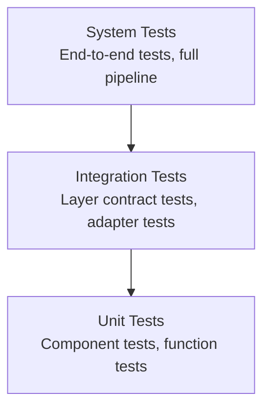

# Testing Strategy

> Tests are deterministic. Tests are compositional. Tests are documentation. Tests are fast.

---

## Test Pyramid



- **Unit tests** verify individual functions and components. They are fast, isolated, and numerous.
- **Integration tests** verify contracts between layers and adapters. They use real storage engines in test mode.
- **System tests** verify end-to-end behavior. They exercise the full pipeline from import to rendering.

---

## Pipeline Testing

The deterministic pipeline enables a specific testing strategy:

### Canonical Tests

Given a fixed input, verify the canonical output. Re-run the pipeline on the same input and verify identical results.

```
Input: "test-paper.md"
Expected: Entity { type: Paper, title: "Test Paper", ... }
Assert: pipeline.run(input) == expected
```

### Derivation Tests

Given canonical data, verify derived artifacts. Drop derived data, re-derive, and verify.

```
Input: Entity { type: Paper, content: "..." }
Expected: SearchIndexEntry { terms: [...], ... }
Assert: derive(entity) == expected
```

### Event Tests

Given a sequence of events, verify the processing pipeline produces correct state.

```
Events: [EntityCreated, ComponentAdded, RelationshipCreated]
Expected: Derived state matches canonical state
Assert: process(events) == expected_derived_state
```

### Regression Tests

When a bug is found, add the failing input as a test case. The bug must never recur.

---

## Property-Based Testing

Where applicable, property-based testing verifies invariants across a range of inputs:

- Entity identifiers are unique across all generated entities.
- Component types are unique within an entity.
- Relationships always reference existing entities.
- Derived data is always reproducible from canonical data.
- Events are always ordered by entity version.

---

## Test Organization

```
tests/
  unit/               Unit tests (co-located with source)
  integration/        Integration tests
    pipeline/         Pipeline layer tests
    storage/          Storage adapter tests
    plugins/          Plugin contract tests
  system/             End-to-end tests
    import/           Import pipeline tests
    query/            Query and rendering tests
    ai/               AI integration tests
  properties/         Property-based tests
  fixtures/           Test data and fixtures
```

---

## Test Data

- **Fixtures.** Pre-defined entities, components, and relationships for deterministic tests.
- **Generators.** Random entity and relationship generators for property-based tests.
- **Snapshots.** Captured pipeline outputs for regression tests.

---

## Test Execution

- **Unit tests:** `cargo test` (milliseconds)
- **Integration tests:** `cargo test --test integration` (seconds)
- **System tests:** `cargo test --test system` (seconds to minutes)
- **All tests:** `cargo test` (comprehensive)

---

## Coverage

- Unit tests target > 90% code coverage.
- Integration tests target all storage adapters and pipeline layers.
- System tests target all import formats and view types.

---

## Further Reading

- [Engineering Principles](../philosophy/engineering-principles.md) -- Testing philosophy
- [Pipeline](../architecture/pipeline.md) -- Pipeline architecture
- [Events](../architecture/events.md) -- Event-driven testing
