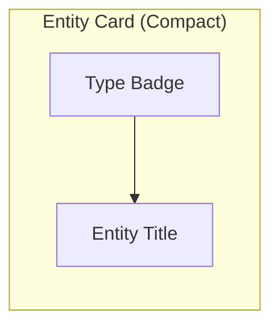
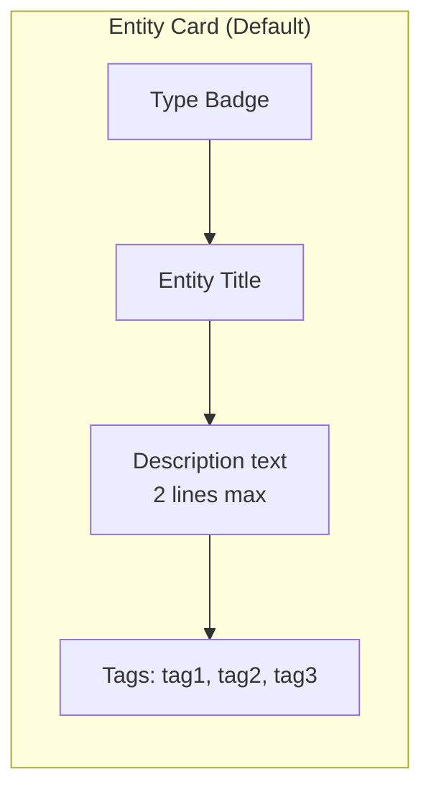
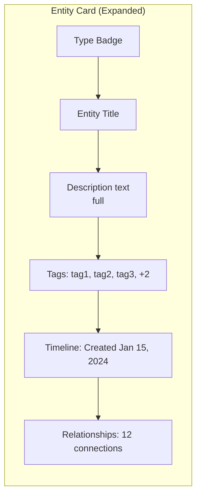

# UI Design System

> Component specifications, design tokens, and accessibility standards for Knowledge OS projections. This document supplements [UI Philosophy](../architecture/ui-philosophy.md) with concrete design specifications.

---

## Purpose

This document defines the design system for Knowledge OS user interfaces. It provides the concrete specifications that the UI Philosophy document describes at the conceptual level.

The design system is projection-agnostic. The same design tokens and component patterns apply across all view types: graph, tree, timeline, table, conversation, and future views.

---

## Design Tokens

Design tokens are the atomic values that define the visual language. They ensure consistency across all projections.

### Color System

**Primary palette:**

| Token                    | Value     | Usage                                    |
| ------------------------ | --------- | ---------------------------------------- |
| `--color-primary`        | `#2563EB` | Primary actions, links, focus indicators |
| `--color-primary-hover`  | `#1D4ED8` | Hover state for primary elements         |
| `--color-primary-active` | `#1E40AF` | Active/pressed state                     |
| `--color-primary-subtle` | `#DBEAFE` | Subtle backgrounds, selection highlights |

**Neutral palette:**

| Token                    | Value     | Usage                              |
| ------------------------ | --------- | ---------------------------------- |
| `--color-bg`             | `#FFFFFF` | Page background                    |
| `--color-bg-secondary`   | `#F8FAFC` | Card backgrounds, alternating rows |
| `--color-bg-tertiary`    | `#F1F5F9` | Input backgrounds, disabled states |
| `--color-border`         | `#E2E8F0` | Borders, dividers                  |
| `--color-border-strong`  | `#CBD5E1` | Emphasized borders                 |
| `--color-text`           | `#0F172A` | Primary text                       |
| `--color-text-secondary` | `#475569` | Secondary text, labels             |
| `--color-text-tertiary`  | `#94A3B8` | Placeholder text, captions         |

**Semantic palette:**

| Token             | Value     | Usage                                    |
| ----------------- | --------- | ---------------------------------------- |
| `--color-success` | `#16A34A` | Success states, positive indicators      |
| `--color-warning` | `#D97706` | Warning states, caution indicators       |
| `--color-error`   | `#DC2626` | Error states, destructive actions        |
| `--color-info`    | `#2563EB` | Informational states, neutral indicators |

**Entity type colors:**

| Entity Type  | Color     | Token                         |
| ------------ | --------- | ----------------------------- |
| Concept      | `#8B5CF6` | `--color-entity-concept`      |
| Person       | `#EC4899` | `--color-entity-person`       |
| Organization | `#F59E0B` | `--color-entity-organization` |
| Paper        | `#3B82F6` | `--color-entity-paper`        |
| Tool         | `#10B981` | `--color-entity-tool`         |
| Technology   | `#6366F1` | `--color-entity-technology`   |
| Decision     | `#EF4444` | `--color-entity-decision`     |
| Event        | `#F97316` | `--color-entity-event`        |
| Collection   | `#14B8A6` | `--color-entity-collection`   |
| Default      | `#64748B` | `--color-entity-default`      |

### Typography

**Font family:**

| Token         | Value                          | Usage                   |
| ------------- | ------------------------------ | ----------------------- |
| `--font-sans` | `Inter, system-ui, sans-serif` | Body text, UI elements  |
| `--font-mono` | `JetBrains Mono, monospace`    | Code, technical content |

**Font sizes:**

| Token         | Value             | Usage                  |
| ------------- | ----------------- | ---------------------- |
| `--text-xs`   | `0.75rem` (12px)  | Captions, metadata     |
| `--text-sm`   | `0.875rem` (14px) | Labels, secondary text |
| `--text-base` | `1rem` (16px)     | Body text              |
| `--text-lg`   | `1.125rem` (18px) | Subheadings            |
| `--text-xl`   | `1.25rem` (20px)  | Section headings       |
| `--text-2xl`  | `1.5rem` (24px)   | Page titles            |

**Font weights:**

| Token             | Value | Usage            |
| ----------------- | ----- | ---------------- |
| `--font-normal`   | `400` | Body text        |
| `--font-medium`   | `500` | Labels, emphasis |
| `--font-semibold` | `600` | Headings         |
| `--font-bold`     | `700` | Page titles      |

### Spacing

| Token       | Value            | Usage               |
| ----------- | ---------------- | ------------------- |
| `--space-1` | `0.25rem` (4px)  | Tight spacing       |
| `--space-2` | `0.5rem` (8px)   | Default spacing     |
| `--space-3` | `0.75rem` (12px) | Comfortable spacing |
| `--space-4` | `1rem` (16px)    | Loose spacing       |
| `--space-6` | `1.5rem` (24px)  | Section spacing     |
| `--space-8` | `2rem` (32px)    | Page spacing        |

### Border Radius

| Token           | Value            | Usage             |
| --------------- | ---------------- | ----------------- |
| `--radius-sm`   | `0.25rem` (4px)  | Buttons, inputs   |
| `--radius-md`   | `0.375rem` (6px) | Cards, containers |
| `--radius-lg`   | `0.5rem` (8px)   | Modals, panels    |
| `--radius-full` | `9999px`         | Pills, badges     |

### Shadows

| Token         | Value                         | Usage            |
| ------------- | ----------------------------- | ---------------- |
| `--shadow-sm` | `0 1px 2px rgba(0,0,0,0.05)`  | Subtle elevation |
| `--shadow-md` | `0 4px 6px rgba(0,0,0,0.1)`   | Card elevation   |
| `--shadow-lg` | `0 10px 15px rgba(0,0,0,0.1)` | Modal elevation  |

---

## Component Specifications

### Entity Card

The entity card is the primary component for displaying an entity in any projection.

**Properties:**

| Property  | Type                               | Required | Description                                       |
| --------- | ---------------------------------- | -------- | ------------------------------------------------- |
| `entity`  | Entity                             | Yes      | The entity to display                             |
| `variant` | `compact` / `default` / `expanded` | No       | Display variant (default: `default`)              |
| `actions` | Action[]                           | No       | Available actions (view, add to collection, etc.) |

**Compact variant:**

- Entity type badge (colored dot + type name)
- Entity title (truncated to 1 line)
- Height: 40px

**Default variant:**

- Entity type badge
- Entity title
- Description component (truncated to 2 lines)
- Tags component (truncated to 3 tags)
- Height: auto (max 120px)

**Expanded variant:**

- All components displayed
- Full description
- All tags
- Timeline component
- Relationship count
- Height: auto

### Entity List

The entity list displays multiple entities in a scrollable list.

**Properties:**

| Property   | Type                               | Required | Description          |
| ---------- | ---------------------------------- | -------- | -------------------- |
| `entities` | Entity[]                           | Yes      | Entities to display  |
| `variant`  | `compact` / `default` / `expanded` | No       | Card variant         |
| `sort`     | SortConfig                         | No       | Sort configuration   |
| `filter`   | FilterConfig                       | No       | Filter configuration |

**Behavior:**

- Virtualized scrolling for lists > 100 items
- Keyboard navigation: Arrow keys to move between items, Enter to select
- Multi-select with Shift+Click and Ctrl+Click

### Search Bar

**Properties:**

| Property      | Type                    | Required | Description       |
| ------------- | ----------------------- | -------- | ----------------- |
| `placeholder` | string                  | No       | Placeholder text  |
| `onSearch`    | (query: string) => void | Yes      | Search callback   |
| `filters`     | FilterConfig[]          | No       | Available filters |

**Capabilities:**

- Full-text matching against indexed fields
- Semantic similarity matching against embeddings
- Entity type filtering
- Relationship-aware ranking
- Autocomplete from entity titles and tags

### Graph View

**Properties:**

| Property        | Type           | Required | Description                      |
| --------------- | -------------- | -------- | -------------------------------- |
| `entities`      | Entity[]       | Yes      | Entities to render as nodes      |
| `relationships` | Relationship[] | Yes      | Relationships to render as edges |
| `focus`         | EntityId       | No       | Initial focus entity             |
| `depth`         | number         | No       | Traversal depth (default: 2)     |

**Node rendering:**

- Node size reflects importance (connection count or custom metric)
- Node color reflects entity type
- Node label shows entity title (truncated)
- Node hover shows tooltip with description

**Edge rendering:**

- Edge label shows relationship type
- Edge color reflects relationship category
- Edge direction indicated by arrow

**Layout:**

- Force-directed layout by default
- Hierarchical layout option
- User may pan, zoom, filter, and select nodes

---

## Accessibility

### WCAG 2.1 AA Compliance

All interfaces must meet WCAG 2.1 AA standards:

**Perceivable:**

- All text has sufficient contrast ratio (4.5:1 for normal text, 3:1 for large text).
- All information is not conveyed by color alone. Icons and text supplement color coding.
- All images have alt text.
- All interactive elements are visible when focused.

**Operable:**

- All functionality is available via keyboard.
- No keyboard traps. Users can navigate away from any component.
- Skip navigation links are provided.
- Focus order is logical and intuitive.

**Understandable:**

- All labels are descriptive and clear.
- Error messages are specific and actionable.
- Forms validate input and provide feedback.
- Navigation is consistent across views.

**Robust:**

- HTML is valid and well-structured.
- ARIA attributes are used correctly.
- Custom components follow ARIA patterns.
- Interfaces work with screen readers.

### Keyboard Navigation

| Key          | Action                                    |
| ------------ | ----------------------------------------- |
| `Tab`        | Move to next interactive element          |
| `Shift+Tab`  | Move to previous interactive element      |
| `Arrow keys` | Navigate between items in a list or graph |
| `Enter`      | Open selected entity or activate button   |
| `Escape`     | Close modal, return to previous view      |
| `/`          | Open search                               |
| `?`          | Show keyboard shortcuts                   |
| `Ctrl+A`     | Select all (in multi-select contexts)     |
| `Ctrl+C`     | Copy selected entity                      |
| `Ctrl+V`     | Paste into collection                     |

### Screen Reader Support

- All interactive elements have accessible names.
- All dynamic content is announced via ARIA live regions.
- Entity type and title are announced when navigating to an entity card.
- Relationship type and target are announced when navigating graph edges.
- Search results announce the count and type of results.

### High Contrast Mode

- All colors meet WCAG AAA contrast requirements (7:1 ratio).
- Borders are visible and distinct.
- Focus indicators are highly visible.
- Icons have text labels.

### Responsive Design

| Breakpoint | Width          | Layout                            |
| ---------- | -------------- | --------------------------------- |
| Mobile     | < 640px        | Single column, stacked panels     |
| Tablet     | 640px - 1024px | Two columns, collapsible sidebar  |
| Desktop    | > 1024px       | Three columns, persistent sidebar |

---

## View-Specific Design Tokens

### Graph View

| Token                      | Value   | Usage                 |
| -------------------------- | ------- | --------------------- |
| `--graph-node-min-size`    | `20px`  | Minimum node diameter |
| `--graph-node-max-size`    | `60px`  | Maximum node diameter |
| `--graph-edge-width`       | `1.5px` | Default edge width    |
| `--graph-edge-hover-width` | `3px`   | Edge width on hover   |
| `--graph-label-font-size`  | `11px`  | Node label font size  |

### Table View

| Token                   | Value            | Usage              |
| ----------------------- | ---------------- | ------------------ |
| `--table-row-height`    | `40px`           | Default row height |
| `--table-header-height` | `48px`           | Header row height  |
| `--table-cell-padding`  | `8px 12px`       | Cell padding       |
| `--table-border-color`  | `--color-border` | Cell borders       |

### Timeline View

| Token                        | Value  | Usage                    |
| ---------------------------- | ------ | ------------------------ |
| `--timeline-line-width`      | `2px`  | Timeline line width      |
| `--timeline-node-size`       | `12px` | Timeline node diameter   |
| `--timeline-label-font-size` | `12px` | Timeline label font size |

---

## Further Reading

- [UI Philosophy](../architecture/ui-philosophy.md) -- Conceptual foundation for interfaces
- [Mental Model](../architecture/mental-model.md) -- The projection model
- [Composition](../architecture/composition.md) -- How entities map to view components
- [Pipeline](../architecture/pipeline.md) -- How views are rendered from canonical data
