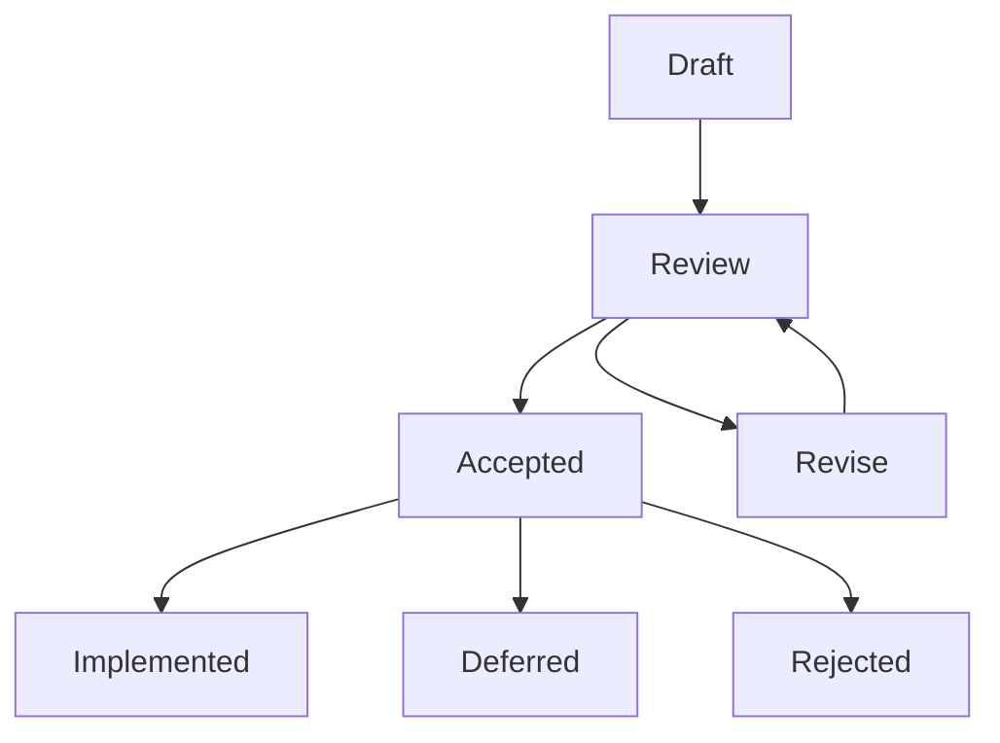

# Governance

> Every architectural decision is recorded. Every record is immutable once accepted. Every change follows a defined process.

---

## Decision Framework

Every decision in Knowledge OS falls into one of three categories:

### Architectural Decisions

Decisions that affect the canonical model, the pipeline, the event system, or the plugin API. These decisions are:

- Recorded as Architecture Decision Records (ADRs)
- Require review by at least one core maintainer
- Are immutable once accepted
- May be superseded, never edited

### Implementation Decisions

Decisions that affect how the architecture is implemented in code. These decisions are:

- Recorded in code comments and commit messages
- Subject to standard code review
- May be changed in subsequent commits
- Do not require ADRs unless they have architectural implications

### Process Decisions

Decisions that affect how the team works: branching strategy, release cadence, communication channels. These decisions are:

- Recorded in documentation
- Subject to team consensus
- May be revised as the team evolves

---

## RFC Process

Significant changes undergo a Request for Comments (RFC) process before acceptance.

### When RFC Is Required

- New entity types, relationship types, or component types
- Changes to the canonical model schema
- Changes to the plugin API
- Changes to the event schema
- New pipeline layers or modifications to existing layers
- Changes to the storage adapter contract
- Deprecation of existing features

### When RFC Is Not Required

- Bug fixes
- Documentation updates
- Dependency upgrades
- Refactoring without API changes
- New importer or exporter plugins that follow the existing contract

### RFC Lifecycle



**Draft.** The author writes the RFC: problem statement, proposed solution, alternatives considered, consequences. The draft is published for review.

**Review.** The community reviews the RFC. Comments are collected. The author revises the RFC in response.

**Decision.** The RFC is accepted, rejected, or deferred. Accepted RFCs proceed to implementation. Rejected RFCs are recorded with their rationale. Deferred RFCs are revisited when context changes.

### RFC Template

```markdown
# RFC-NNNN: [Short Title]

**Status:** Draft | Review | Accepted | Rejected | Deferred
**Author:** [name]
**Date:** YYYY-MM-DD

## Problem

What is the problem this RFC addresses?

## Proposed Solution

What is the proposed change?

## Alternatives Considered

What other approaches were considered?

## Consequences

What are the positive, negative, and risk outcomes?

## Related ADRs

- ADR-XXXX: [related decision]
```

---

## Architecture Review

Every architectural change undergoes review before merge.

### Review Board

Architectural review is performed by core maintainers. Review is asynchronous. The reviewer may:

- **Approve.** The change is consistent with the architecture.
- **Request changes.** The change needs modification.
- **Reject.** The change contradicts the architecture.

### Review Criteria

1. **Consistency.** Does the change align with the foundational manifesto and engineering architecture?
2. **Completeness.** Does the change answer all ten engineering questions?
3. **Compatibility.** Does the change preserve backward compatibility?
4. **Correctness.** Does the change maintain the canonical model as the source of truth?
5. **Clarity.** Is the change well-documented and clearly explained?

### Review Timeline

- **Simple changes.** Reviewed within 3 business days.
- **Complex changes.** Reviewed within 7 business days.
- **Architectural changes.** Reviewed within 14 business days.

---

## Feature Acceptance

Features are accepted through a defined process.

### Acceptance Criteria

A feature is accepted when:

1. It passes the ten-question engineering checklist.
2. It has been reviewed by at least one core maintainer.
3. It has comprehensive tests (unit, integration, or system as appropriate).
4. It has documentation explaining the feature.
5. It does not introduce implementation leakage.
6. It preserves the canonical model as the source of truth.

### Acceptance Process

```
Proposal  -->  RFC  -->  Implementation  -->  Review  -->  Merge
                        (code + tests + docs)
```

**Proposal.** The feature is proposed through a GitHub issue or RFC.

**RFC.** If the feature is architectural, an RFC is written and reviewed.

**Implementation.** The feature is implemented with code, tests, and documentation.

**Review.** The implementation is reviewed against the acceptance criteria.

**Merge.** The feature is merged into the main branch.

---

## Deprecation Policy

Features are deprecated through a defined process.

### Deprecation Criteria

A feature is deprecated when:

- It has been superseded by a better approach.
- It violates the canonical model or architectural principles.
- It is no longer maintained.
- It introduces security risks.

### Deprecation Process

1. **Announcement.** The deprecation is announced in the changelog and documentation.
2. **Warning period.** The deprecated feature continues to function but emits warnings.
3. **Removal.** After the warning period, the feature is removed.

### Warning Periods

| Feature Type | Warning Period |
|-------------|----------------|
| Plugin API | 2 minor versions |
| Entity types | 3 minor versions |
| Relationship types | 3 minor versions |
| Component types | 3 minor versions |
| CLI commands | 2 minor versions |
| Configuration options | 2 minor versions |

### Migration Support

When a feature is deprecated, the system provides:

- **Migration guide.** Step-by-step instructions for migrating from the deprecated feature.
- **Migration tool.** An automated tool that transforms deprecated data to the new format.
- **Compatibility layer.** A temporary adapter that translates between old and new formats.

---

## Change Management

### Change Categories

| Category | Impact | Process |
|----------|--------|---------|
| **Patch** | Bug fixes, no data model changes | Code review, no RFC |
| **Minor** | New features, backward-compatible | Code review, RFC if architectural |
| **Major** | Breaking changes | RFC required, deprecation period |

### Breaking Changes

Breaking changes require:

1. An RFC explaining the change and its rationale.
2. A deprecation period with warnings.
3. A migration guide and tool.
4. A major version bump.

### Data Model Changes

Changes to the canonical model are the highest-impact changes. They require:

1. An RFC with full analysis of the ten engineering questions.
2. Review by all core maintainers.
3. A migration plan that preserves all canonical data.
4. A rebuild plan for all affected derived data.

---

## Communication

### Channels

- **GitHub Issues.** Bug reports, feature requests, questions.
- **GitHub Discussions.** Design discussions, RFCs, community conversation.
- **Pull Requests.** Code review, documentation review.
- **Changelog.** Release notes, deprecation announcements.

### Decision Transparency

Every decision is recorded and public:

- ADRs are in the repository.
- RFCs are in GitHub Discussions.
- Changelogs are in the repository.
- Release notes are on the releases page.

---

## Further Reading

- [Architecture Decision Records](../architecture/adrs/README.md) -- ADR template and index
- [Engineering Principles](engineering-principles.md) -- How code is developed
- [CONTRIBUTING.md](../../CONTRIBUTING.md) -- How to participate
- [Product Vision](product-vision.md) -- Long-term direction
